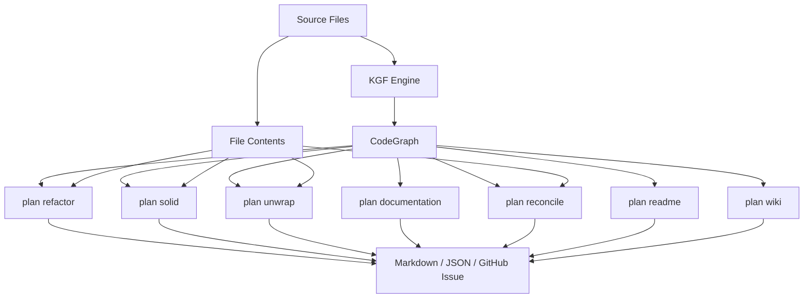
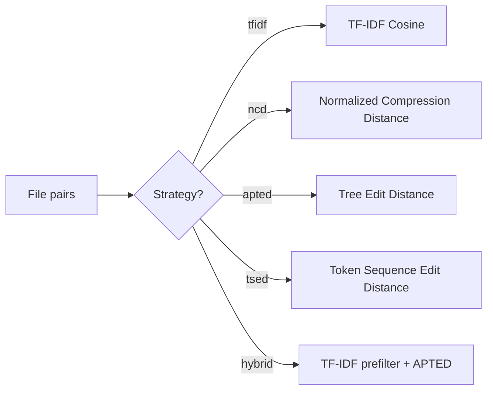

# Analysis Tools

indexion ships a suite of analysis commands under `plan` that consume the CodeGraph and source files to produce actionable reports. Each command targets a specific code quality concern -- duplication, documentation gaps, unnecessary indirection, or doc/code drift.

## Plan commands overview



## plan refactor

**Purpose:** Find duplicate and near-duplicate code, then generate a refactoring checklist.

The refactor command compares all files in a directory pairwise using a configurable similarity algorithm. Files that exceed the threshold are grouped into clusters and presented with similarity percentages and suggested actions.

```bash
indexion plan refactor --threshold=0.85 --include='*.mbt' src/
```

The output contains three sections:

1. **Duplicate Code Blocks** -- line-level duplication across files.
2. **Function-Level Duplicates** -- structurally similar functions that could share a common implementation.
3. **Configuration summary** -- threshold, strategy, file count.

Output styles:
- `--style=raw` -- similarity pairs and matrices (default)
- `--style=structured` -- organized refactoring plan with action items

> Source: `cmd/indexion/plan/refactor/cli.mbt`, `cmd/indexion/plan/refactor/render_structured.mbt`

## plan solid

**Purpose:** Extract common code from multiple packages into a shared location.

When two or more packages contain similar implementations, `plan solid` identifies the overlap and generates a plan for consolidating it into a target directory.

```bash
indexion plan solid --from=pkg1/,pkg2/ --to=shared/ --threshold=0.9
```

Solid supports rule files (`.solidrc`) and inline rules that map glob patterns to target paths:

```bash
indexion plan solid --from=pkg1/,pkg2/ --rule="auth/** -> auth/"
```

> Source: `cmd/indexion/plan/solid/cli.mbt`

## plan unwrap

**Purpose:** Detect unnecessary wrapper functions and optionally remove them.

A wrapper function is one whose body is a single delegation call with no added logic. Callers should call the delegate directly. Unwrap detects these patterns and supports three modes:

| Mode | Flag | Behavior |
|------|------|----------|
| Report | (default) | List detected wrappers |
| Dry-run | `--dry-run` | Preview all edits (call site replacements + definition deletions) |
| Fix | `--fix` | Apply edits to source files |

```bash
# Report wrappers
indexion plan unwrap --include='*.mbt' src/

# Preview what would change
indexion plan unwrap --dry-run --include='*.mbt' src/

# Apply fixes
indexion plan unwrap --fix --include='*.mbt' src/
```

> Source: `cmd/indexion/plan/unwrap/cli.mbt`, `cmd/indexion/plan/unwrap/types.mbt`

## plan documentation

**Purpose:** Analyze documentation coverage and identify undocumented public symbols.

The documentation command inspects every public symbol in the CodeGraph and checks whether it has a doc comment. It produces a coverage report with per-module statistics and a list of undocumented symbols.

```bash
# Full report
indexion plan documentation src/

# Coverage summary only
indexion plan documentation --style=coverage src/

# Output as GitHub Issue
indexion plan documentation --format=github-issue src/
```

Output formats: `md`, `json`, `github-issue`. The GitHub Issue format produces YAML-frontmatter issues compatible with GitHub Issue Forms.

> Source: `cmd/indexion/plan/documentation/cli.mbt`, `cmd/indexion/plan/documentation/analyze.mbt`

## plan reconcile

**Purpose:** Detect drift between implementation and documentation.

Reconcile cross-references documentation files against source code to find:

- Documentation that describes functions/types that no longer exist
- Code that has changed significantly since its documentation was written
- Terminology mismatches between docs and code

```bash
indexion plan reconcile .
```

Reconcile uses content hashing and git timestamps to determine staleness. It builds a mapping between document fragments and code units, then flags pairs where the code has been modified more recently than the documentation.

> Source: `cmd/indexion/plan/reconcile/cli.mbt`, `cmd/indexion/plan/reconcile/mapping.mbt`

## plan readme

**Purpose:** Generate README writing tasks for packages that lack documentation.

Unlike `doc readme` which generates actual README content, `plan readme` produces a task list describing what documentation is missing and what each README should cover.

```bash
indexion plan readme src/
```

> Source: `cmd/indexion/plan/readme/cli.mbt`

---

## Similarity algorithms

The explore and plan commands share a common comparison engine (`@batch`) that supports multiple similarity algorithms. The choice of algorithm affects both accuracy and performance.



### TF-IDF

Treats each file as a bag of tokens, computes term frequency-inverse document frequency vectors, and measures similarity via cosine distance. Fast and effective for detecting files with similar vocabulary.

- **Strengths:** Very fast (O(n) per comparison after vocabulary build). Good at catching renamed copies.
- **Weaknesses:** Ignores structure. Two files can have identical vocabulary but very different logic.
- **When to use:** First pass, large directories, quick exploration.

### NCD (Normalized Compression Distance)

Compresses files individually and jointly, then computes similarity from the compression ratios. Based on Kolmogorov complexity theory. No tokenization needed -- works on raw bytes.

- **Strengths:** Language-agnostic. Captures structural patterns that TF-IDF misses.
- **Weaknesses:** Slower than TF-IDF. Compression quality varies.
- **When to use:** Cross-language comparison, binary files, when TF-IDF results feel too noisy.

### APTED (All-Path Tree Edit Distance)

Parses files into AST-like trees (using KGF), then computes the minimum-cost edit sequence to transform one tree into another.

- **Strengths:** Most accurate structural comparison. Detects refactored code even when names change.
- **Weaknesses:** O(n^2 * m^2) worst case. Impractical for large files without prefiltering.
- **When to use:** Small, targeted comparisons. Confirming similarity flagged by TF-IDF.

### TSED (Token Sequence Edit Distance)

Similar to APTED but operates on flat token sequences rather than trees. A middle ground between TF-IDF and APTED.

### Hybrid

The default for `plan refactor`. Uses TF-IDF as a fast prefilter to identify candidate pairs, then runs APTED on those candidates for structural confirmation.


This two-stage approach gives APTED-quality results at near-TF-IDF speed. The prefilter threshold is set slightly below the target threshold to avoid false negatives.

> Source: `src/pipeline/comparison/` (`@batch`)

## Candidate generation

The comparison engine supports two candidate generation strategies:

- **Brute force** -- compare every pair. O(n^2). Used for small file sets.
- **TF-IDF prefilter** -- compute TF-IDF scores first, only send pairs above a threshold to the expensive comparator. Used by the hybrid strategy.

> Source: `src/pipeline/comparison/candidates/`

## Output formats

All plan commands support multiple output formats:

| Format | Flag | Description |
|--------|------|-------------|
| Markdown | `--format=md` | Human-readable report with checklists (default) |
| JSON | `--format=json` | Machine-readable output for tooling integration |
| Text | `--format=text` | Plain text, minimal formatting |
| GitHub Issue | `--format=github-issue` | YAML-frontmatter issue compatible with GitHub Issue Forms |

The Markdown format is designed for inclusion in pull requests or issue descriptions. The JSON format is consumed by the VS Code extension and the DeepWiki frontend.

## Common options

Most plan commands share these flags:

| Flag | Description |
|------|-------------|
| `--threshold=FLOAT` | Similarity threshold (0.0--1.0) |
| `--strategy=NAME` | Algorithm: `tfidf`, `ncd`, `hybrid`, `apted`, `tsed` |
| `--include=PATTERN` | Glob pattern for files to include (repeatable) |
| `--exclude=PATTERN` | Glob pattern for files to exclude (repeatable) |
| `--output=FILE` / `-o=FILE` | Write output to a file instead of stdout |
| `--specs-dir=DIR` | KGF specs directory (default: `kgfs`) |

## See Also

- [Similarity Algorithms (src/similarity)](wiki://src-similarity) -- NCD, TF-IDF, APTED, TSED algorithm internals

> Source: `cmd/indexion/plan/cli.mbt`, `src/pipeline/comparison/`
