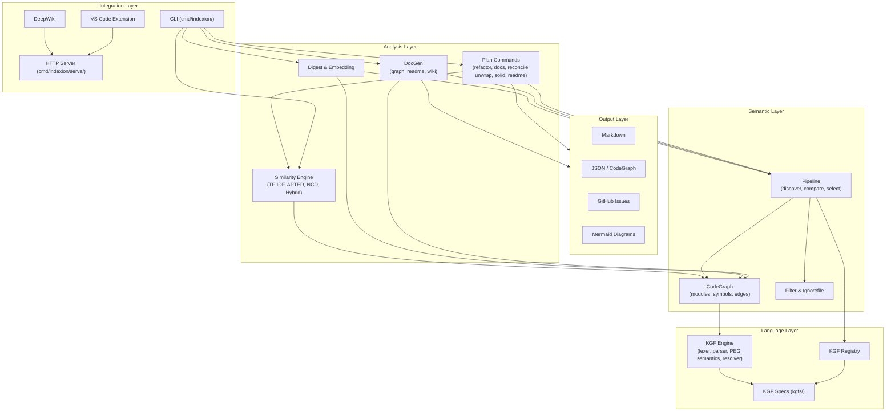
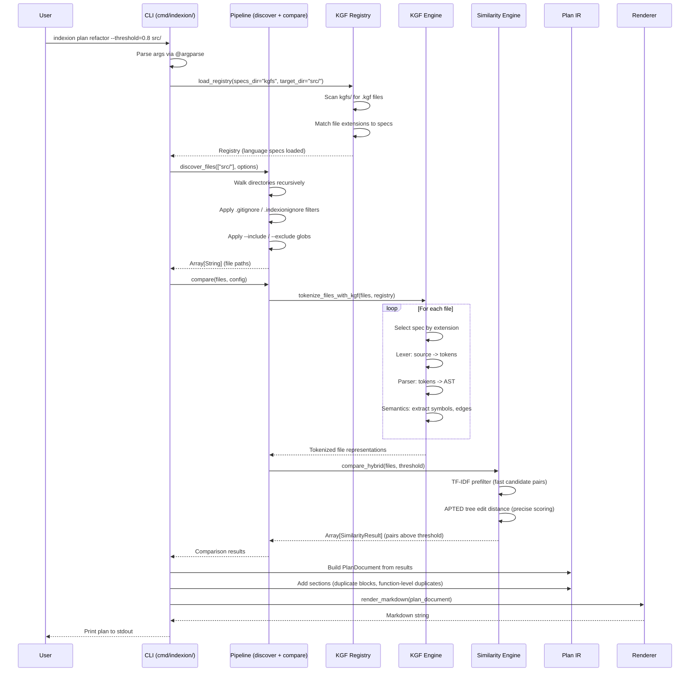

# Architecture

indexion is a language-agnostic source code analysis and documentation tool built in MoonBit. It transforms raw source files into structured knowledge (graphs, similarity scores, documentation plans) through a layered pipeline driven by declarative KGF (Knowledge Graph Framework) specifications rather than hardcoded language logic.

## Layered Architecture

The system is organized into five distinct layers, each with a clear responsibility boundary. Higher layers depend on lower layers but never the reverse.



**Language Layer** -- KGF specifications (`kgfs/programming/`, `kgfs/project/`) define lexical rules, grammar, semantics, and module resolution for each supported language. The KGF engine (`src/kgf/`) compiles these specs into tokenizers, parsers, and semantic extractors at runtime. The Registry (`src/kgf/registry/`) auto-detects which spec to apply based on file extensions declared in each spec's `sources:` field.

**Semantic Layer** -- The CodeGraph (`src/core/graph/`) is the central data model: a directed graph of `ModuleNode`, `SymbolNode`, and `Edge` objects representing declarations, references, dependencies, and calls. The Pipeline (`src/pipeline/`) handles file discovery (respecting `.gitignore` and `.indexionignore`), comparison orchestration, and result selection.

**Analysis Layer** -- Multiple analysis engines consume the semantic layer. The Similarity engine (`src/similarity/`) provides four strategies (TF-IDF, APTED tree edit distance, NCD compression distance, and a hybrid that auto-selects). Plan commands (`src/plan/`, `cmd/indexion/plan/`) generate actionable refactoring, documentation, and reconciliation plans. DocGen (`src/docgen/`) produces dependency diagrams and README content. Digest (`src/digest/`) builds purpose-based function indices with optional embeddings.

**Output Layer** -- A Plan IR (`src/plan/types/plan_ir.mbt`) serves as the common intermediate representation for all plan outputs. Renderers convert PlanDocument objects into Markdown (`src/plan/render/markdown.mbt`), GitHub Issues (`src/plan/render/github_issue.mbt`), or other formats. DocGen renders Mermaid diagrams and JSON graphs (`src/docgen/diagram/`).

**Integration Layer** -- The CLI (`cmd/indexion/`) parses arguments via `@argparse` and delegates to library code. Each subcommand module exposes a `command()` and `run_matches()` pair. The VS Code extension (`vscode-plugin/`) and DeepWiki frontend (`deepwiki/`) communicate through the HTTP server (`cmd/indexion/serve/`).

## Data Flow

A typical analysis -- for example, `indexion plan refactor --threshold=0.8 src/` -- flows through the system as follows:



Key observations about the flow:

- **Language detection is automatic.** The KGF Registry matches file extensions to specs, so the pipeline never needs to know which language it is analyzing. Adding a new `.kgf` file is sufficient to support a new language.

- **Comparison is strategy-driven.** The `compare()` function in `src/pipeline/comparison/` dispatches to the configured strategy (hybrid, tfidf, apted, or tsed). The hybrid strategy uses TF-IDF as a cheap prefilter and only runs the expensive APTED tree edit distance on promising candidate pairs.

- **Output format is decoupled.** The Plan IR (`PlanDocument` with `PlanSection` and `PlanItem`) is format-agnostic. The same analysis can emit Markdown for terminal output, a GitHub Issue body for CI integration, or structured JSON.

## Package Organization

The codebase follows a strict separation between reusable libraries (`src/`) and CLI wrappers (`cmd/`).

### `src/` -- Reusable Libraries

Each package in `src/` is a self-contained library with no CLI dependencies:

| Package | Purpose | Key types / functions |
|---------|---------|----------------------|
| `src/kgf/` | KGF engine (lexer, PEG parser, semantics, resolver) | Compiles `.kgf` specs into runtime analyzers |
| `src/kgf/features/` | High-level KGF utilities | `extract_pub_declarations()`, `build_line_func_map()`, `tokenize_files_with_kgf()` |
| `src/kgf/registry/` | Spec auto-detection | `Registry`, `load_registry()` |
| `src/core/graph/` | CodeGraph data model | `CodeGraph`, `ModuleNode`, `SymbolNode`, `Edge`, `EdgeKind` |
| `src/similarity/` | Similarity algorithms | `compare_hybrid()`, `compare_tfidf()`, `compare_apted()` |
| `src/pipeline/` | File discovery and batch comparison | `discover_files()`, `compare()`, `build_filter_from_root()` |
| `src/digest/` | Function indexing with embeddings | `extract/`, `embed/`, `index/`, `query/` |
| `src/docgen/` | Documentation generation | `diagram/` (Mermaid, JSON), `wiki/`, `analyze/`, `render/` |
| `src/plan/` | Plan IR and renderers | `PlanDocument`, `render_markdown()`, `render_github_issue()` |
| `src/filter/` | File filtering (include/exclude/ignore) | `FilterConfig`, `should_include()` |
| `src/glob/` | Glob pattern matching | `glob_match()`, `expand_glob()` |
| `src/text/` | Text processing primitives | Line splitting, normalization |
| `src/segmentation/` | Text chunking for RAG pipelines | Strategy-based text segmentation |
| `src/parallel/` | Fork-based parallelism (native only) | `run_parallel()`, `cpu_count()` |
| `src/config/` | OS paths and project configuration | `get_global_cache_dir()`, `resolve_os_dir()` |
| `src/scope/` | Scope analysis | Nested scope tracking |
| `src/vcs/` | Version control integration | Git operations |
| `src/http/` | HTTP client | Network requests for update checks, embeddings |

### `cmd/indexion/` -- CLI Wrappers

Each subdirectory under `cmd/indexion/` corresponds to a top-level subcommand. Every module follows the same pattern:

1. **`command() -> @argparse.Command`** -- declares flags, options, and help text.
2. **`run_matches(matches)` or `dispatch(matches)`** -- reads parsed arguments and calls into `src/` libraries.

| CLI module | Subcommand | Delegates to |
|------------|-----------|--------------|
| `cmd/indexion/explore/` | `explore` | `src/pipeline/`, `src/similarity/` |
| `cmd/indexion/plan/refactor/` | `plan refactor` | `src/pipeline/`, `src/similarity/`, `src/plan/` |
| `cmd/indexion/plan/documentation/` | `plan documentation` | `src/kgf/features/`, `src/plan/` |
| `cmd/indexion/plan/reconcile/` | `plan reconcile` | `src/docgen/`, `src/plan/` |
| `cmd/indexion/plan/unwrap/` | `plan unwrap` | `src/kgf/features/`, `src/plan/` |
| `cmd/indexion/plan/solid/` | `plan solid` | `src/pipeline/`, `src/plan/` |
| `cmd/indexion/plan/readme/` | `plan readme` | `src/docgen/`, `src/plan/` |
| `cmd/indexion/doc/` | `doc graph`, `doc readme` | `src/docgen/`, `src/core/graph/` |
| `cmd/indexion/digest/` | `digest` | `src/digest/` |
| `cmd/indexion/kgf/` | `kgf` | `src/kgf/` |
| `cmd/indexion/similarity/` | `sim` | `src/similarity/` |
| `cmd/indexion/segment/` | `segment` | `src/segmentation/` |
| `cmd/indexion/serve/` | `serve` | HTTP server for IDE/DeepWiki integration |

The `cmd/indexion/common/` module (`@common`) provides shared CLI utilities -- argument parsing helpers, file collection, string manipulation, path operations -- that all CLI modules import.

### `kgfs/` -- Language Specifications

KGF specs are organized by category:

- **`kgfs/programming/`** -- 25 programming languages (MoonBit, Rust, Go, Python, TypeScript, etc.)
- **`kgfs/project/`** -- 13 project file formats (moon.mod.json, Cargo.toml, package.json, etc.)
- **`kgfs/dsl/`** -- Domain-specific languages
- **`kgfs/natural/`** -- Natural language processing specs
- **`kgfs/universal.kgf`** -- Fallback spec for unknown file types

## Extension Points

### Adding a New Language

To add support for a new programming language, create a single `.kgf` file in `kgfs/programming/`. No MoonBit code changes are required.

A minimal KGF spec declares:

```
kgf 0.6
language: mylang
sources: .ml

=== lex
# Token definitions (regex patterns)
TOKEN KW_fn /def\b/
TOKEN Ident /[a-zA-Z_]\w*/
...

=== grammar
# Grammar rules (PEG-based)
...

=== semantics
# Edge extraction rules
# e.g., how to derive Declares, References, Imports edges from AST
...

=== resolver
# Module resolution
sources: .ml
relative_prefixes: ./
bare_prefix: pkg:
```

The Registry (`src/kgf/registry/registry.mbt`) will auto-detect the new spec by scanning the `kgfs/` directory and matching the `sources:` extension. All existing commands -- explore, plan, doc -- will automatically work with the new language.

### Adding a New Plan Command

To add a new analysis plan (e.g., `plan security`):

1. **Create the analysis module** in `cmd/indexion/plan/security/`:
   - Define `command() -> @argparse.Command` with flags and help text.
   - Implement `run_matches(matches)` that calls into `src/` libraries.
   - Build a `PlanDocument` from analysis results using the Plan IR (`src/plan/types/`).

2. **Register the subcommand** in `cmd/indexion/plan/cli.mbt` by adding it to the `subcommands` array and the `dispatch()` match expression.

3. **Reuse existing infrastructure**:
   - File discovery: `@pipeline.discover_files()`
   - KGF tokenization: `@kgf_features.tokenize_files_with_kgf()`
   - Similarity: `@batch.compare()` or individual strategies
   - Output: `@plan_render.render_markdown()` / `render_github_issue()`

The Plan IR ensures your new command automatically supports all output formats without writing format-specific code.

### Adding a New Output Format

To add a new output format (e.g., SARIF, YAML):

1. **Add a renderer** in `src/plan/render/` that takes a `PlanDocument` and returns the formatted string. Follow the pattern in `markdown.mbt` or `github_issue.mbt` -- iterate over `doc.sections`, render each `PlanSection` and its `PlanItem` children.

2. **Wire the format flag** in the relevant CLI module's `command()` definition and `run_matches()` handler.

The `PlanDocument` / `PlanSection` / `PlanItem` IR (`src/plan/types/plan_ir.mbt`) captures all the semantic content (titles, descriptions, code blocks, task lists, metadata) so renderers only need to handle formatting, not analysis logic.

### Adding a New Similarity Strategy

To add a new comparison strategy:

1. **Implement the strategy** in a new subdirectory under `src/similarity/` (following the pattern of `apted/`, `tfidf_strategy/`, `ncd/`).

2. **Register it** in `src/similarity/strategy.mbt` and `src/pipeline/comparison/` so the batch comparison engine can dispatch to it.

3. **Optionally integrate with hybrid** by adding it as a prefilter or precise scorer in `src/similarity/hybrid/`.

## Design Principles

**No hardcoding.** Language-specific behavior lives exclusively in KGF specs. The core engine is language-agnostic. Internal vs. external module detection uses the CodeGraph's `ModuleNode.file` field (present for internal modules, absent for external). Package prefixes come from KGF `bare_prefix` and `relative_prefixes` fields.

**Single Source of Truth.** Common utilities live in dedicated modules (`@common`, `@config`, `@kgf_features`, `@batch`) and are never duplicated across commands. The CLAUDE.md SoT table is the authoritative reference for which module owns which concern.

**Plan IR as universal output.** Every analysis command that produces human-readable output goes through the `PlanDocument` intermediate representation, ensuring consistent formatting and trivial addition of new output formats.

**Declarative over imperative.** KGF specs are declarative descriptions of language structure. The engine interprets them at runtime, which means supporting 25 languages requires 25 data files rather than 25 code modules.
