# CLI Commands

indexion's CLI is organized into command groups. Each group addresses a different aspect of codebase analysis and documentation.

```mermaid
flowchart TD
    INDEXION[indexion]
    INDEXION --> INIT[init]
    INDEXION --> EXPLORE[explore]
    INDEXION --> PLAN[plan]
    INDEXION --> WIKI[wiki]
    INDEXION --> DOC[doc]
    INDEXION --> DIGEST[digest]
    INDEXION --> KGF[kgf]
    INDEXION --> SIM[sim]
    INDEXION --> SEGMENT[segment]
    INDEXION --> PERF[perf]
    INDEXION --> UPDATE[update]
    INDEXION --> GREP[grep]
    INDEXION --> SERVE[serve]
    INDEXION --> SEARCH[search]
    INDEXION --> MCP[mcp]
    INDEXION --> SPEC[spec]

    PLAN --> PR[refactor]
    PLAN --> PD[documentation]
    PLAN --> PS[solid]
    PLAN --> PU[unwrap]
    PLAN --> PREC[reconcile]
    PLAN --> PREADME[readme]

    WIKI --> WPAGES[pages]
    WIKI --> WINDEX[index]
    WIKI --> WL[lint]
    WIKI --> WE[export]
    WIKI --> WM[import]
    WIKI --> WO[log]
    WIKI --> WH[hook]

    WPAGES --> WP[plan]
    WPAGES --> WA[add]
    WPAGES --> WU[update]
    WPAGES --> WI[ingest]

    WINDEX --> WIB[build]

    WH --> WHI[install]
    WH --> WHU[uninstall]
    WH --> WHS[status]

    DOC --> DI[init]
    DOC --> DG[graph]
    DOC --> DR[readme]

    SPEC --> SD[draft]
    SPEC --> SV[verify]
    SPEC --> SA[align]

    SA --> SAD[diff]
    SA --> SAT[trace]
    SA --> SAS[suggest]
    SA --> SAST[status]
    SA --> SAW[watch]
```



---

## init

Initialize a project for indexion. Creates the `kgfs/` directory with bundled KGF spec files for supported languages.

```bash
indexion init
```

**When to use:** First time setting up indexion in a project. Run once, commit the `kgfs/` directory.

---

## explore

Analyze pairwise similarity between files in one or more directories. This is the fundamental building block -- most other commands build on the same comparison engine.

```bash
indexion explore [options] <directory...>
```

| Option | Description | Default |
|--------|-------------|---------|
| `--format=FORMAT` | `matrix`, `list`, `cluster`, `json` | `matrix` |
| `--strategy=NAME` | `tfidf`, `ncd`, `hybrid`, `apted`, `tsed` | `tfidf` |
| `--threshold=FLOAT` | Minimum similarity for output | `0.5` |
| `--ext=EXT` | File extension filter (repeatable) | all |
| `--include=PATTERN` | Include glob pattern (repeatable) | `*` |
| `--exclude=PATTERN` | Exclude glob pattern (repeatable) | -- |
| `--specs-dir=DIR` | KGF specs directory | `kgfs` |

**Output formats:**

- **matrix** -- grid showing similarity percentages between all files
- **list** -- pairs sorted by similarity (highest first), filtered by threshold
- **cluster** -- groups of files exceeding threshold
- **json** -- machine-readable output with file list and pair scores

**When to use:** Quick exploration. "Are there duplicates in this directory?" Start with `--format=list` to see the most similar pairs.

```bash
indexion explore --format=list --threshold=0.8 src/
```

---

## plan

Generate planning documents for various code quality concerns. All subcommands produce Markdown by default and support `--format=json` for tooling.

### plan refactor

Find duplicate and near-duplicate code. Generates a refactoring checklist.

```bash
indexion plan refactor [options] <directory>
```

| Option | Description | Default |
|--------|-------------|---------|
| `--threshold=FLOAT` | Similarity threshold | `0.7` |
| `--strategy=NAME` | Comparison algorithm | `hybrid` |
| `--style=STYLE` | `raw` (similarity data) or `structured` (plan) | `raw` |
| `--include` / `--exclude` | Glob filters | -- |
| `-o=FILE` | Output to file | stdout |

**When to use:** Before a refactoring sprint. Identify consolidation opportunities.

### plan documentation

Analyze documentation coverage across all public symbols.

```bash
indexion plan documentation [options] <directory>
```

| Option | Description | Default |
|--------|-------------|---------|
| `--style=STYLE` | `full` or `coverage` | `full` |
| `--format=FORMAT` | `md`, `json`, `github-issue` | `md` |
| `--name=NAME` | Project name (auto-detected from moon.mod.json) | -- |
| `--template=FILE` | GitHub Issue Form template (.yml) | -- |

**When to use:** Track doc coverage over time. Generate GitHub issues for documentation tasks.

### plan solid

Plan extraction of common code from multiple packages into a shared location.

```bash
indexion plan solid --from=dir1/,dir2/ --to=shared/ [options]
```

| Option | Description | Default |
|--------|-------------|---------|
| `--from=DIRS` | Comma-separated source directories | required |
| `--to=DIR` | Target directory for extracted code | required |
| `--rules=FILE` | Rules file (.solidrc) | -- |
| `--rule=RULE` | Inline rule (repeatable), e.g. `"auth/** -> auth/"` | -- |
| `--threshold=FLOAT` | Similarity threshold | `0.9` |

**When to use:** Multiple packages have converged on similar implementations and you want to extract the common parts.

### plan unwrap

Detect wrapper functions that simply delegate to another function.

```bash
indexion plan unwrap [options] <directory>
```

| Option | Description | Default |
|--------|-------------|---------|
| `--dry-run` | Preview edits without applying | -- |
| `--fix` | Apply edits to source files | -- |
| `--include-self` | Include self-referencing wrappers | false |
| `--include-bare` | Include bare delegation (no arguments) | false |

**When to use:** After a refactoring that introduced indirection layers. Clean up trivial proxies.

### plan reconcile

Detect drift between documentation and implementation.

```bash
indexion plan reconcile [options] <directory>
```

**When to use:** Before a release, to ensure documentation is up to date with code changes.

### plan readme

Generate a task list of missing package READMEs.

```bash
indexion plan readme [options] <directory>
```

**When to use:** Planning a documentation sprint. Produces tasks that can be assigned to humans or LLMs.

### plan wiki

Analyze project structure and generate a wiki writing plan. Proposes concept-based page structure based on CodeGraph analysis. This is an alias for `indexion wiki pages plan`.

```bash
indexion wiki pages plan [options] <directory>
```

| Option | Description | Default |
|--------|-------------|---------|
| `--format=FORMAT` | `md`, `json`, `github-issue` | `md` |
| `--wiki-dir=DIR` | Wiki directory | `.indexion/wiki` |
| `-o=FILE` | Output to file | stdout |

**When to use:** Starting a new wiki or planning a documentation sprint. Generates a page structure proposal.

---

## wiki

Wiki management commands. All wiki operations are grouped under this top-level command.

```bash
indexion wiki <subcommand> [options]
```

### wiki pages

Manage wiki pages. All page lifecycle operations are grouped under this subcommand.

```bash
indexion wiki pages <subcommand> [options]
```

| Subcommand | Description |
|------------|-------------|
| `plan` | Propose page structure from CodeGraph |
| `add` | Add a new page to the manifest |
| `update` | Update an existing page |
| `ingest` | Detect pages with stale source files |

### wiki pages plan

Analyze project structure and generate a wiki writing plan from CodeGraph analysis.

```bash
indexion wiki pages plan [options] <directory>
```

| Option | Description | Default |
|--------|-------------|---------|
| `--format=FORMAT` | `md`, `json`, `github-issue` | `md` |
| `--wiki-dir=DIR` | Wiki directory | `.indexion/wiki` |
| `-o=FILE` | Output to file | stdout |

### wiki pages ingest

Detect source file changes since the last run and generate wiki update tasks for affected pages.

```bash
indexion wiki pages ingest [options]
```

| Option | Description | Default |
|--------|-------------|---------|
| `--wiki-dir=DIR` | Wiki directory | `.indexion/wiki` |
| `--format=FORMAT` | `md`, `json`, `github-issue` | `md` |
| `--dry-run` | Detect changes but don't update the ingest manifest | false |
| `-o=FILE` | Output to file | stdout |

Hashes each source file listed in `wiki.json` using content-addressable storage (`@cas_hash`), compares against `.indexion/wiki/ingest-manifest.json`, and produces a task list of pages whose sources have changed. The tool generates tasks only -- actual page rewriting is the responsibility of the human or agent that receives the task list.

### wiki pages add

Add a new page to the wiki manifest and write the `.md` file.

```bash
indexion wiki pages add --id=<id> --title=<title> --content=<file.md> [options]
```

| Option | Description | Default |
|--------|-------------|---------|
| `--id` | Page ID (slug, e.g. `my-page`) | required |
| `--title` | Page title | required |
| `--content` | Path to `.md` file with page content | required |
| `--parent` | Parent page ID (adds this page as a child) | -- |
| `--sources` | Comma-separated source file paths | -- |
| `--provenance` | `extracted`, `synthesized`, or `manual` | -- |
| `--actor` | Who is adding: `indexion`, `agent:<name>`, `user` | `user` |
| `--wiki-dir=DIR` | Wiki directory | `.indexion/wiki` |

### wiki pages update

Update an existing wiki page's content and metadata.

```bash
indexion wiki pages update --id=<id> --content=<file.md> [options]
```

| Option | Description | Default |
|--------|-------------|---------|
| `--id` | Page ID to update | required |
| `--content` | Path to `.md` file with new content | required |
| `--sources` | Comma-separated source paths (replaces existing) | -- |
| `--provenance` | `extracted`, `synthesized`, or `manual` | -- |
| `--actor` | Who is updating: `indexion`, `agent:<name>`, `user` | `user` |
| `--wiki-dir=DIR` | Wiki directory | `.indexion/wiki` |

### wiki index

Manage the wiki index (navigation catalog and search vectors).

```bash
indexion wiki index <subcommand> [options]
```

| Subcommand | Description |
|------------|-------------|
| `build` | Build `index.md` and optionally `vectors.db` |

### wiki index build

Build the wiki navigation index and optionally the vector search index.

```bash
indexion wiki index build [options]
```

| Option | Description | Default |
|--------|-------------|---------|
| `--wiki-dir=DIR` | Wiki directory | `.indexion/wiki` |
| `--output=FILE` | Output path for index.md | `<wiki-dir>/index.md` |
| `--dry-run` | Print index.md to stdout instead of writing | false |
| `--full` | Also build vector search index (`vectors.db` + `search-sections.json`) | false |

The index groups pages by their top-level source directory (e.g., `src`, `cmd`, `kgfs`), identifies **hub pages** (most-linked via `wiki://` references), and lists recent changes from the operation log. With `--full`, `indexion search .indexion/wiki/` will use the pre-built vectors instead of rebuilding from scratch.

### wiki lint

Check wiki structural integrity. Runs six deterministic checks without requiring an LLM.

```bash
indexion wiki lint [options]
```

| Option | Description | Default |
|--------|-------------|---------|
| `--wiki-dir=DIR` | Wiki directory | `.indexion/wiki` |
| `--format=FORMAT` | `md`, `json`, `github-issue` | `md` |
| `--severity=LEVEL` | Minimum severity to show: `info`, `warning`, `error` | `info` |
| `-o=FILE` | Output to file | stdout |

**Checks performed:**
1. **Broken internal links** -- `wiki://` link targets that don't exist
2. **Orphan pages** -- pages reachable neither from navigation nor from any link
3. **Missing cross-references** -- pages sharing source files that don't link to each other
4. **Stale source references** -- `sources` entries pointing to files that no longer exist
5. **Empty pages** -- pages with no meaningful content
6. **Manifest-file mismatch** -- wiki.json entries with no corresponding .md file (or vice versa)

**When to use:** After adding or updating wiki pages. Also exposed as an MCP tool (`wiki_lint`) for AI-driven workflows.

### wiki export

Export the indexion wiki (`.indexion/wiki/`) to an external wiki format.

```bash
indexion wiki export --format=github --input=.indexion/wiki --output=./wiki
```

| Option | Short | Description | Default |
|--------|-------|-------------|---------|
| `--format` | | Target format: `github`, `gitlab` | required |
| `--input` | `-i` | Input wiki directory | `.indexion/wiki` |
| `--output` | `-o` | Output directory | required |
| `--force` | `-f` | Overwrite existing files | false |

### wiki import

Import an external wiki into indexion's internal format.

```bash
indexion wiki import --input=./github-wiki --output=.indexion/wiki
```

| Option | Short | Description | Default |
|--------|-------|-------------|---------|
| `--format` | | Source format: `github`, `gitlab`, `auto` | `auto` |
| `--input` | `-i` | Input wiki directory | required |
| `--output` | `-o` | Output directory | `.indexion/wiki` |
| `--title` | | Wiki title for manifest | `Wiki` |
| `--force` | `-f` | Overwrite existing files | false |

**When to use:** Syncing wiki content between indexion's internal format and GitHub/GitLab wikis. Use `export` to publish, `import` to pull external changes back.

### wiki log

Display the wiki operation audit log.

```bash
indexion wiki log [options]
```

| Option | Description | Default |
|--------|-------------|---------|
| `--wiki-dir=DIR` | Wiki directory | `.indexion/wiki` |
| `--tail=N` | Show only the last N entries | all |
| `--json` | Output as JSON instead of text | false |

Every wiki-modifying command (`pages add`, `pages update`, `pages ingest`, `index build`, `lint`) appends an entry to `.indexion/wiki/log.json`. Each entry records the timestamp, operation name, actor, summary, and affected page IDs.

### wiki hook

Manage VCS hooks that run wiki maintenance automatically after commits and branch switches. Hooks are non-destructive: they append to existing hook files using comment markers, so other tools can coexist.

```bash
indexion wiki hook <subcommand> [--vcs-dir=DIR]
```

| Subcommand | Description |
|------------|-------------|
| `install` | Install hooks into the VCS hooks directory |
| `uninstall` | Remove only the indexion-managed section from hooks |
| `status` | Show whether hooks are currently installed |

| Option | Description | Default |
|--------|-------------|---------|
| `--vcs-dir=DIR` | Repository root (default: auto-detect from cwd) | auto |

**Installed hooks:**

| Hook | Trigger | Action |
|------|---------|--------|
| `post-commit` | After every commit | `indexion wiki pages ingest --format=md` |
| `post-checkout` | After branch switches (not file checkouts) | `indexion wiki pages ingest --format=md` |

**VCS support:** Git and Jujutsu are detected automatically from `.git` / `.jj` directory markers. The hooks directory is resolved per-VCS via `src/vcs/vcs.mbt` (the SoT). Adding support for a new VCS requires only adding an entry to the `vcs_root_markers` and `vcs_hooks_subdirs` tables — no other code changes.

**Marker format:** The indexion section is delimited by `# indexion-hook-start` and `# indexion-hook-end` comment lines. These are parsed by the KGF shell lexer, not hand-rolled string scanning, so quoting and escaping edge cases in existing hook files are handled correctly.

```bash
# Install hooks (auto-detects Git/Jujutsu)
indexion wiki hook install

# Check status
indexion wiki hook status
# VCS: Git
# post-commit:   installed
# post-checkout: installed

# Remove only the indexion section (preserves other hook content)
indexion wiki hook uninstall
```

---

## doc

Documentation generation commands.

### doc init

Create documentation templates (README.md scaffolds).

```bash
indexion doc init [options] <directory>
```

### doc graph

Generate a dependency graph from the CodeGraph.

```bash
indexion doc graph [options] <directory>
```

| Option | Description | Default |
|--------|-------------|---------|
| `--format=FORMAT` | `mermaid`, `json`, `dot`, `d2`, `text`, `codegraph` | `mermaid` |

**When to use:** Visualize module dependencies. The `mermaid` format can be embedded directly in Markdown. The `codegraph` format produces the full CodeGraph JSON used by the serve API.

### doc readme

Generate README files from source doc comments.

```bash
indexion doc readme [options] <directory>
```

| Option | Description |
|--------|-------------|
| `--per-package` | Generate one README per package (skips existing) |
| `--template=FILE` | Custom template file |

**When to use:** Bootstrap documentation from existing doc comments. Use `--per-package` for monorepos.

---

## digest

Build and query a purpose-based function index.

```bash
indexion digest <subcommand> [options] <directory>
```

### digest build

Build or incrementally update the vector index.

| Option | Description | Default |
|--------|-------------|---------|
| `--provider=TYPE` | `auto`, `tfidf`, `openai` | `auto` |
| `--dim=INT` | Embedding dimension | `256` (tfidf) / `1536` (openai) |
| `--strategy=NAME` | vcdb strategy: `bruteforce`, `hnsw`, `ivf` | `hnsw` |
| `--index-dir=DIR` | Where to store the index | `.indexion/digest` |

### digest query

Search the index by purpose.

| Option | Description | Default |
|--------|-------------|---------|
| `--purpose=TEXT` | What the function does | required |
| `--top-k=INT` | Number of results | `10` |
| `--min-score=FLOAT` | Minimum similarity | `0.1` |

**When to use:** "Where is the function that does X?" Faster and more semantic than grep.

---

## kgf

Inspect and debug KGF spec parsing.

```bash
indexion kgf <subcommand> [options] <file>
```

| Subcommand | Output |
|------------|--------|
| `inspect` | Full parsing result (tokens + events + edges) |
| `tokens` | Tokenization only |
| `events` | Parse events only |
| `edges` | Generated edges only |
| `classify train` | Train a Naive Bayes section classifier from labeled documents |

| Option | Description |
|--------|-------------|
| `--spec=NAME` | Force a specific spec (default: auto-detect) |

### classify train

Train a Naive Bayes classification model from document sections. Uses KGF `document_section_role` semantics as training labels and outputs a `=== classify` section for the KGF spec.

```bash
indexion kgf classify train --spec=rfc-plaintext --min-weight=3.5 /path/to/rfc-corpus/
```

| Option | Description | Default |
|--------|-------------|---------|
| `--spec=NAME` | KGF spec to use for document interpretation | auto-detect |
| `--default-class=NAME` | Class label for unlabeled sections | `normative` |
| `--min-weight=FLOAT` | Minimum term weight to include (reduces model size) | `0.5` |
| `--include=PATTERN` | Include file glob pattern | all |
| `--exclude=PATTERN` | Exclude file glob pattern | none |

**When to use:** Developing or debugging a KGF spec. Verify that a file is tokenized and parsed correctly. Training a section classifier for a new document type.

---

## grep

KGF-aware token pattern search across source files. Unlike text-based grep, this matches on token kinds, enabling structural queries like "public function without doc comment."

```bash
indexion grep [options] <pattern> [paths...]
```

| Option | Description | Default |
|--------|-------------|---------|
| `--include=PATTERN` | Include file glob pattern (repeatable) | `*` |
| `--exclude=PATTERN` | Exclude file glob pattern (repeatable) | -- |
| `--specs-dir=DIR` | KGF specs directory | `kgfs` |
| `--context=INT` | Lines of context around matches | `0` |
| `--semantic=QUERY` | Semantic query: `proxy`, `short:N`, `long:N`, `params-gte:N`, `name:substr`, `undocumented`, `similar:QUERY` | -- |

| Flag | Description |
|------|-------------|
| `--undocumented` | Find pub declarations without doc comments |
| `--count` | Show match count per file only |
| `--files` | Show matching file paths only |

**Pattern syntax:** Space-separated token matchers. `KW_fn` matches a token kind exactly, `Ident:foo` matches kind and text, `*` matches any single token, `...` matches zero or more tokens, `!KW_pub` negates.

**Examples:**

```bash
# Find all pub fn declarations
indexion grep "KW_pub KW_fn Ident" src/

# Find undocumented public declarations
indexion grep --undocumented src/

# Find nested for loops
indexion grep "KW_for ... KW_for" src/

# Find functions named "sort"
indexion grep "KW_fn Ident:sort" src/
```

**When to use:** Structural code search. "Find all functions that don't have a doc comment" or "find nested for loops."

---

## sim

Calculate text similarity or distance between two inputs.

```bash
indexion sim [options]
```

**When to use:** Ad-hoc similarity checks. Testing algorithm behavior on specific inputs.

---

## segment

Split text into contextual segments using various strategies.

```bash
indexion segment [options] <file>
```

**When to use:** Preparing text for RAG pipelines, embedding, or other chunk-based processing.

---

## perf

Performance benchmarking.

```bash
indexion perf kgf [options]
```

**When to use:** Measuring KGF parser throughput on your codebase.

---

## update

Check for and install updates.

```bash
indexion update
```

---

## serve

Start an HTTP server that exposes the CodeGraph, Digest index, and wiki content via REST endpoints. Powers the DeepWiki frontend and supports live rebuild of the digest index.

```bash
indexion serve [options] [workspace_dir]
```

| Option | Description | Default |
|--------|-------------|---------|
| `--port=INT` | Listen port | `3741` |
| `--host=HOST` | Listen address | `127.0.0.1` |
| `--static-dir=DIR` | Static file directory for SPA serving | -- |
| `--provider=TYPE` | Embedding provider: `tfidf`, `openai`, `auto` | `auto` |
| `--dim=INT` | Embedding dimension | `256` (tfidf) / `1536` (openai) |
| `--strategy=NAME` | vcdb strategy: `bruteforce`, `hnsw`, `ivf` | `hnsw` |
| `--specs=DIR` | KGF specs directory | `kgfs` |
| `--index-dir=DIR` | Digest index directory | project-based |
| `--cors` | Enable CORS headers | false |

**REST API endpoints (POST):**

| Endpoint | Description |
|----------|-------------|
| `/api/digest/rebuild` | Trigger rebuild of the digest index |
| `/api/digest/query` | Query the digest index by purpose |
| `/api/wiki/search` | Search wiki pages |
| `/api/explore` | Run explore analysis |
| `/api/kgf/tokens` | KGF tokenization |
| `/api/kgf/edges` | KGF edge extraction |
| `/api/doc/graph` | Dependency graph generation |
| `/api/plan/refactor` | Refactoring plan |
| `/api/plan/documentation` | Documentation coverage |
| `/api/plan/reconcile` | Doc/code drift detection |
| `/api/plan/solid` | Code solidification plan |
| `/api/plan/unwrap` | Wrapper function detection |
| `/api/plan/readme` | README generation plan |

### serve export

Export a self-contained static site (wiki + explorer) for GitHub Pages or GitLab Pages.

```bash
indexion serve export --format=github --output=dist/pages
```

| Option | Short | Description | Default |
|--------|-------|-------------|---------|
| `--format` | | Target format: `github`, `gitlab` | required |
| `--input` | `-i` | Input wiki directory | `.indexion/wiki` |
| `--output` | `-o` | Output directory | `dist/pages` |
| `--force` | `-f` | Overwrite existing files | false |

**When to use:** Running the DeepWiki frontend, building custom tooling against the indexion API, or exporting a static wiki site.

---

## search

Semantic search across code, wiki, and documentation. Uses TF-IDF vectors to find relevant content and supports filtering by node attributes.

```bash
indexion search [options] <query> [paths...]
```

| Option | Short | Description | Default |
|--------|-------|-------------|---------|
| `--top-k` | `-k` | Number of results | `20` |
| `--min-score=FLOAT` | | Minimum similarity threshold | `0.05` |
| `--include=PATTERN` | | Include files matching glob pattern (repeatable) | -- |
| `--exclude=PATTERN` | | Exclude files matching glob pattern (repeatable) | -- |
| `--specs-dir=DIR` | | KGF specs directory | `kgfs` |
| `--filter` | `-f` | Filter by attributes (e.g. `node_type:code`, `language:moonbit`). Comma-separated. | -- |

| Flag | Description |
|------|-------------|
| `--files` | Show matching file paths only |
| `--json` | Output as JSON |

**Examples:**

```bash
# Search for error handling code
indexion search "error handling" src/

# Search wiki content
indexion search "SemanticSearch" .indexion/wiki/

# Filter by language
indexion search "parser" --filter="language:moonbit" src/

# Filter by node type
indexion search "query" --filter="node_type:code" src/ .indexion/wiki/
```

**When to use:** Finding relevant code or documentation by natural language query. More context-aware than text grep, faster than manual browsing.

---

## mcp

Start an MCP (Model Context Protocol) server that exposes indexion tools to AI assistants like Claude Code and Cursor.

```bash
indexion mcp [options] [workspace_dir]
```

| Option | Description | Default |
|--------|-------------|---------|
| `--transport=MODE` | Transport mode: `stdio`, `http` | `stdio` |
| `--port=INT` | HTTP server port (http transport only) | `3741` |
| `--host=HOST` | HTTP server host (http transport only) | `127.0.0.1` |
| `--specs-dir=DIR` | KGF specs directory | `kgfs` |

**Transport modes:**

- **stdio** -- reads JSON-RPC from stdin, writes to stdout. Use this with Claude Code, Cursor, and other MCP-compatible editors.
- **http** -- serves MCP over HTTP POST `/mcp` endpoint.

**Examples:**

```bash
# stdio mode (for Claude Code, Cursor, etc.)
indexion mcp

# HTTP mode
indexion mcp --transport=http --port=3741
```

**When to use:** Integrating indexion's analysis capabilities into AI-powered development workflows. The MCP server exposes tools for code search, graph analysis, and documentation queries.

## spec

Specification-driven analysis commands. Verify conformance between spec documents and implementation code.

```bash
indexion spec <subcommand> [options]
```

### spec draft

Generate an SDD (Software Design Document) draft from usage or README documents.

```bash
indexion spec draft [options] <source-path>
```

| Option | Description | Default |
|--------|-------------|---------|
| `-o=FILE` | Output to file | stdout |
| `--format=FORMAT` | `markdown`, `json` | `markdown` |
| `--profile=NAME` | Draft profile | `sdd-requirement` |
| `--max-requirements=INT` | Maximum drafted requirements | `64` |
| `--specs-dir=DIR` | KGF specs directory | `kgfs` |

**When to use:** Bootstrap a formal SDD from an existing README or usage document. The generated draft contains numbered requirements with scenarios.

### spec verify

Check spec-to-implementation conformance. Tokenizes spec documents and implementation code via KGF/TF-IDF to identify spec terms absent from the implementation.

```bash
indexion spec verify [options] <directory>
```

| Option | Description | Default |
|--------|-------------|---------|
| `--spec=PATTERN` | Spec document glob pattern (repeatable) | required |
| `--format=FORMAT` | `json`, `md`, `github-issue` | `json` |
| `--focus=KIND` | Filter by token kind: `ident`, `text`, `vocab`, `all` | `all` |
| `--max-candidates=INT` | Maximum items in output | `200` |
| `--specs-dir=DIR` | KGF specs directory | `kgfs` |
| `-o=FILE` | Output to file | stdout |

**When to use:** Checking whether all terms and concepts from a specification document appear in the implementation. The reverse direction of `plan reconcile`.

### spec align

Align SDD-style specification documents with implementation code. Provides multiple views of the alignment relationship.

```bash
indexion spec align <subcommand> [options] <spec-path> <impl-path>
```

**Common options (all align subcommands):**

| Option | Description | Default |
|--------|-------------|---------|
| `-o=FILE` | Output to file | stdout |
| `--spec-format=NAME` | SDD KGF spec language or `auto` | `auto` |
| `--algorithm=NAME` | Similarity algorithm: `tfidf`, `ncd`, `hybrid` | `hybrid` |
| `--threshold=FLOAT` | Similarity threshold (0.0-1.0) | `0.6` |
| `--git-base=REF` | Git base ref for incremental mode | `HEAD` |
| `--specs-dir=DIR` | KGF specs directory | `kgfs` |
| `--cache-dir=DIR` | Cache directory | `.indexion/cache/spec/align` |

| Flag | Description |
|------|-------------|
| `--incremental` | Restrict results to files changed from git base |

#### spec align diff

Detect spec and implementation drift. Classifies each requirement as MATCHED, DRIFTED, SPEC_ONLY, or IMPL_ONLY.

```bash
indexion spec align diff [options] <spec-path> <impl-path>
```

| Option | Description | Default |
|--------|-------------|---------|
| `--format=FORMAT` | `json`, `markdown`, `summary` | `markdown` |

#### spec align trace

Generate requirement-to-implementation traceability matrix.

```bash
indexion spec align trace [options] <spec-path> <impl-path>
```

| Option | Description | Default |
|--------|-------------|---------|
| `--format=FORMAT` | `json`, `yaml`, `mermaid` | `json` |

#### spec align suggest

Generate provenance-backed reconciliation suggestions.

```bash
indexion spec align suggest [options] <spec-path> <impl-path>
```

| Option | Description | Default |
|--------|-------------|---------|
| `--format=FORMAT` | `markdown`, `tasks`, `delta-spec`, `json` | `markdown` |
| `--direction=DIR` | `spec-wins`, `impl-wins`, `both` | `both` |
| `--agent=NAME` | `generic`, `claude`, `copilot` | `generic` |

#### spec align status

Summarize alignment status for CI. Returns a non-zero exit code when the configured threshold is exceeded.

```bash
indexion spec align status [options] <spec-path> <impl-path>
```

| Option | Description | Default |
|--------|-------------|---------|
| `--format=FORMAT` | `text`, `json`, `badge` | `text` |
| `--fail-on=LEVEL` | `none`, `drifted`, `spec-only`, `any` | `none` |

#### spec align watch

Watch spec and implementation inputs and rerun alignment on changes.

```bash
indexion spec align watch [options] <spec-path> <impl-path>
```

| Option | Description | Default |
|--------|-------------|---------|
| `--mode=MODE` | `diff`, `trace`, `suggest`, `status` | `diff` |
| `--format=FORMAT` | Output format for the watched subcommand | `markdown` |
| `--interval=INT` | Polling interval in seconds | `2` |
| `--limit=INT` | Max emitted updates (0 = unlimited) | `0` |

**When to use:** Continuous spec-implementation alignment monitoring during development. Useful for CI pipelines and real-time drift detection.

---

## See Also

- [CLI Entry Point](wiki://cmd-indexion) -- internal architecture of the dispatch mechanism
- [Overview](wiki://overview) -- architectural context for all commands

> **Source:** `cmd/indexion/main.mbt`, `cmd/indexion/*/cli.mbt`
