# cmd/indexion -- CLI Entry Point

indexion is a source code exploration and documentation tool written in MoonBit.
The `cmd/indexion` directory contains the CLI entry point and all subcommand implementations,
organized as a tree of MoonBit packages rooted at `main.mbt`. The CLI uses `@argparse` for
command parsing and dispatches to subcommand handlers via pattern matching.

## Architecture

```mermaid
graph TD
    main["main.mbt<br/>build_command() + dispatch"]

    main --> init["init"]
    main --> explore["explore"]
    main --> plan["plan"]
    main --> wiki["wiki"]
    main --> doc["doc"]
    main --> kgf["kgf"]
    main --> digest["digest"]
    main --> sim["sim (similarity)"]
    main --> segment["segment"]
    main --> perf["perf"]
    main --> update["update"]
    main --> serve["serve"]
    main --> grep["grep"]

    plan --> plan_refactor["plan refactor"]
    plan --> plan_docs["plan documentation"]
    plan --> plan_readme["plan readme"]
    plan --> plan_solid["plan solid"]
    plan --> plan_reconcile["plan reconcile"]
    plan --> plan_unwrap["plan unwrap"]

    wiki --> wiki_plan["wiki plan"]
    wiki --> wiki_lint["wiki lint"]
    wiki --> wiki_ingest["wiki ingest"]
    wiki --> wiki_index["wiki index"]
    wiki --> wiki_add["wiki add-page"]
    wiki --> wiki_update["wiki update-page"]
    wiki --> wiki_export["wiki export"]
    wiki --> wiki_import["wiki import"]
    wiki --> wiki_log["wiki log"]

    doc --> doc_init["doc init"]
    doc --> doc_graph["doc graph"]
    doc --> doc_readme["doc readme"]

    perf --> perf_kgf["perf kgf"]

    serve --> serve_export["serve export"]

    common["common/<br/>shared CLI utilities"]
    main -.-> common
```

## Dispatch Flow

The entry point in `main.mbt` follows a strict pattern:

1. `build_command()` constructs the `@argparse.Command` tree with all subcommands registered
2. `main` parses CLI arguments via `cmd.parse()`
3. A `match` on the subcommand name dispatches to the corresponding `*_cli.run_matches(sub)` or `*_cli.dispatch(sub)` for nested subcommands

Nested dispatchers (`plan`, `doc`, `perf`) follow the same pattern internally, with their own `dispatch()` function that matches on sub-subcommand names.

## Key Components

### Top-Level Subcommands

| Subcommand | Package | Description |
|------------|---------|-------------|
| `init` | `cmd/indexion/init` | Initialize project configuration |
| `explore` | `cmd/indexion/explore` | Analyze file similarity in a directory |
| `plan` | `cmd/indexion/plan` | Generate planning documents (6 sub-subcommands) |
| `wiki` | `cmd/indexion/wiki` | Wiki management (9 sub-subcommands) |
| `doc` | `cmd/indexion/doc` | Documentation generation (3 sub-subcommands) |
| `kgf` | `cmd/indexion/kgf` | KGF spec management and inspection |
| `digest` | `cmd/indexion/digest` | Purpose-based function index with embedding search |
| `sim` | `cmd/indexion/similarity` | Calculate text similarity/distance metrics |
| `segment` | `cmd/indexion/segment` | Split text into contextual segments |
| `perf` | `cmd/indexion/perf` | Performance benchmarks (KGF parser) |
| `update` | `cmd/indexion/update` | Self-update mechanism |
| `serve` | `cmd/indexion/serve` | HTTP server for all features via REST API |
| `grep` | `cmd/indexion/grep` | Code search with KGF awareness |

### `wiki/` -- Wiki Management

The `wiki` package (`cmd/indexion/wiki/cli.mbt`) provides nine subcommands for managing the `.indexion/wiki/` knowledge base. All wiki operations were previously split between `plan wiki` and `doc wiki`; they are now unified under a single `wiki` top-level command.

| Subcommand | Package | Description |
|------------|---------|-------------|
| `plan` | `cmd/indexion/wiki/plan` | Generate wiki writing plan from CodeGraph analysis |
| `lint` | `cmd/indexion/wiki/lint` | Check wiki structural integrity (6 deterministic checks) |
| `ingest` | `cmd/indexion/wiki/ingest` | Detect source changes; generate update tasks for affected pages |
| `index` | `cmd/indexion/wiki/index` | Generate `index.md` (categories + hub pages + recent changes) |
| `add-page` | `cmd/indexion/wiki/add_page` | Add a new page to the manifest and write the `.md` file |
| `update-page` | `cmd/indexion/wiki/update_page` | Replace a page's content and update its metadata |
| `export` | `cmd/indexion/wiki/export` | Export wiki to GitHub/GitLab format |
| `import` | `cmd/indexion/wiki/import` | Import GitHub/GitLab wiki into indexion format |
| `log` | `cmd/indexion/wiki/log` | Display the wiki operation audit log |

The underlying library modules live in `src/docgen/wiki/`: `types` (data model), `reader` (page loading), `lint` (structural checks), `ingest` (change detection), `index` (index generation), `log` (audit trail), `search` (semantic search), and `interop` (format conversion).

### `common/` -- Shared CLI Utilities

The `common` package (`cmd/indexion/common/args.mbt`) is the Single Source of Truth for CLI utilities. It provides string parsing (`parse_int`, `parse_double`), file collection (`collect_files`), path manipulation (`split_by_slash`, `make_relative_path`), JSON helpers (`extract_json_string`, `extract_json_array`), and display formatting (`format_percent`, `truncate`).

### `serve` -- HTTP Server

The `serve` subcommand starts an HTTP server (default port 3741) that exposes the full indexion feature set as a REST API. It manages a `ServerState` containing the code graph, digest index, wiki data, and embedding provider. Key design points:

- GET routes are built into a `Map[String, String]` lookup table via `build_get_routes()` (SoT for API paths)
- POST routes handle dynamic operations (digest query, rebuild, explore, plan, doc graph, KGF tokenize/edges, wiki search)
- Supports CORS for browser frontends
- Serves static files for the wiki SPA with SPA fallback to `index.html`
- `serve export` sub-subcommand generates a self-contained static site

### Command Pattern

Each subcommand package exports two public functions:
- `command() -> @argparse.Command` -- defines the command with its options, flags, and positional args
- `run_matches(matches : @argparse.Matches) -> Unit` -- executes the command logic from parsed arguments

For commands with sub-subcommands, `dispatch(matches)` replaces `run_matches`.

## Dependencies

The main package imports from:
- `moonbitlang/core/argparse` -- CLI argument parsing
- `moonbitlang/async` -- async runtime
- `trkbt10/indexion/src/update` -- version info for `--version` flag
- All 13 subcommand packages under `cmd/indexion/*`

The `serve` subcommand additionally depends on `@mhttp` (HTTP server), `@graph` (code graph), `@index` (digest index), `@wiki` (wiki data), and various `src/` library packages.

Build target: **native only** for `main.mbt` (stub files for wasm/wasm-gc/js targets).

## See Also

- [Getting Started](wiki://getting-started) -- first-use walkthrough
- [CLI Commands](wiki://cli-commands) -- full command reference with options tables

> Source: `cmd/indexion/`
