# cmd/indexion -- CLI Entry Point

indexion is a source code exploration and documentation tool written in MoonBit.
The `cmd/indexion` directory contains the CLI entry point and all subcommand implementations,
organized as a tree of MoonBit packages rooted at `main.mbt`. The CLI uses `@argparse` for
command parsing and dispatches to subcommand handlers via pattern matching.

## Architecture

```mermaid
graph TD
    main["main.mbt<br/>build_command() + dispatch"]

    main --> init["init"]
    main --> explore["explore"]
    main --> plan["plan"]
    main --> wiki["wiki"]
    main --> doc["doc"]
    main --> kgf["kgf"]
    main --> digest["digest"]
    main --> sim["sim (similarity)"]
    main --> segment["segment"]
    main --> perf["perf"]
    main --> update["update"]
    main --> serve["serve"]
    main --> grep["grep"]
    main --> spec["spec"]

    plan --> plan_refactor["plan refactor"]
    plan --> plan_docs["plan documentation"]
    plan --> plan_readme["plan readme"]
    plan --> plan_solid["plan solid"]
    plan --> plan_reconcile["plan reconcile"]
    plan --> plan_unwrap["plan unwrap"]

    wiki --> wiki_pages["wiki pages"]
    wiki --> wiki_index["wiki index"]
    wiki --> wiki_lint["wiki lint"]
    wiki --> wiki_export["wiki export"]
    wiki --> wiki_import["wiki import"]
    wiki --> wiki_log["wiki log"]
    wiki --> wiki_hook["wiki hook"]

    wiki_pages --> wiki_plan["pages plan"]
    wiki_pages --> wiki_add["pages add"]
    wiki_pages --> wiki_update["pages update"]
    wiki_pages --> wiki_ingest["pages ingest"]

    wiki_index --> wiki_index_build["index build"]

    wiki_hook --> wiki_hook_install["hook install"]
    wiki_hook --> wiki_hook_uninstall["hook uninstall"]
    wiki_hook --> wiki_hook_status["hook status"]

    doc --> doc_init["doc init"]
    doc --> doc_graph["doc graph"]
    doc --> doc_readme["doc readme"]

    perf --> perf_kgf["perf kgf"]

    serve --> serve_export["serve export"]

    spec --> spec_draft["draft"]
    spec --> spec_verify["verify"]
    spec --> spec_align["align"]

    spec_align --> spec_align_diff["align diff"]
    spec_align --> spec_align_trace["align trace"]
    spec_align --> spec_align_suggest["align suggest"]
    spec_align --> spec_align_status["align status"]
    spec_align --> spec_align_watch["align watch"]

    common["common/<br/>shared CLI utilities"]
    main -.-> common
```

## Dispatch Flow

The entry point in `main.mbt` follows a strict pattern:

1. `build_command()` constructs the `@argparse.Command` tree with all subcommands registered
2. `main` parses CLI arguments via `cmd.parse()`
3. A `match` on the subcommand name dispatches to the corresponding `*_cli.run_matches(sub)` or `*_cli.dispatch(sub)` for nested subcommands

Nested dispatchers (`plan`, `doc`, `perf`) follow the same pattern internally, with their own `dispatch()` function that matches on sub-subcommand names.

## Key Components

### Top-Level Subcommands

| Subcommand | Package | Description |
|------------|---------|-------------|
| `init` | `cmd/indexion/init` | Initialize project configuration |
| `explore` | `cmd/indexion/explore` | Analyze file similarity in a directory |
| `plan` | `cmd/indexion/plan` | Generate planning documents (6 sub-subcommands) |
| `wiki` | `cmd/indexion/wiki` | Wiki management (pages/index/lint/export/import/log/hook) |
| `doc` | `cmd/indexion/doc` | Documentation generation (3 sub-subcommands) |
| `kgf` | `cmd/indexion/kgf` | KGF spec management and inspection |
| `digest` | `cmd/indexion/digest` | Purpose-based function index with embedding search |
| `sim` | `cmd/indexion/similarity` | Calculate text similarity/distance metrics |
| `segment` | `cmd/indexion/segment` | Split text into contextual segments |
| `perf` | `cmd/indexion/perf` | Performance benchmarks (KGF parser) |
| `update` | `cmd/indexion/update` | Self-update mechanism |
| `serve` | `cmd/indexion/serve` | HTTP server for all features via REST API |
| `grep` | `cmd/indexion/grep` | Code search with KGF awareness |
| `spec` | `cmd/indexion/spec` | Specification-driven analysis (3 sub-subcommands) |

### `wiki/` -- Wiki Management

The `wiki` package (`cmd/indexion/wiki/cli.mbt`) provides wiki management via two grouped subcommands (`pages`, `index`) and four direct subcommands. All wiki operations were previously split between `plan wiki` and `doc wiki`; they are now unified under a single `wiki` top-level command.

| Subcommand | Package | Description |
|------------|---------|-------------|
| `pages plan` | `cmd/indexion/wiki/pages/plan` | Generate wiki writing plan from CodeGraph analysis |
| `pages add` | `cmd/indexion/wiki/pages/add` | Add a new page to the manifest and write the `.md` file |
| `pages update` | `cmd/indexion/wiki/pages/update` | Replace a page's content and update its metadata |
| `pages ingest` | `cmd/indexion/wiki/pages/ingest` | Detect source changes; generate update tasks for affected pages |
| `index build` | `cmd/indexion/wiki/index` | Build `index.md` (categories + hub pages + recent changes) and optionally `vectors.db` |
| `lint` | `cmd/indexion/wiki/lint` | Check wiki structural integrity (6 deterministic checks) |
| `export` | `cmd/indexion/wiki/export` | Export wiki to GitHub/GitLab format |
| `import` | `cmd/indexion/wiki/import` | Import GitHub/GitLab wiki into indexion format |
| `log` | `cmd/indexion/wiki/log` | Display the wiki operation audit log |
| `hook install` | `cmd/indexion/wiki/hook` | Install VCS hooks (`post-commit`, `post-checkout`) |
| `hook uninstall` | `cmd/indexion/wiki/hook` | Remove the indexion section from VCS hooks |
| `hook status` | `cmd/indexion/wiki/hook` | Show whether hooks are installed |

**VCS detection:** `hook` auto-detects the repository type (Git via `.git`, Jujutsu via `.jj`) using `src/vcs/vcs.mbt` and resolves the correct hooks directory per VCS. Hook file parsing uses the KGF shell lexer to locate marker comments, not hand-rolled string scanning.

### `spec/` -- Specification-Driven Analysis

The `spec` package (`cmd/indexion/spec/cli.mbt`) provides specification-driven analysis via three subcommands.

| Subcommand | Package | Description |
|------------|---------|-------------|
| `draft` | `cmd/indexion/spec/draft` | Generate an SDD draft from usage or README documents |
| `verify` | `cmd/indexion/spec/verify` | Check spec-to-implementation conformance via token analysis |
| `align diff` | `cmd/indexion/spec/align` | Detect spec and implementation drift (MATCHED/DRIFTED/SPEC_ONLY/IMPL_ONLY) |
| `align trace` | `cmd/indexion/spec/align` | Generate requirement-to-implementation traceability matrix |
| `align suggest` | `cmd/indexion/spec/align` | Generate provenance-backed reconciliation suggestions |
| `align status` | `cmd/indexion/spec/align` | Summarize alignment status for CI (with `--fail-on` exit code control) |
| `align watch` | `cmd/indexion/spec/align` | Watch inputs and rerun alignment on changes |

The underlying library modules live in `src/spec/align/` (alignment analysis, caching, history) and `src/spec/draft/` (SDD draft generation). The `align` subcommand supports incremental mode via `--incremental` and `--git-base`, and caches results for efficient re-analysis.

#### `src/spec/align/` Library Types

The alignment engine defines a rich type system for traceability analysis:

| Type | Description |
|------|-------------|
| `SpecAlignConfig` | Full configuration: paths, format, algorithm, threshold, direction, agent, fail-on, incremental/watch settings |
| `AlignSnapshot` | Complete alignment result: requirements, scenarios, implementations, trace edges, diff items, summary, file hashes, cache state, history |
| `AlignDiffReport` | Focused diff output: summary + diff items for a single run |
| `AlignTraceReport` | Traceability matrix output: requirements, implementations, edges, history |
| `AlignSuggestReport` | Reconciliation suggestions: summary + suggestion items |
| `AlignStatusReport` | CI status output: summary, status string, should_fail flag |
| `RequirementNode` | A spec requirement: id, title, description, normative level, criteria, section refs, literals, table pairs |
| `ScenarioNode` | A BDD-style scenario: given/when/then arrays, parent requirement, section refs |
| `ImplementationNode` | An implementation symbol: name, kind, file, line range, signature, declaration text, doc comment |
| `TraceEdge` | Requirement-to-implementation mapping: confidence, algorithm, status, rank |
| `AlignDiffItem` | A single diff entry: category (MATCHED/DRIFTED/SPEC_ONLY/IMPL_ONLY/CONFLICT), confidence, reasons, excerpts |
| `AlignSummary` | Aggregate counts: matched, drifted, spec_only, impl_only, conflict, totals |
| `AlignSuggestion` | A reconciliation suggestion: category, direction, title, summary, patch, task, reasons |
| `AlignCommitInfo` | Git commit metadata: repo root, HEAD, short HEAD, timestamp, dirty flag |
| `AlignHistoryEntry` | Historical alignment entry: timestamp, fingerprint, summary, commit info |
| `AlignCacheManifest` | Cache metadata for incremental runs: config, summary, file hashes, fingerprint |
| `AlignTraceStore` | Persisted trace data: requirements, scenarios, implementations, edges |
| `AlignDiffStore` | Persisted diff items |
| `AlignHistoryStore` | Persisted history entries |

#### `src/spec/draft/` Library Types and API

The draft engine generates SDD (Spec-Driven Development) requirements from documents:

| Type | Description |
|------|-------------|
| `DraftConfig` | Configuration: source path, specs dir, output, format, profile, max requirements |
| `DraftRequirement` | A generated requirement: id, title, description, criteria, source file/line, level |
| `DraftReport` | Complete draft output: version, timestamp, config, source files, requirements array |

| Function | Description |
|----------|-------------|
| `DraftConfig::default()` | Create default config with `sdd-requirement` profile and 64 max requirements |
| `report(config)` | Generate a `DraftReport?` from the given config |
| `render_report(report, format)` | Render a draft report to string in the given format (markdown, json) |
| `run_to_string(config)` | Combined: generate report and render to string |

The underlying library modules live in `src/docgen/wiki/`: `types` (data model), `reader` (page loading), `lint` (structural checks), `ingest` (change detection), `index` (index generation), `log` (audit trail), `search` (semantic search), and `interop` (format conversion).

### `common/` -- Shared CLI Utilities

The `common` package (`cmd/indexion/common/args.mbt`) is the Single Source of Truth for CLI utilities. All new CLI helpers must be added here rather than duplicated in subcommand packages.

#### Parsing

| Function | Description |
|----------|-------------|
| `parse_double(s)` | Parse a string to `Double`, returning `0.0` on failure |
| `parse_int(s)` | Parse a string to `Int`, returning `0` on failure |
| `parse_comma_list(s)` | Split a comma-separated string into a trimmed `Array[String]` |

#### File & Path Operations

| Function | Description |
|----------|-------------|
| `collect_files(dirs, includes~, excludes~, extensions~)` | Recursively collect files from directories with include/exclude glob filtering, returning `Array[(String, String)]` of (path, content) pairs |
| `split_by_slash(path)` | Split a file path by `/` separator |
| `split_by_char(s, delim)` | Split a string by an arbitrary delimiter character |
| `make_relative_path(path, base)` | Make a path relative to a base directory |
| `normalize_path(path)` | Remove trailing slash from a path |
| `parent_dir(path)` | Get the parent directory of a path |
| `ancestor_dirs(dir)` | Walk up from a directory, collecting all ancestor paths |
| `extract_dirname(path)` | Extract the directory name from a file path |
| `extract_unique_dir_names(dirs)` | Deduplicate and normalize directory names |
| `is_directory(path)` | Check if a path is a directory (via `@fs`) |
| `resolve_wiki_dir(wiki_dir, base_dir?)` | Resolve a wiki directory path, returning `None` if it doesn't exist |

#### Display Name Parsing

| Function | Description |
|----------|-------------|
| `split_display_name(name)` | Split `"prefix:path"` into `("prefix", "path")` tuple |
| `get_dirname_prefix(name)` | Get the part before `:` in a display name |
| `get_relative_part(name)` | Get the part after `:` in a display name |

#### String Operations

| Function | Description |
|----------|-------------|
| `split_lines(text)` | Split text by newlines into `Array[String]` |
| `join_lines(lines)` | Join lines with `\n` separator |
| `trim_ascii_spaces(s)` | Trim leading and trailing ASCII whitespace |
| `truncate(s, max_len)` | Truncate a string to `max_len` characters, appending `...` if truncated |
| `substring(s, start, end)` | Extract a substring by character index range |
| `slugify(text)` | Convert text to a URL-friendly slug (lowercase, spaces to hyphens) |
| `make_anchor(text)` | Convert heading text to a Markdown anchor |
| `capitalize(text)` | Capitalize the first character of a string |
| `first_sentence(text)` | Extract the first sentence from text (up to `.` or newline) |
| `count_lines(text)` | Count the number of lines in a string |
| `render_inline_code_list(items)` | Render an array of strings as inline code backtick list |

#### Formatting & Output

| Function | Description |
|----------|-------------|
| `format_percent(d)` | Format a `0.0`-`1.0` double as a percentage string (e.g. `"75%"`) |
| `elapsed_ms(start_ms)` | Compute elapsed milliseconds from a start timestamp |
| `write_output(content, path)` | Write content to a file path, or stdout if path is `""` or `"-"` |

#### JSON Helpers

| Function | Description |
|----------|-------------|
| `extract_json_string(json, key)` | Extract a string value from a JSON string by key (lightweight parser) |
| `extract_json_array(json, key)` | Extract a string array from a JSON string by key |

#### Argparse Helpers

| Function | Description |
|----------|-------------|
| `get_option(matches, key)` | Get an optional string value from `@argparse.Matches` |
| `get_flag(matches, key)` | Get a boolean flag from `@argparse.Matches` |

### `serve` -- HTTP Server

The `serve` subcommand starts an HTTP server (default port 3741) that exposes the full indexion feature set as a REST API. It manages an internal (private) `ServerState` containing the code graph, digest index, wiki data, wiki search index, and embedding provider.

#### ServeConfig

| Field | Type | Default | Description |
|-------|------|---------|-------------|
| `port` | `Int` | `3741` | HTTP server port |
| `host` | `String` | `"127.0.0.1"` | Bind address |
| `index_dir` | `String` | `.indexion/digest` | Digest index directory |
| `static_dir` | `String` | `""` | Static file directory for wiki SPA |
| `workspace_dir` | `String` | `"."` | Workspace root |
| `provider` | `String` | `"auto"` | Embedding provider selection |
| `dim` | `Int` | `256` | TF-IDF embedding dimension |
| `strategy` | `String` | `"hnsw"` | vcdb indexing strategy |
| `specs_dir` | `String` | `"kgfs"` | KGF specs directory |
| `cors` | `Bool` | `false` | Enable CORS headers |
| `api_key_env` | `String` | (from embed_config) | Environment variable for API key |
| `api_base_url` | `String` | (from embed_config) | API base URL |
| `model` | `String` | (from embed_config) | Embedding model name |
| `watch_stdin` | `Bool` | `false` | Watch stdin for shutdown signal |
| `wiki_config` | `WikiFileConfig` | empty | Wiki file configuration |

| Function | Description |
|----------|-------------|
| `ServeConfig::default()` | Create default configuration |
| `ServeConfig::from_matches(matches)` | Parse from `@argparse.Matches` |

Key design points:

- GET routes are built into a `Map[String, String]` lookup table via `build_get_routes()` (SoT for API paths)
- POST routes handle dynamic operations (digest query, rebuild, explore, plan, doc graph, KGF tokenize/edges, wiki search)
- Supports CORS for browser frontends
- Serves static files for the wiki SPA with SPA fallback to `index.html`
- `serve export` sub-subcommand generates a self-contained static site

### Command Pattern

Each subcommand package exports two public functions:
- `command() -> @argparse.Command` -- defines the command with its options, flags, and positional args
- `run_matches(matches : @argparse.Matches) -> Unit` -- executes the command logic from parsed arguments

For commands with sub-subcommands, `dispatch(matches)` replaces `run_matches`.

## Dependencies

The main package imports from:
- `moonbitlang/core/argparse` -- CLI argument parsing
- `moonbitlang/async` -- async runtime
- `trkbt10/indexion/src/update` -- version info for `--version` flag
- All 13 subcommand packages under `cmd/indexion/*`

The `serve` subcommand additionally depends on `@mhttp` (HTTP server), `@graph` (code graph), `@index` (digest index), `@wiki` (wiki data), and various `src/` library packages.

Build target: **native only** for `main.mbt` (stub files for wasm/wasm-gc/js targets).

## See Also

- [Getting Started](wiki://getting-started) -- first-use walkthrough
- [CLI Commands](wiki://cli-commands) -- full command reference with options tables

> Source: `cmd/indexion/`
