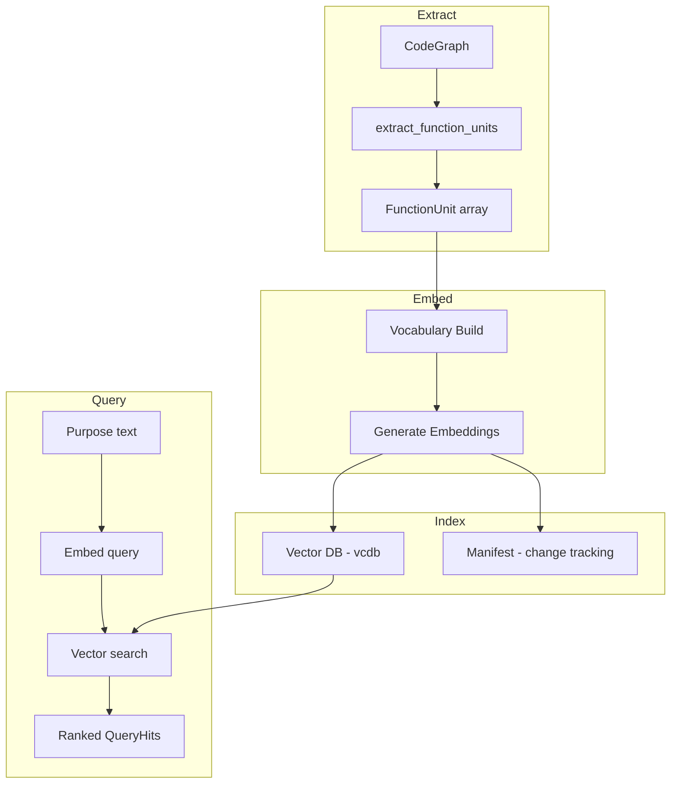

# Digest Pipeline

The Digest pipeline builds a purpose-based function index. Traditional code search works on names and text patterns; Digest lets you search by what a function does. Ask "parse JSON from a file" and get ranked results, even if no function is named `parse_json_from_file`.

## Pipeline overview



## Stage 1: Extract

The extraction stage converts CodeGraph symbols into `FunctionUnit` values -- self-contained representations of each function with enough context for embedding and search.

Each FunctionUnit captures:

| Field | Purpose |
|-------|---------|
| `symbol` | Reference to the SymbolNode (name, kind, namespace, doc) |
| `module_id` | Which module this function belongs to |
| `source_hash` | Hash of function content for change detection |
| `context_hash` | Hash including caller/callee relationships |
| `callers` | Symbol IDs of functions that call this one |
| `callees` | Symbol IDs of functions this one calls |
| `depth` | Position in call graph (0 = leaf, no outgoing calls) |

Extraction is configured through `ExtractConfig`:

- **include_external** -- whether to index functions from external packages (those with no `file` path on their module). Default: false.
- **exclude_kinds** -- symbol kinds to skip. Default: `["param"]`, which filters out function parameters.

The `is_internal_module` check uses the `ModuleNode.file` field presence, following the project convention of never hard-coding organization names.

> Source: `src/digest/extract/extract.mbt`

## Stage 2: Embed

Embedding converts each FunctionUnit into a dense vector that captures its semantic meaning. indexion supports two embedding providers.

### TF-IDF (local)

The default provider. It builds a vocabulary from all functions in the codebase, computes TF-IDF weights, and projects each function into a fixed-dimension dense vector (default: 256 dimensions).


The text for each function is constructed from its name, kind, namespace, and optionally its doc comment and callees (depending on the `EmbeddingSource` setting).

Three embedding source modes exist:

| Mode | Text composition |
|------|-----------------|
| `Raw` | name + kind + ns (+ doc if available) |
| `Impression` | LLM-generated purpose summary + keywords |
| `RawWithContext` | Raw + "calls callee1 callee2 ..." |

TF-IDF has no external dependencies and works offline. Quality is good for finding structurally similar functions within a single project.

### OpenAI (remote)

Uses the `text-embedding-3-small` model (1536 dimensions) for higher-quality semantic embeddings. Requires an `OPENAI_API_KEY` environment variable.

Configuration is centralized in `EmbeddingApiConfig`:

- `api_key` / `api_key_env` -- API authentication
- `base_url` -- endpoint (defaults to OpenAI, but any compatible API works)
- `model` -- embedding model name
- `dim` -- vector dimension

Remote embeddings capture deeper semantic similarity. "Parse a configuration file" and "read settings from disk" will score higher than with TF-IDF.

### Impressions (optional)

When `EmbeddingSource::Impression` is selected and an LLM config is provided, indexion first generates a one-line purpose summary and keywords for each function using an LLM (default: `gpt-4o-mini`). These impressions are then embedded instead of raw function metadata, producing the highest-quality search results.

> Source: `src/digest/index/index.mbt`, `src/digest/config/config.mbt`, `src/digest/embed/`

## Stage 3: Index

Embedding vectors are stored in **vcdb**, indexion's built-in vector database. vcdb supports three indexing strategies:

| Strategy | Characteristics |
|----------|----------------|
| `BruteForce` | Exact nearest-neighbor search. Simple, slow for large datasets. |
| `Hnsw` | Approximate search via hierarchical navigable small world graphs. Default. |
| `Ivf` | Inverted file index. Good for very large datasets. |

Each vector is stored with metadata attributes (function name, kind, module, depth, doc) that power filtered search.

The `DigestManifest` tracks the state of every indexed function: its source hash, context hash, and assigned vector ID. This manifest is the mechanism for incremental updates.

> Source: `src/digest/index/index.mbt`, `src/digest/manifest/manifest.mbt`

## Stage 4: Query

Querying embeds the user's purpose text using the same provider that built the index, then performs a nearest-neighbor search in vcdb.

```
query_by_purpose(index, "parse JSON from file", options)
  -> embed("parse JSON from file")
  -> vcdb.search(query_vector, top_k=10)
  -> filter by min_score, module, kind
  -> Array[QueryHit]
```

Each `QueryHit` contains the matched `FunctionUnit`, a similarity score (0.0--1.0), and matched keywords.

`QueryOptions` controls the search:

- `top_k` -- number of results (default: 10)
- `min_score` -- minimum similarity threshold (default: 0.1)
- `filter_module` -- restrict to functions in modules matching a pattern
- `filter_kind` -- restrict to a specific symbol kind (e.g., "function")

> Source: `src/digest/query/query.mbt`

## Incremental updates via hashing

Digest avoids re-embedding unchanged functions through a two-level hashing scheme:

1. **source_hash** -- hash of the function's own content. Detects direct edits.
2. **context_hash** -- hash of source_hash plus caller and callee IDs. Detects changes to the function's call neighborhood.

When you rebuild the index, the manifest compares current hashes against stored ones. Only functions with changed hashes are re-embedded. Deleted functions are removed from both the manifest and vcdb.

This makes rebuilds fast even on large codebases. A typical incremental rebuild after editing a few files takes seconds, not minutes.

> Source: `src/digest/hash/hash.mbt`, `src/digest/traverse/traverse.mbt`

## CLI integration

The digest pipeline is exposed through two CLI paths:

- `indexion digest build <dir>` -- build or incrementally update the index
- `indexion digest query --purpose="..." <dir>` -- search the index

The `indexion serve` command also exposes the index via HTTP endpoints (`/digest/query`, `/digest/index`) for the DeepWiki frontend.

## See Also

- [Core Concepts](wiki://core-concepts) -- how Digest relates to CodeGraph and KGF
- [Digest Library (src/digest)](wiki://src-digest) -- digest subpackage internals

> Source: `cmd/indexion/digest/cli.mbt`, `cmd/indexion/serve/cli.mbt`
