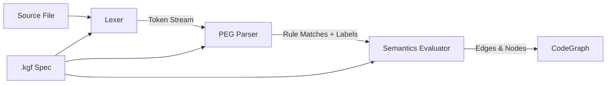

# KGF (Knowledge Graph Framework)

KGF is indexion's unified specification language for programming languages. Rather than writing custom parsers for every language, indexion uses declarative `.kgf` spec files that describe how to tokenize, parse, and extract semantic relationships from source code. A single spec file -- typically 100-300 lines -- is enough to teach indexion a new language. The project ships 63 specs covering programming languages, DSLs, project manifests, natural languages, and even binary format decoders.

## Why KGF Exists

Traditional code analysis tools hard-wire language knowledge into their implementation. Adding a new language means writing thousands of lines of parser code. KGF inverts this: the analysis engine is language-agnostic, and all language-specific knowledge lives in spec files. The engine reads a spec at runtime, constructs a lexer and PEG parser from it, and uses semantic actions to build a knowledge graph. This design means that supporting a new language is a data problem, not a code problem.

## Spec File Structure

Every KGF file begins with a header and is divided into named sections separated by `=== section_name` markers. The parser splits the file by these markers and delegates each section to a specialized sub-parser `[src/kgf/parser/parse_kgf.mbt:76-87]`.

```
kgf 0.6
language: typescript
sources: .ts, .d.ts

=== lex
...token definitions...

=== grammar
...PEG rules...

=== attrs
...attribute annotations...

=== features
...consumer metadata...

=== semantics
...graph construction rules...

=== resolver
...module resolution config...

=== ignore
...file patterns to skip...
```

The header declares the language name and the file extensions it covers. When the registry loads specs, it uses `sources` to build the extension-to-language mapping that drives automatic language detection `[src/kgf/registry/registry.mbt:73-78]`.

### === lex (Lexical Analysis)

The lex section defines token rules using regex patterns. Tokens are matched in declaration order -- first match wins -- so more specific patterns (keywords) must appear before general ones (identifiers). There are two kinds of rules `[src/kgf/parser/parse_lex.mbt:5-15]`:

- **SKIP** rules match text that is consumed but not emitted (whitespace, comments)
- **TOKEN** rules match text and emit a named token into the stream

```kgf
=== lex
SKIP /[ \t]+/
TOKEN NL /\r?\n/
TOKEN KW_fn       /fn\b/
TOKEN Ident       /[a-zA-Z_][a-zA-Z0-9_]*/
TOKEN String      /"([^"\\]|\\.)*"/
TOKEN LBRACE      /\{/
```

Patterns use JavaScript-compatible regular expression syntax with support for character classes, quantifiers, groups, and lookahead. The lexer compiles each pattern once at construction time into a `CompiledPattern` for efficient matching `[src/kgf/lexer/lexer.mbt:17-25]`. Capture groups in patterns can extract sub-matches -- for example, a doc comment pattern `/(\/\/\/(.*))/` captures just the content after the `///` prefix. The special `skip_value` flag on a token makes it act as a marker without carrying text content.

### === grammar (PEG Parsing)

The grammar section defines a Parsing Expression Grammar (PEG). Each rule maps a name to an expression composed of sequences, ordered choices, quantifiers, and labeled captures `[src/kgf/parser/parse_rules.mbt:1-63]`:

```kgf
=== grammar
Module -> ModuleDoc? Item*

Item -> FnDecl
     | StructDecl
     | LetDecl
     | Other

FnDecl -> fn_doc:DocBlock? Visibility? KW_fn fn_id:Ident LPAREN ParamList? RPAREN Body?
```

Labels like `fn_id:Ident` capture the matched token's text into a named variable that semantic actions can reference later. The PEG engine compiles rules into a `PEG` struct containing both an AST representation and a pre-compiled fast-evaluation form with integer IDs for token and rule references `[src/kgf/peg/peg.mbt:1-14]`. For small files, parsing uses a fast recursive evaluator; for large files, it switches to an iterative evaluator to avoid stack overflow `[src/kgf/peg/eval.mbt:66-96]`.

### === attrs (Attribute Annotations)

The attrs section provides shorthand annotations for common patterns. Each line declares what a matched rule represents:

```kgf
=== attrs
on FnDecl:      def fn_id kind=Function doc=fn_doc
on StructDecl:  def struct_id kind=Struct doc=struct_doc
on StructField: def field_id kind=Field doc=field_doc
```

The `def` annotation tells the system that this rule declares a symbol with the given identifier label, kind, and optional documentation label. These are evaluated before the full semantics blocks `[src/kgf/semantics/eval_semantics.mbt:35-47]`.

### === features (Consumer Metadata)

The features section exposes metadata that downstream consumers can query. Each line is a key mapping to a comma-separated list of values:

```kgf
=== features
document_symbol_kinds: Function, Struct, Enum, Type, Trait
coverage_token_kinds: Ident, TypeIdent, PackageRef
reference_token_kinds: INLINE_CODE
```

These inform consumers like documentation coverage analysis which token or symbol kinds are relevant, without hard-coding that knowledge into the analysis engine `[src/kgf/parser/parse_kgf.mbt:215-239]`.

### === semantics (Graph Construction)

The semantics section is where the knowledge graph is actually built. Each `on` block fires when a grammar rule matches and has access to all labeled captures from the parse:

```kgf
=== semantics
on FnDecl {
  let sym_id = concat($file, "::", $fn_id)
  edge declares from $file to sym_id attrs obj("name", $fn_id, "kind", "Function")
}

on StructField when $scope("value", "current_struct") {
  let parent = $scope("value", "current_struct")
  let sym_id = concat(parent, ".", $field_id)
  edge declares from parent to sym_id attrs obj("name", $field_id, "kind", "Field")
}

on ImportDecl {
  edge moduleDependsOn from $file to $resolve($path)
}
```

The semantics DSL supports six statement types `[src/kgf/semantics/eval_stmt.mbt:3-13]`:

| Statement | Purpose |
|-----------|---------|
| `edge kind from X to Y` | Add a typed edge to the graph |
| `bind ns N name K to V` | Set a scoped variable (e.g., current class context) |
| `let var = expr` | Local variable assignment |
| `note type payload expr` | Emit metadata events (e.g., module documentation) |
| `for var in expr { ... }` | Iterate over arrays |
| `module id file expr` | Register a module node |

Built-in functions like `$file` (current file path), `$resolve(path)` (module resolution), `$scope(ns, name)` (scope lookup), and `concat(...)` / `obj(...)` allow specs to construct node IDs and edge attributes without any language-specific code in the engine. The evaluation context (`SemEvalCtx`) maintains a scope stack for nested declarations -- a struct's fields can reference their parent struct through `$scope` `[src/kgf/semantics/context.mbt:75-91]`.

### === resolver (Module Resolution)

The resolver section configures how import paths map to files. It uses a YAML-like syntax `[src/kgf/parser/parse_resolver.mbt:1-57]`:

```kgf
=== resolver
sources: .ts, .tsx
relative_prefixes: ./, ../, /
bare_prefix: npm:
module_path_style: slash
exts: .ts, .tsx, .d.ts, .js
indexes: index.ts, index.js

aliases:
  -
    pattern: ^@/(.*)$
    replace: src/\1

resolve:
  - manifest: package.json @ dependencies
  - ext: .ts, .tsx
  - index: index.ts
  - fallback: npm:
```

The `resolve:` block defines a chain of resolution steps tried in order. The resolver implementation `[src/kgf/resolver/resolver.mbt:16-60]` applies aliases first, handles namespace prefixes, determines whether the import is relative or bare, and then walks the resolve chain. This means language ecosystems with very different module systems (npm, pip, Go modules, MoonBit packages) are all handled by the same engine configured through data.

### === ignore

The ignore section lists glob patterns for files that should be excluded from analysis, similar to `.gitignore` syntax:

```kgf
=== ignore
_build/
target/
*_test.mbt
```

## The Pipeline

The processing pipeline transforms source code into a knowledge graph through three stages:



1. **Lexing**: The `Lexer` struct takes token definitions from the `=== lex` section and transforms source text into a flat array of `Tok` values. Each token carries its kind (e.g., `KW_fn`, `Ident`), matched text, position, and optionally an extracted value. Skip tokens are consumed but not emitted `[src/kgf/lexer/lexer.mbt:30-61]`.

2. **Parsing**: The `PEG` engine takes grammar rules from `=== grammar` and matches them against the token stream. PEG parsing is deterministic -- ordered choice means the first matching alternative wins. When a rule matches, its labeled captures (like `fn_id:Ident`) are collected into a `labels` map. The parser emits events for each successfully matched rule.

3. **Semantic Evaluation**: For each matched rule, `eval_rule_semantics` fires `[src/kgf/semantics/eval_semantics.mbt:35-47]`. It first processes `attrs` annotations, then executes `semantics` blocks. These blocks add edges (`declares`, `calls`, `imports`, `moduleDependsOn`) and nodes to the `CodeGraph`, building the knowledge graph that powers all of indexion's analysis features.

## The Registry

The `KGFRegistry` is the runtime container that loads and indexes all spec files `[src/kgf/registry/registry.mbt:7-14]`. It maintains three maps:

- **specs**: language name to full `KGFSpec` object
- **ext_to_lang**: file extension to language name (e.g., `.ts` -> `typescript`)
- **lang_to_doc_spec**: language to its documentation-specific spec variant (e.g., `typescript` -> `typescript-doc`)

Loading is recursive -- `KGFRegistry::load_from_dir` walks the `kgfs/` directory tree, parses every `.kgf` file, and registers it `[src/kgf/registry/registry.mbt:24-55]`. When indexion encounters a source file, it calls `detect_from_path` which tries filename-based patterns first (e.g., `moon.pkg`), then falls back to extension matching `[src/kgf/registry/registry.mbt:167-190]`.

The registry also aggregates cross-spec information: `get_external_prefixes()` collects all `bare_prefix` values (`npm:`, `pkg:`, `pip:`) so the engine knows which imports are external without hard-coding ecosystem names `[src/kgf/registry/registry.mbt:213-234]`. Similarly, `get_project_markers()` and `get_package_markers()` gather manifest filenames from all specs for project root and package boundary detection `[src/kgf/registry/registry.mbt:241-283]`.

## Supported Languages

The `kgfs/` directory is organized by category:

| Category | Count | Examples |
|----------|-------|---------|
| `programming/` | 25 | C, C++, C#, Dart, Go, Haskell, Java, JavaScript, Kotlin, Lua, MoonBit, OCaml, PHP, Python, Ruby, Rust, Scala, Swift, TypeScript, Zig |
| `project/` | 13 | `package.json`, `Cargo.toml`, `go.mod`, `moon.mod.json`, `pyproject.toml`, `pom.xml` |
| `toy/` | 11 | Base64, JPEG/PNG binary formats, relational text |
| `dsl/` | 9 | CSS, HTML, Markdown, SQL, TOML, `moon.pkg` |
| `natural/` | 4 | English, Japanese, Chinese, Korean |
| `universal.kgf` | 1 | Fallback spec for unknown file types |

In total, 63 spec files cover source code, configuration files, documentation formats, and even binary data. Each programming language spec defines lexer tokens for that language's syntax, grammar rules for its declarations and imports, semantic actions for graph construction, and resolver configuration for its module system.

## Adding a New Language

To add support for a new language, create a `.kgf` file in the appropriate `kgfs/` subdirectory. No engine code changes are required. Here is a minimal template:

```kgf
kgf 0.6
language: mylang
sources: .mylang

=== lex
SKIP /\s+/
TOKEN KW_import  /import\b/
TOKEN KW_fn      /fn\b/
TOKEN Ident      /[a-zA-Z_][a-zA-Z0-9_]*/
TOKEN String     /"([^"\\]|\\.)*"/
TOKEN LBRACE     /\{/
TOKEN RBRACE     /\}/
TOKEN LPAREN     /\(/
TOKEN RPAREN     /\)/
TOKEN SEMI       /;/
TOKEN DOT        /\./

=== grammar
Module -> Item*
Item -> ImportDecl | FnDecl | Other

ImportDecl -> KW_import path:String SEMI?
FnDecl -> KW_fn fn_id:Ident LPAREN RPAREN Body?
Body -> LBRACE BodyContent* RBRACE
BodyContent -> LBRACE BodyContent* RBRACE | Atom
Atom -> Ident | String | KW_fn | KW_import | LPAREN | RPAREN | SEMI | DOT
Other -> Atom

=== attrs
on FnDecl: def fn_id kind=Function

=== semantics
on FnDecl {
  let sym_id = concat($file, "::", $fn_id)
  edge declares from $file to sym_id attrs obj("name", $fn_id, "kind", "Function")
}

on ImportDecl {
  module $path
  edge moduleDependsOn from $file to $resolve($path)
}

=== resolver
relative_prefixes: ./
module_path_style: slash
resolve:
  - ext: .mylang
  - fallback: external:
```

The key steps are:

1. **Define tokens** in the lex section. Put keywords before identifiers. Use SKIP for whitespace and comments.
2. **Write grammar rules** starting from `Module`. Use labeled captures (`fn_id:Ident`) for any value you need in semantic actions.
3. **Add attrs** for declaration shorthand.
4. **Write semantic actions** to emit `declares` edges for definitions and `moduleDependsOn` edges for imports.
5. **Configure the resolver** so import paths can be mapped to files.

Drop the file into `kgfs/programming/` (or `dsl/`, `project/`, etc.) and it will be picked up automatically by the registry on next load. No recompilation needed -- KGF specs are loaded at runtime from the filesystem.

## Architecture Summary

The KGF system achieves language-agnostic code analysis through a clean separation of concerns. The spec files are pure data -- they declare *what* to match and *what graph edges to emit*. The engine code in `src/kgf/` provides the *how*:

- `src/kgf/lexer/` -- regex-based tokenizer
- `src/kgf/peg/` -- PEG parser with recursive and iterative evaluators
- `src/kgf/parser/` -- KGF spec file parser (reads the `.kgf` format itself)
- `src/kgf/semantics/` -- graph construction from parse results
- `src/kgf/resolver/` -- module path resolution
- `src/kgf/registry/` -- spec loading and language detection
- `src/kgf/features/` -- KGF-based feature extraction for downstream consumers

This architecture means that the engine code changes only when new *capabilities* are needed (a new statement type, a new resolution strategy). Adding or improving language support is entirely a matter of editing `.kgf` files.
