# indexion -- Architectural Overview

> "The map is not the territory" -- Alfred Korzybski

## What is indexion?

indexion is a source code exploration, analysis, and documentation tool written
in MoonBit. It builds structured, queryable representations of codebases and
then performs various analyses on top of them -- similarity detection, duplicate
discovery, refactoring planning, documentation coverage auditing, and
implementation-vs-documentation drift detection. The guiding principle is that
these analyses should be **language-agnostic**: rather than hard-coding knowledge
about any particular programming language, indexion delegates all
language-specific concerns to declarative **KGF specification files**
[`README.md:4-5`].

The problem indexion addresses is a familiar one for any engineering team that
maintains a growing codebase across multiple packages, languages, or
repositories. Code duplicates quietly accumulate, documentation falls out of
sync with implementation, and refactoring candidates hide in plain sight because
no one has time to read every file. Traditional linting tools catch local style
issues; indexion operates at a higher level, reasoning about inter-file
relationships, cross-package structure, and semantic similarity
[`README.md:7-12`].

indexion ships as a single native binary with no runtime dependencies. Language
support is provided by a bundled collection of 60+ KGF spec files covering
25 programming languages, 9 DSL/document formats, 4 natural languages, and
13 project-manifest formats. Adding support for a new language or format means
writing a new `.kgf` file -- no recompilation required
[`README.md:278-280`, `kgfs/`].

---

## Core Architecture

The processing pipeline has four major stages. Source files enter through
**file discovery**, pass through **KGF-based parsing** to produce a
**CodeGraph**, and then various **analysis commands** consume the graph to
generate actionable output.

```mermaid
flowchart LR
    subgraph Input
        SRC["Source Files<br/>(*.mbt, *.ts, *.py, ...)"]
        DOCS["Document Files<br/>(*.md, *.toml, ...)"]
        PROJ["Project Manifests<br/>(moon.mod.json,<br/>package.json, ...)"]
    end

    subgraph KGF["KGF Engine"]
        direction TB
        SPEC["KGF Specs<br/>(kgfs/)"]
        REG["Registry<br/>(src/kgf/registry/)"]
        LEX["Lexer<br/>(src/kgf/lexer/)"]
        PEG["PEG Parser<br/>(src/kgf/peg/)"]
        SEM["Semantics<br/>(src/kgf/semantics/)"]
        RES["Resolver<br/>(src/kgf/resolver/)"]
        SPEC --> REG
        REG --> LEX --> PEG --> SEM
        REG --> RES
    end

    subgraph Core["Core Graph"]
        CG["CodeGraph<br/>(modules, symbols,<br/>edges, notes)"]
    end

    subgraph Analysis["Analysis & Commands"]
        direction TB
        EXP["explore<br/>(similarity matrix)"]
        REF["plan refactor<br/>(duplicate detection)"]
        REC["plan reconcile<br/>(doc drift)"]
        SOL["plan solid<br/>(extraction plan)"]
        UNW["plan unwrap<br/>(wrapper removal)"]
        PDOC["plan documentation<br/>(coverage audit)"]
        PREAD["plan readme<br/>(README plans)"]
        PWIKI["plan wiki<br/>(wiki plans)"]
        DOC["doc graph/readme/init/wiki<br/>(doc generation)"]
        GRP["grep<br/>(token search)"]
        SRCH["search<br/>(semantic search)"]
        DIG["digest<br/>(semantic index)"]
        SRV["serve<br/>(HTTP API)"]
        MCPS["mcp<br/>(MCP server)"]
    end

    subgraph Output
        MD["Markdown Reports"]
        JSON["JSON Data"]
        GH["GitHub Issues"]
    end

    SRC --> KGF
    DOCS --> KGF
    PROJ --> KGF
    KGF --> Core
    Core --> Analysis
    Analysis --> Output
```



### Stage 1: File Discovery

The `@pipeline.discover_files` module collects source files from the target
directories. It respects `.gitignore` and `.indexionignore` patterns via the
`@glob` and `@ignorefile` modules. KGF specs themselves declare ignore rules
(for example, the MoonBit spec ignores `_build/`, `.mooncakes/`, and test files
like `*_wbtest.mbt`), so language-specific exclusions are handled declaratively
rather than being hard-coded into the discovery logic
[`kgfs/programming/moonbit.kgf:274-282`].

### Stage 2: KGF Parsing

Each discovered file is matched to a KGF spec via its file extension. The spec
drives a three-phase parse:

1. **Lexing** -- regex-based tokenization producing a typed token stream.
2. **PEG Parsing** -- the grammar section defines a PEG grammar that produces a
   concrete syntax tree with named captures.
3. **Semantic Evaluation** -- the `=== semantics` section contains rules that
   fire on matched grammar nodes to emit graph edges, symbol declarations, and
   documentation notes.

The KGF engine lives under `src/kgf/` and is organized into sub-packages for
each phase: `lexer/`, `peg/`, `parser/`, `semantics/`, `resolver/`, `types/`,
`registry/`, `features/`, `cas/`, and `preprocess/`.

### Stage 3: CodeGraph Construction

The semantic rules produce nodes and edges that are collected into a `CodeGraph`
structure [`src/core/graph/types.mbt`]:

| Component       | Type                          | Purpose                                         |
|-----------------|-------------------------------|-------------------------------------------------|
| `modules`       | `Map[String, ModuleNode]`     | One entry per source file or package             |
| `symbols`       | `Map[String, SymbolNode]`     | Functions, structs, enums, traits, variables     |
| `edges`         | `Array[Edge]`                 | Declares, References, ModuleDependsOn, Calls, etc. |
| `notes`         | `Array[ModuleNote]`           | Module-level documentation, annotations          |

A `ModuleNode` may or may not have a `file` field. Internal modules (files
present in the analyzed directory) have a file path; external dependencies
referenced by import statements do not. This distinction is the canonical way to
separate internal from external code -- no organization names or path prefixes
are hard-coded [`CLAUDE.md` guidelines].

### Stage 4: Analysis Commands

The CodeGraph feeds into multiple independent analysis commands, each exposed
as a subcommand of the `indexion` CLI:

| Command              | What it does                                                     |
|----------------------|------------------------------------------------------------------|
| `explore`            | Pairwise file similarity matrix using configurable strategies    |
| `plan refactor`      | Detects duplicate code blocks and similar functions              |
| `plan solid`         | Plans extraction of shared code into a common package            |
| `plan unwrap`        | Finds trivial wrapper functions that can be inlined              |
| `plan reconcile`     | Detects drift between code symbols and documentation             |
| `plan documentation` | Audits documentation coverage across the codebase                |
| `plan readme`        | Generates README writing plans for packages                      |
| `plan wiki`          | Generates wiki writing/update plans from project analysis        |
| `doc graph`          | Generates dependency graphs in Mermaid format                    |
| `doc readme`         | Generates per-package README files from doc comments             |
| `doc init`           | Initializes documentation template structure                     |
| `doc wiki`           | Converts wiki between indexion format and GitHub/GitLab formats  |
| `grep`               | KGF-aware token pattern search across source files               |
| `search`             | Semantic search across code, wiki, and documentation             |
| `sim`                | Point comparison of two texts with multiple algorithms           |
| `digest`             | Builds a semantic index for purpose-based function lookup        |
| `serve`              | HTTP server for CodeGraph, Digest, and wiki REST API             |
| `mcp`                | MCP server exposing indexion tools to AI assistants              |

Output can be rendered as Markdown, JSON, or GitHub Issue format depending on
the `--format` flag.

---

## Key Concepts

### KGF (Knowledge Graph Framework)

KGF is the declarative specification format that makes indexion language-agnostic.
A single `.kgf` file encodes everything indexion needs to process files of a
given type. Each spec contains several sections delimited by `===` headers
[`kgfs/programming/moonbit.kgf`]:

- **`=== lex`** -- Token definitions as regex patterns. Tokens have names
  (`KW_fn`, `Ident`, `String`, `DocComment`, etc.) and optional modifiers like
  `skip_value` for tokens whose matched text should be discarded.

- **`=== grammar`** -- A PEG grammar built from the token names. Productions
  use named captures (e.g., `fn_id:Ident`) to bind matched tokens to variables
  that later sections can reference.

- **`=== attrs`** -- Attribute declarations that tag grammar nodes with
  metadata. For example, `on FnDecl: def fn_id kind=Function doc=fn_doc`
  tells the engine that a matched `FnDecl` node defines a symbol whose name
  comes from `fn_id`, whose kind is `Function`, and whose documentation comes
  from `fn_doc`.

- **`=== features`** -- Feature metadata used by analysis commands.
  `document_symbol_kinds` tells reconcile which symbol kinds are documentable;
  `coverage_token_kinds` tells it which token types to consider for coverage
  matching.

- **`=== semantics`** -- Imperative-style rules that fire on matched grammar
  nodes to emit CodeGraph edges and notes. The rule language supports `let`
  bindings, `concat`, `edge ... from ... to ... attrs ...`, `note`, and scoped
  variable binding via `bind`/`$scope`.

- **`=== resolver`** -- Module resolution configuration: source file extensions,
  relative path prefixes, bare import prefixes, project config filenames,
  package markers, and fallback resolution rules.

- **`=== ignore`** -- Glob patterns for files that should be excluded from
  analysis (build output, vendored dependencies, test files).

### CodeGraph

The CodeGraph is the central data structure. It is a directed labeled graph
where nodes are either **modules** (files/packages) or **symbols**
(functions, types, traits, variables), and edges represent relationships like
`Declares`, `References`, `ModuleDependsOn`, `Calls`, `Extends`, and
`Implements` [`src/core/graph/types.mbt:32-51`].

The graph is produced entirely by KGF semantic rules -- the core engine has no
language-specific graph construction logic. This means adding a new edge type
for a new language feature only requires updating the relevant `.kgf` file.

### Digest

The digest subsystem (`src/digest/`) enables **purpose-based function lookup**
using semantic indexing. It extracts function-level content hashes and
"impressions" (short natural-language summaries and keyword sets), then builds
an index that can answer queries like "find functions that parse JSON" across
the codebase [`src/digest/types/types.mbt`].

The digest pipeline has several sub-stages:

- **extract** -- Pulls function bodies and signatures from the CodeGraph.
- **hash** -- Computes content hashes for change detection.
- **embed** -- (Optional) Generates vector embeddings via remote providers.
- **index** -- Builds the queryable index.
- **traverse** -- Walks the graph to collect traversal-ordered function lists.

Digest configuration is managed through `.indexion.toml` files discovered
alongside the target directory.

### Plan Commands

The `plan` family of commands produces **actionable reports** rather than
modifying code directly. Each plan command follows the same pattern:

1. Collect files from the target directory.
2. Build a CodeGraph (or use a lighter-weight token stream for similarity).
3. Run the specific analysis.
4. Render a structured report.

This design keeps analysis and action separate. A developer can review the plan,
adjust thresholds, and re-run before committing to any changes.

### Batch Comparison Engine

The `@batch` module (`src/pipeline/comparison/`) is the shared comparison
engine used by `explore`, `plan refactor`, and `plan solid`. It provides
multiple similarity strategies:

| Strategy | Algorithm                              | Best for                        |
|----------|----------------------------------------|---------------------------------|
| `tfidf`  | TF-IDF cosine similarity               | Fast lexical similarity         |
| `apted`  | All-Path Tree Edit Distance            | Structural AST similarity       |
| `tsed`   | Token Sequence Edit Distance           | Token-level structural match    |
| `hybrid` | Dynamic TF-IDF pre-filter + APTED      | Balanced speed and accuracy     |

The `compare_with_prefilter` function combines a fast TF-IDF pass to prune
obviously dissimilar pairs, then applies the more expensive tree-based algorithm
only to candidates above the pre-filter threshold.

---

## Multi-Language Support

indexion currently ships KGF specs in four categories:

**Programming Languages (25 specs)** -- C, C++, C#, Clojure, Dart, Elixir,
Go, Haskell, Java, JavaScript, JavaScript-JSX, Julia, Kotlin, Lua, MoonBit,
OCaml, PHP, Python, Ruby, Rust, Scala, Swift, TypeScript, TypeScript-JSX, Zig.

**DSL and Document Formats (9 specs)** -- CSS, HTML, Markdown, MoonPkg,
npm package.json, Plaintext, SQL, SQL-DDL, TOML.

**Natural Languages (4 specs)** -- Chinese, English, Japanese, Korean. Used
for text segmentation and digest keyword extraction.

**Project Manifest Formats (13 specs)** -- build.gradle.kts, Cargo.toml,
composer.json, .csproj, deno.json, Gemfile, go.mod, moon.mod.json,
package.json, Package.swift, pom.xml, pyproject.toml, vcpkg.json. These let
the resolver understand dependency declarations across ecosystems.

### How KGF Enables Language-Agnostic Analysis

The key architectural insight is that **no analysis command contains
language-specific logic**. Consider the duplicate-detection pipeline in
`plan refactor`:

1. `@pipeline.discover_files` collects files.
2. `@kgf_features.tokenize_files_with_kgf` tokenizes them using whichever
   KGF spec matches each file's extension.
3. `@kgf_features.build_line_func_map` maps line numbers to function names
   using the grammar and attrs sections of the matched spec.
4. `@batch.compare` runs the similarity algorithm on the token streams.
5. The plan renderer formats the results.

At no point does the pipeline check whether it is processing MoonBit, Python,
or Rust. The KGF spec handles all language-specific concerns: what constitutes
a token, how functions are declared, what to ignore. Adding support for a new
language is purely additive -- write a `.kgf` file, drop it in `kgfs/programming/`,
and every analysis command gains support for that language automatically.

The `@kgf_features` module (`src/kgf/features/`) provides the bridge between
raw KGF parsing and the higher-level features that commands need:

- `extract_pub_declarations` -- Extracts public API surface using KGF attrs.
- `build_line_func_map` -- Maps source lines to enclosing function names.
- `tokenize_files_with_kgf` -- Batch-tokenizes files through the registry.
- `load_registry` -- Loads and caches KGF specs with auto-detection.

### The Registry

The `@kgf.registry` module maintains a mapping from file extensions to loaded
KGF specs. When `load_registry` is called, it scans the specs directory,
parses each `.kgf` file, and indexes them by their declared `sources:`
extensions. The registry is the single lookup point that all downstream code
uses to find the right spec for a given file.

The registry search order is configurable [`README.md:303-309`]:

1. Explicit `--specs=DIR` CLI flag.
2. `INDEXION_KGFS_DIR` environment variable.
3. `[global].kgfs_dir` in the global config file.
4. `kgfs/` in the target project directory.
5. `kgfs/` in the current working directory.
6. OS-standard data directory (resolved via `@config`).

---

## Source Layout

```
indexion/
  cmd/indexion/               # CLI entry point and subcommands
    common/                   #   Shared CLI utilities (@common)
    explore/                  #   indexion explore
    plan/{refactor,solid,     #   indexion plan {refactor,solid,
          unwrap,reconcile,   #     unwrap,reconcile,
          documentation,      #     documentation,
          readme,wiki}/       #     readme,wiki}
    doc/{graph,readme,       #   indexion doc {graph,readme,
         init,wiki}/          #     init,wiki}
    digest/ similarity/       #   indexion digest, indexion sim
    grep/ perf/               #   indexion grep, indexion perf
    serve/ segment/ kgf/      #   indexion serve, segment, kgf
    search/ mcp/              #   indexion search, indexion mcp
  src/
    core/graph/               # CodeGraph types and construction
    kgf/                      # KGF engine (lexer, peg, parser,
                              #   semantics, resolver, registry,
                              #   features, types, cas, preprocess,
                              #   manage)
    config/                   # OS paths, app config (@config)
    mcp/                      # MCP protocol server (types,
                              #   transport, server, protocol)
    pipeline/comparison/      # @batch similarity engine
    similarity/               # TF-IDF, APTED, NCD algorithms
    digest/                   # Semantic function index
    search/                   # Semantic search engine
    plan/                     # Plan rendering and templates
    parallel/                 # Fork-based parallelism (native)
    glob/ ignorefile/ filter/ # Pattern matching and filtering
    docgen/                   # Doc generation (types, diagram,
                              #   render, analyze, query, wiki/)
    scope/ text/              # Scope analysis, text utils
    segmentation/ vcs/ http/  # Segmentation, VCS, HTTP client
  kgfs/                       # KGF specification files
    programming/              #   25 programming language specs
    dsl/                      #   9 DSL/document format specs
    natural/                  #   4 natural language specs
    project/                  #   13 project manifest specs
  packages/
    wiki/                     # DeepWiki frontend (React/TypeScript)
    api-client/               # REST API client
    vscode-plugin/            # VS Code extension
```

---

## Design Principles

- **No Hard-Coding** -- Language names, organization names, file paths, magic
  numbers, and pattern prefixes must never be hard-coded. All language-specific
  behavior flows through KGF specs; path decisions use `@config`; thresholds
  are named constants or configuration parameters.

- **Single Source of Truth (SoT)** -- Every shared concern has one canonical
  module: `@common` for CLI utilities, `@config` for OS paths, `@kgf_features`
  for language-aware extraction, `@batch` for similarity comparison. Duplicating
  logic from these modules into commands is prohibited.

- **Dogfooding** -- The project uses indexion on itself. `plan refactor` catches
  new duplicates; `plan reconcile` verifies documentation consistency.

- **Analysis without Mutation** -- Plan commands produce reports, never modify
  source files (except `plan unwrap --fix`). Safe for CI and review workflows.

---

## Getting Started

- **Installation**: See [`README.md:257-298`] for quick-install scripts,
  manual downloads, and building from source.

- **First analysis**: Run `indexion explore --include='*.py' .` to see a
  similarity matrix of Python files in the current directory.

- **Find duplicates**: Run `indexion plan refactor --threshold=0.8 src/` to
  generate a refactoring checklist.

- **Check documentation**: Run `indexion plan reconcile .` to detect drift
  between code and docs.

- **Debug KGF parsing**: Run `indexion kgf tokenize <file>` to see how a
  file is tokenized, or `indexion kgf parse <file>` to see the parse tree.

- **KGF spec reference**: Browse `kgfs/programming/` for examples of how
  language specs are structured.

---

## Further Reading

| Topic                       | Location                                      |
|-----------------------------|-----------------------------------------------|
| CLI command documentation   | `cmd/indexion/*/README.md`                     |
| KGF spec format             | `kgfs/README.md`                              |
| Similarity algorithms       | `src/similarity/README.md`                     |
| Batch comparison engine     | `src/pipeline/README.md`                       |
| Development guidelines      | `CLAUDE.md`                                    |
| License                     | Apache License 2.0                             |
