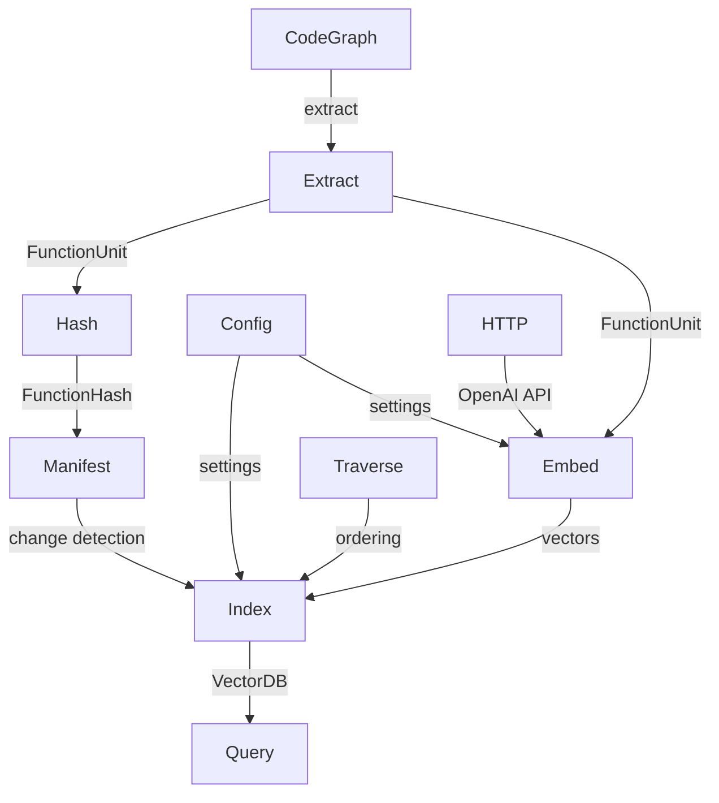

# Digest Pipeline

The digest pipeline builds a **function-level search index** from a codebase's CodeGraph. It extracts individual functions as `FunctionUnit` records, computes content and context hashes for incremental updates, optionally generates LLM-powered "impressions" (summaries + keywords), embeds function text into vectors (TF-IDF or OpenAI), and stores them in a vcdb vector database for semantic search.

The pipeline is split into focused subpackages that follow a clear data flow: extract functions from the graph, hash them for change detection, embed their text into vectors, persist the manifest, and query the index.

## Architecture

## Subpackages

| Subpackage | Purpose |
|-----------|---------|
| `types` | Core data types: `FunctionUnit`, `FunctionHash`, `Impression`, `QueryHit`, `EmbeddingProvider` trait |
| `config` | `DigestConfig` with `LlmConfig`, provider configuration, and vcdb strategy. Embedding provider enums (`EmbeddingProvider`, `EmbeddingSource`, `VcdbStrategy`, etc.) live in `src/embedding/config/` |
| `extract` | Extract `FunctionUnit` records from a `CodeGraph`, with filtering by kind and depth |
| `hash` | Content-addressable hashing for function source and context (callers/callees) |
| `embed` | OpenAI embedding and LLM impression generation (async) |
| `http` | HTTP GET/POST helpers for OpenAI API calls |
| `index` | Central `DigestIndex` that ties everything together: build, query, serialize |
| `manifest` | `DigestManifest` for incremental indexing: tracks file/function hashes and vector IDs |
| `query` | High-level query API: search by keywords or purpose |
| `traverse` | Call-graph traversal: bottom-up/top-down ordering with cycle detection |

## Key Types

| Type | Package | Description |
|------|---------|-------------|
| `FunctionUnit` | types | A single function with symbol info, module ID, hashes, callers/callees, optional impression |
| `FunctionHash` | types | Content-addressable hash for function source or context |
| `FunctionEmbedding` | types | A function's embedding vector with its ID and provider key |
| `Impression` | types | LLM-generated summary + keywords for a function |
| `QueryHit` | types | Search result with function, score, and matched keywords |
| `QueryOptions` | types | Query configuration: top_k, min_score, filter, provider_key |
| `EmbeddingProvider` | types | Trait for embedding text into vectors (`embed`, `dim`, `embed_batch`) |
| `EmbeddingConfig` | types | Configuration for embedding providers (provider_type, dim, endpoint, api_key) |
| `RemoteEmbeddingConfig` | types | Configuration for remote pre-computed embeddings (file path, dimension) |
| `RemoteEmbeddingProvider` | types | Loads and caches pre-computed embeddings from JSONL files |
| `DigestConfig` | config | Full pipeline config: `embedding_source`, `providers`, `vcdb_strategy`, `include_external`, `exclude_kinds`, `index_dir`, `llm_config` |
| `EmbeddingSource` | `embedding/config` | What text to embed (`Raw`, `Impression`, or `RawWithContext`). `pub(all)` enum |
| `EmbeddingProvider` | `embedding/config` | Embedding provider enum (`TfIdf`, `OpenAI`, `Precomputed`). `pub(all)` enum |
| `EmbeddingApiConfig` | `embedding/config` | OpenAI-compatible API configuration. `pub(all)` struct |
| `VcdbStrategy` | `embedding/config` | vcdb indexing strategy (`Hnsw`, `Ivf`, `BruteForce`). `pub(all)` enum |
| `ProviderConfig` | `embedding/config` | Resolved provider with key, kind, dim, and optional API config. `pub(all)` struct |
| `LlmConfig` | config | OpenAI-compatible LLM config: `api_key`, `model`, `system_prompt`, `base_url`, `temperature` |
| `DigestIndex` | index | The main index: holds manifest, vcdb, TF-IDF provider, and function units |
| `DigestManifest` | manifest | Persistent manifest tracking indexed files, functions, and vector IDs |
| `FileEntry` | manifest | Per-file entry with content hash and function IDs |
| `FunctionEntry` | manifest | Per-function entry with hashes, vector IDs, and module info |
| `ExtractConfig` | extract | Extraction settings: include external, min body length, exclude kinds |
| `TraversalResult` | traverse | Ordered function IDs with depth info and detected cycles |

## Public API

### config

#### Constants

| Constant | Description |
|----------|-------------|
| `DEFAULT_INDEX_DIR` | Default index directory (`.indexion/digest`) |
| `DEFAULT_TFIDF_DIM` | Default TF-IDF embedding dimension (256) |
| `OPENAI_EMBEDDING_DIM` | OpenAI embedding dimension (1536) |
| `DEFAULT_API_KEY_ENV` | Environment variable for OpenAI API key |
| `DEFAULT_API_BASE_URL` | Default OpenAI embeddings API URL |
| `DEFAULT_EMBEDDING_MODEL` | Default OpenAI embedding model |
| `DEFAULT_TFIDF_KEY` | Default TF-IDF provider key |
| `INDEX_MANIFEST_FILE` | Manifest file name (`manifest.json`) |
| `INDEX_GRAPH_FILE` | Code graph file name (`graph.json`) |
| `INDEX_LOCK_FILE` | Build lock file name (`build.lock`) |
| `DEFAULT_IMPRESS_MODEL` | Default LLM model for impression generation |
| `DEFAULT_IMPRESS_PROMPT` | Default system prompt for impression generation |

#### Path Functions

| Function | Description |
|----------|-------------|
| `index_path(index_dir, file_name)` | Construct full path by joining index_dir with a file name |
| `manifest_path(index_dir)` | Path to the manifest file within index directory |
| `graph_path(index_dir)` | Path to the code graph within index directory |
| `lock_path(index_dir)` | Path to the build lock file within index directory |
| `vectors_db_path(index_dir, provider_key)` | Path to vector database for a given provider key |
| `vocabulary_json_path(index_dir, provider_key)` | Path to vocabulary file for a given provider key (TF-IDF) |
| `compute_index_file_names(provider_keys)` | Compute list of all index file names for given provider keys |
| `default_exclude_kinds()` | Get default symbol kinds to exclude from indexing |

#### DigestConfig

| Function | Description |
|----------|-------------|
| `DigestConfig::default()` | Create default config with TF-IDF embedding |
| `DigestConfig::openai(api_key)` | Create config with TF-IDF + OpenAI dual providers |
| `DigestConfig::with_impressions(api_key)` | Create config with impression-based embedding and LLM |
| `DigestConfig::from_provider(provider)` | Construct from a resolved EmbeddingProvider enum |
| `DigestConfig::with_llm(llm_config)` | Set LLM configuration |
| `DigestConfig::with_impress_prompt(prompt)` | Set impression system prompt |
| `DigestConfig::with_impress_model(model)` | Set impression model name |
| `DigestConfig::with_index_dir(dir)` | Set index directory |
| `DigestConfig::with_exclude_kinds(kinds)` | Set symbol kinds to exclude |
| `DigestConfig::first_of_kind(kind)` | Find first provider matching a kind string |
| `DigestConfig::get_provider(key)` | Find provider by key string |
| `DigestConfig::provider_keys()` | Get ordered list of provider keys |
| `DigestConfig::uses_impressions()` | Check if embedding source is Impression |
| `DigestConfig::to_extract_config()` | Convert to ExtractConfig for the extract subpackage |
| `DigestConfig::get_embedding_text(unit)` | Get text for embedding from FunctionUnit based on embedding source |

#### LlmConfig

| Function | Description |
|----------|-------------|
| `LlmConfig::openai(api_key)` | Create default OpenAI LLM config |
| `LlmConfig::with_prompt(api_key, prompt)` | Create with custom system prompt |
| `LlmConfig::with_model(api_key, model)` | Create with custom model name |

### types

#### FunctionUnit / FunctionHash / Impression

| Function | Description |
|----------|-------------|
| `FunctionUnit::new(symbol, module_id, source_hash, context_hash, callers, callees, depth)` | Create a new function unit |
| `FunctionUnit::with_impression(impression)` | Attach an impression to a function unit |
| `FunctionUnit::is_leaf()` | Check if function has no callees |
| `FunctionUnit::id()` | Get unique function ID |
| `FunctionUnit::name()` | Get function display name |
| `FunctionHash::from_string(s)` | Create hash from string |
| `FunctionHash::to_string()` | Convert hash to string |
| `Impression::new(summary, keywords, context?)` | Create impression with summary and keywords |
| `Impression::from_summary(summary)` | Create impression from summary only |
| `Impression::to_text()` | Convert impression to searchable text |
| `FunctionEmbedding::new(id, vector, provider_key)` | Create a function embedding record |

#### QueryHit / QueryOptions

| Function | Description |
|----------|-------------|
| `QueryHit::new(unit, score, keywords)` | Create a query hit result |
| `QueryOptions::default()` | Create default query options |
| `QueryOptions::with_top_k(k)` | Create options with specific top-k |

#### EmbeddingConfig

| Function | Description |
|----------|-------------|
| `EmbeddingConfig::tfidf(dim)` | Create TF-IDF embedding config |
| `EmbeddingConfig::remote(endpoint, dim, api_key?)` | Create remote embedding config |
| `EmbeddingConfig::default()` | Default TF-IDF config with 256 dimensions |

#### RemoteEmbeddingProvider

| Function | Description |
|----------|-------------|
| `RemoteEmbeddingConfig::default()` | Create default config for OpenAI text-embedding-3-small |
| `RemoteEmbeddingProvider::new(config)` | Create a new remote embedding provider |
| `RemoteEmbeddingProvider::load_from_file(content)` | Load embeddings from JSONL content; returns count loaded |
| `RemoteEmbeddingProvider::get(id)` | Get pre-computed embedding by ID |
| `RemoteEmbeddingProvider::dim()` | Get embedding dimension |
| `RemoteEmbeddingProvider::has(id)` | Check if embedding exists for ID |
| `RemoteEmbeddingProvider::cached_ids()` | Get all cached embedding IDs |

### extract

| Function | Description |
|----------|-------------|
| `extract_function_units(graph, config)` | Extract all matching functions from a CodeGraph |
| `extract_leaf_functions(graph, config)` | Extract only leaf functions (no callees) |
| `extract_functions_at_depth(graph, config, depth)` | Extract functions at a specific call depth |
| `get_max_depth(units)` | Get the maximum depth among function units |

### hash

| Function | Description |
|----------|-------------|
| `compute_source_hash(source)` | Hash function body text |
| `compute_context_hash(source_hash, callers, callees)` | Hash function context (callers + callees) |
| `compute_impression_hash(impression)` | Hash an impression for change detection |
| `combine_hashes(hashes)` | Combine multiple hashes into one |

### index

| Function | Description |
|----------|-------------|
| `DigestIndex::new(config)` | Create a new index with given config |
| `DigestIndex::with_config(digest_config)` | Create from a full DigestConfig |
| `DigestIndex::build(graph, extract_config)` | Build index from graph (TF-IDF, synchronous) |
| `DigestIndex::build_native(graph, extract_config, api_key)` | Build with OpenAI embeddings (async, native) |
| `DigestIndex::query(query, top_k)` | Query the index with TF-IDF |
| `DigestIndex::serialize()` | Serialize to (manifest_json, vcdb_bytes) |
| `DigestIndex::from_manifest(manifest, bytes)` | Restore from serialized data |

### embed

| Function | Description |
|----------|-------------|
| `generate_impressions(api_key, units)` | Generate LLM impressions for function units |
| `get_embeddings(config, texts)` | Get OpenAI embeddings for text batch |

### query

| Function | Description |
|----------|-------------|
| `query_by_keywords(index, keywords, options)` | Search by keyword string |
| `query_by_purpose(index, purpose, options)` | Search by natural language purpose description |
| `format_results(hits)` | Format query hits as readable text |

### manifest

| Constant/Function | Description |
|----------|-------------|
| `MANIFEST_VERSION` | Current manifest schema version (4) |
| `DigestManifest::new(spec_hash, providers)` | Create a new manifest with KGF spec hash and provider metadata registry |
| `DigestManifest::allocate_vector_id(provider_key)` | Allocate next vector ID for a provider, returns (updated manifest, id) |
| `DigestManifest::provider_keys()` | Get list of provider keys |
| `DigestManifest::provider_description()` | Get human-readable provider description |
| `DigestManifest::is_function_valid(id, source_hash, context_hash)` | Check if function entry is still valid (hashes match) |
| `DigestManifest::get_function(id)` | Get function entry by ID |
| `DigestManifest::update_function(entry)` | Insert or update a function entry |
| `DigestManifest::remove_function(id)` | Remove a function entry |
| `DigestManifest::get_function_ids()` | Get all function IDs in the manifest |
| `DigestManifest::get_stale_functions(units)` | Find functions whose hashes have changed |
| `DigestManifest::get_deleted_functions(current_ids)` | Find functions in manifest not in current ID list |
| `DigestManifest::remove_deleted_functions(ids)` | Remove deleted functions, returns freed vector IDs per provider |
| `DigestManifest::is_file_unchanged(path, hash)` | Check if a file's content hash is unchanged |
| `DigestManifest::update_file(path, hash, function_ids)` | Update file entry with new hash and function list |
| `DigestManifest::to_json_string()` | Serialize manifest to JSON |
| `DigestManifest::from_json_string(json_str)` | Deserialize manifest from JSON (returns `None` on error) |
| `FunctionEntry::from_unit(unit, vector_ids)` | Create function entry from a FunctionUnit and vector ID map |

### traverse

| Function | Description |
|----------|-------------|
| `compute_bottom_up_order(graph, ids)` | Compute leaf-first traversal order |
| `compute_top_down_order(graph, ids)` | Compute root-first traversal order |
| `traverse_bottom_up(units, callback)` | Iterate units in bottom-up order |
| `traverse_top_down(units, callback)` | Iterate units in top-down order |

## Dependencies

| Subpackage | Key Dependencies |
|-----------|-----------------|
| types | `@core/graph`, `@json` |
| config | `digest/types`, `digest/extract` |
| extract | `@core/graph`, `digest/types`, `digest/hash` |
| hash | `digest/types`, `@kgf/cas` |
| embed | `digest/http`, `digest/types`, `digest/config` |
| http | `mizchi/x/http` |
| index | `digest/*` (all subpackages), `@text/tfidf`, `@text/tokenizer`, `@text/embed`, `trkbt10/vcdb` |
| manifest | `digest/types`, `@kgf/cas/types`, `@json` |
| query | `digest/index`, `digest/types` |
| traverse | `@core/graph`, `digest/types` |

## See Also

- [Digest Pipeline](wiki://digest-pipeline) -- user-facing guide to building and querying the index
- [Core Concepts](wiki://core-concepts) -- how Digest fits into the overall architecture

> Source: `src/digest/`
