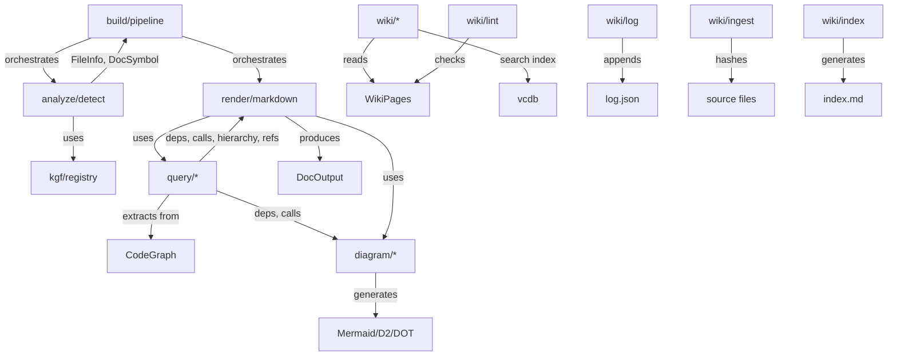

# Document Generation

The `docgen` package generates API documentation from source code using KGF-based analysis. It analyzes source files to detect languages and extract symbols, queries the CodeGraph for dependencies/calls/type hierarchies, renders output as Markdown or JSON, and generates dependency diagrams in multiple formats (Mermaid, D2, DOT, text). It also includes a wiki subsystem for reading and searching `.indexion/wiki/` pages.

## Architecture

## Subpackages

| Subpackage | Purpose |
|-----------|---------|
| `types` | Shared data types: `ComponentDoc`, `TokenGroup`, `TokenInfo` |
| `analyze` | Language detection and symbol extraction from source files |
| `query` | Graph queries: declarations, dependencies, call graphs, type hierarchies, references |
| `diagram` | Diagram generation: Mermaid, D2, DOT, text renderers from `GraphJSON` |
| `render` | Markdown/JSON output rendering with configurable sections |
| `build` | Pipeline orchestration: file analysis, graph merging, output generation |
| `wiki/types` | Backend-agnostic wiki data model: `WikiPage`, `WikiSourceRef`, `WikiHeading`, `WikiNavItem`, `WikiNav`, `WikiData`, `ManifestPage`, `WikiManifest` |
| `wiki/reader` | Wiki page loader: reads `.indexion/wiki/` into `WikiData` |
| `wiki/log` | Append-only operation audit trail: `WikiLog`, `WikiLogEntry`, stored in `log.json` |
| `wiki/lint` | Structural integrity checks: broken links, orphans, stale sources, empty pages |
| `wiki/ingest` | Source change detection using content hashes; produces `IngestTask` lists |
| `wiki/index` | Wiki index generation: category catalog, hub pages, recent changes |
| `wiki/search` | Semantic search index over wiki sections via TF-IDF vectors |
| `wiki/interop` | Format conversion between indexion, GitHub, and GitLab wiki formats |

## Key Types

| Type | Package | Description |
|------|---------|-------------|
| `DocConfig` | build | Pipeline input: files, KGF specs, render options, root path |
| `DocOutput` | render | Generated output: API reference, diagrams, call graph, hierarchy, cross-refs |
| `RenderOptions` | render | What to include: diagrams, deps, calls, hierarchy, refs, format |
| `OutputFormat` | render | `Markdown` or `Json` |
| `AnalysisResult` | analyze | Collected files, graph, symbols, and module docs |
| `DocSymbol` | analyze | A documented symbol with id, name, kind, doc, parent, file, children |
| `FileInfo` | analyze | Detected file metadata: path, language, extension, spec name |
| `DetectedLang` | analyze | Language enum: TypeScript, JavaScript, Python, MoonBit, Go, Rust, etc. |
| `GraphJSON` | diagram | Portable graph representation with nodes, edges, metadata |
| `GraphNode` / `GraphEdge` | diagram | Node (id, label, kind, file) and edge (from, to, kind) |
| `CallInfo` | query | Caller-callee pair with source file |
| `ModuleDep` | query | Module dependency with optional via and dep_kind |
| `SymbolDecl` | query | Symbol declaration: id, name, kind, module, doc |
| `SymbolRef` | query | Symbol reference: symbol, ref_site, ref_kind |
| `TypeRelation` | query | Parent-child type relationship |
| `CircularDep` | query | Circular dependency between two modules |
| `WikiPage` | wiki/types | A wiki page with content, sources, headings, children, parent |
| `WikiSourceRef` | wiki/types | Source file reference with optional line range. Custom `ToJson` serializes `file` and optional `start_line`/`end_line` |
| `WikiHeading` | wiki/types | A heading extracted from markdown content for ToC |
| `WikiNavItem` | wiki/types | Navigation tree item with id, title, children |
| `WikiNav` | wiki/types | Navigation tree wrapper containing page items |
| `WikiData` | wiki/types | Wiki data ready for serving: nav, pages, index_content |
| `ManifestPage` | wiki/types | Manifest entry: id, title, file, sources, children, provenance, last_actor. Supports `ToJson` and custom `FromJson` with graceful null/missing field handling |
| `WikiManifest` | wiki/types | Root of `wiki.json`: title + pages array. Supports `ToJson` and custom `FromJson` |
| `WikiFormat` | wiki/interop | Wiki storage format enum: Indexion, GitHub, GitLab, Unknown |
| `WikiBackendSpec` | wiki/interop | Loaded KGF spec context shared across wiki backends |
| `WikiBackendConfig` | wiki/interop | Backend configuration for the generic load/export pipeline |
| `WikiSection` | wiki/search | A searchable section extracted from a wiki page |
| `WikiSearchIndex` | wiki/search | Vector-backed search index over wiki sections |
| `WikiSearchHit` | wiki/search | Search result with section and score |
| `WikiLog` | wiki/log | Audit log with load/append/save/tail API |
| `WikiLogEntry` | wiki/log | One log entry: timestamp, operation, actor, summary, affected_pages |
| `LintSeverity` | wiki/lint | Severity level enum: Error, Warning, Info |
| `LintIssue` | wiki/lint | A single lint issue with severity, check, page_id, message, suggestion |
| `LintReport` | wiki/lint | Collection of lint findings; converts to `PlanDocument` |
| `SourceChange` | wiki/ingest | A single source file change with file, change_type, hashes |
| `IngestTask` | wiki/ingest | Per-page update task: page_id, action, reason, changed_sources |
| `PageSourceState` | wiki/ingest | Per-page source state: page_hash + source_hashes |
| `IngestManifest` | wiki/ingest | Full ingest manifest persisted between runs |
| `IngestResult` | wiki/ingest | Changed pages + tasks; saves updated hash manifest |
| `IndexCategory` | wiki/index | A category grouping pages by their source directory |
| `HubPage` | wiki/index | A hub page with page_id, title, incoming_link_count |
| `WikiIndex` | wiki/index | Category catalog + hub pages; renders to Markdown |

## Public API

### build (pipeline)

| Function | Description |
|----------|-------------|
| `build(config)` | Full pipeline: analyze files, build graph, render output |
| `build_with_graph(config)` | Same as `build` but also returns the CodeGraph |
| `build_markdown(files, specs)` | Quick Markdown generation from files and KGF specs |
| `build_json(files, specs)` | Quick JSON generation |
| `quick_build(files, specs)` | Quick DocOutput with default options |
| `merge_graphs(graphs)` | Merge multiple CodeGraphs into one |

### analyze

| Function | Description |
|----------|-------------|
| `analyze_file(path, content)` | Detect language and extract file metadata |
| `analyze_file_with_registry(registry, path, content)` | Same, using KGF registry for detection |
| `detect_language(path, content)` | Detect programming language from path/content |
| `extract_extension(path)` | Extract file extension |

### query

| Function | Description |
|----------|-------------|
| `extract_module_deps(graph)` | Extract all module dependencies |
| `extract_call_graph(graph)` | Extract all caller-callee relationships |
| `extract_type_hierarchy(graph)` | Extract type inheritance/implementation |
| `extract_circular_deps(graph)` | Detect circular dependencies |
| `extract_declarations(graph)` | Extract all symbol declarations |
| `extract_references(graph)` | Extract all symbol references |
| `get_callers(graph, symbol)` / `get_callees(graph, symbol)` | Get direct callers/callees |
| `get_call_chain(graph, symbol, max_depth?)` | Transitive call chain |
| `get_transitive_deps(graph, module)` | Transitive module dependencies |

### diagram

| Function | Description |
|----------|-------------|
| `generate_dep_diagram(deps, title?)` | Mermaid dependency diagram |
| `generate_dep_diagram_with_circular(deps, circulars, ...)` | With circular dep highlighting |
| `generate_call_diagram(calls, title?, focus?)` | Mermaid call graph diagram |
| `generate_hierarchy_diagram(relations, title?)` | Mermaid type hierarchy |
| `build_graph_from_deps(deps, ...)` | Build portable GraphJSON from deps |
| `render_mermaid(graph)` / `render_d2(graph)` / `render_dot(graph)` / `render_text(graph)` | Multi-format rendering |

### wiki/types

| Function | Description |
|----------|-------------|
| `WikiPage::new(...)` | Construct a wiki page with content and metadata |
| `WikiSourceRef::new(file~, start_line?, end_line?)` | Construct a source file reference |
| `WikiHeading::new(level~, text~, anchor~)` | Construct a heading for ToC |
| `WikiNavItem::new(id~, title~, children?)` | Construct a navigation tree item |
| `WikiNav::new(pages?)` | Construct a navigation tree wrapper |
| `WikiData::new(nav~, pages~, index_content?)` | Construct wiki data for serving |
| `ManifestPage::new(...)` | Construct a manifest page entry |
| `ManifestPage::with_updates(self, sources?, children?, provenance?, last_actor?)` | Create an updated copy with selected fields replaced |
| `WikiManifest::new(title~, pages~)` | Construct a wiki manifest |
| `wiki_log_path(dir)` | Construct full path to the wiki log file |
| `wiki_manifest_path(dir)` | Construct full path to the wiki manifest |
| `WIKI_MANIFEST_FILE` | Wiki manifest file name constant (SoT) |
| `WIKI_LOG_FILE` | Wiki log file name constant (SoT) |

### wiki/reader

| Function | Description |
|----------|-------------|
| `load_wiki(wiki_dir, registry?)` | Load all wiki pages from a directory into `WikiData` |
| `extract_headings(content, path?, registry?)` | Extract headings from markdown content for ToC |

### wiki/log

| Function | Description |
|----------|-------------|
| `WikiLog::new()` | Construct an empty wiki log |
| `WikiLog::load(wiki_dir)` | Load `log.json`; returns empty log if file doesn't exist |
| `WikiLog::append(self, entry)` | Append a `WikiLogEntry` to the in-memory log |
| `WikiLog::save(self, wiki_dir)` | Persist log to `log.json` |
| `WikiLog::tail(self, n)` | Return the last N entries |
| `WikiLog::length(self)` | Get total number of entries |
| `WikiLog::to_display(self)` | Render the full log as human-readable text |
| `WikiLogEntry::new(...)` | Construct a log entry with timestamp, operation, actor, summary |
| `WikiLogEntry::to_display(self)` | Render a single log entry as a human-readable line |

### wiki/lint

| Function | Description |
|----------|-------------|
| `lint(wiki, wiki_dir~)` | Run all 6 structural checks; returns `LintReport` |
| `LintReport::new(total_pages~)` | Construct an empty lint report |
| `LintReport::add(self, issue)` | Append a `LintIssue` to the report |
| `LintReport::error_count(self)` | Count issues with Error severity |
| `LintReport::warning_count(self)` | Count issues with Warning severity |
| `LintReport::to_plan_document(self)` | Convert findings to `@plan_types.PlanDocument` for rendering |
| `LintSeverity::to_string(self)` | Convert severity to lowercase string: "error", "warning", "info" |
| `LintSeverity::priority(self)` | Numeric priority: Error=1, Warning=2, Info=3 |

### wiki/ingest

| Function | Description |
|----------|-------------|
| `analyze(wiki, wiki_dir)` | Hash sources, compare to manifest, produce `IngestResult` |
| `save_manifest(manifest, wiki_dir)` | Write updated hash manifest to `ingest-manifest.json` |
| `load_manifest(wiki_dir)` | Load previous hash manifest |
| `tasks_to_plan_document(tasks)` | Convert `IngestTask` list to `@plan_types.PlanDocument` |
| `INGEST_MANIFEST_FILE` | Ingest manifest file name constant (SoT) |

### wiki/index

| Function | Description |
|----------|-------------|
| `build_index(wiki, log?)` | Build `WikiIndex` from wiki data and optional log |
| `WikiIndex::to_markdown()` | Render index as Markdown string |

### wiki/search

| Function | Description |
|----------|-------------|
| `build_search_index(pages, provider, registry?)` | Build vector search index over wiki sections |
| `WikiSearchIndex::search(self, query, top_k?, min_score?)` | Semantic search over wiki |
| `WikiSearchIndex::update_page(self, page_id, page_title, content, path?, registry?)` | Update a single page's sections in the index |
| `WikiSearchIndex::save(self, wiki_dir)` | Persist search index to disk |
| `WikiSearchIndex::load(wiki_dir)` | Load a persisted search index from wiki_dir |
| `extract_sections(page_id, page_title, content, path?, registry?)` | Extract searchable sections from page content |

### wiki/interop

| Function | Description |
|----------|-------------|
| `load_wiki_spec(spec_name)` | Load a named KGF wiki spec (e.g., "github-wiki") |
| `detect_wiki_spec(dir)` | Detect which KGF wiki spec matches a directory |
| `detect_wiki_format(dir)` | Detect wiki format (Indexion, GitHub, GitLab, Unknown) from directory contents |
| `load_wiki_auto(wiki_dir, registry?)` | Load wiki from directory, auto-detecting format |
| `load_external_wiki(wiki_dir, config)` | Generic load for any external wiki backend |
| `export_external_wiki(data, config)` | Generic export for any external wiki backend |
| `load_github_wiki(wiki_dir)` | Load a GitHub wiki directory into `WikiData` |
| `export_github_wiki(data)` | Export `WikiData` to GitHub wiki format |
| `load_gitlab_wiki(wiki_dir)` | Load a GitLab wiki directory into `WikiData` |
| `export_gitlab_wiki(data)` | Export `WikiData` to GitLab wiki format |
| `generate_manifest_json(data, title)` | Generate `wiki.json` manifest content from `WikiData` |
| `title_to_slug(title, lowercase?)` | Generic slug: lowercase, spaces to hyphens, strip invalid chars |
| `slug_to_id(slug)` | Convert slug to lowercase ID |
| `slug_to_title(slug)` | Convert slug to display title (capitalize after hyphens) |
| `embed_sources_comment(sources)` | Embed sources as an HTML comment |
| `extract_sources_kgf(content, spec)` | Extract META_COMMENT tokens containing sources metadata |
| `parse_source_strings(sources)` | Parse source reference strings into `WikiSourceRef` |
| `convert_wikilinks_to_internal(content, ...)` | Convert `[[wiki links]]` to `wiki://` links using KGF parse events |
| `convert_internal_to_wikilinks(content, id_to_name, id_to_title)` | Convert `wiki://` links to `[[wiki links]]` |
| `parse_sidebar_kgf(content, ...)` | Parse a sidebar file using KGF parse events |
| `build_tree_from_entries(entries)` | Build navigation tree from `(level, id, title)` entries |
| `find_children_for(id, items)` | Find child IDs for a given page in the nav tree |
| `find_parent_in_nav(id, items)` | Find parent page ID in the nav tree |
| `find_root_id(nav)` | Get the root page ID from navigation |
| `collect_pages_in_nav_order(items, pages, result)` | Collect pages in navigation traversal order |
| `list_md_files(dir, special_files)` | List `.md` files in a directory (flat, without extension) |
| `list_md_files_recursive(dir, special_files)` | List `.md` files recursively (for nested directory wikis) |
| `render_sidebar_wikilinks(nav, ...)` | Render WikiNav as sidebar content with `[[wiki links]]` |
| `apply_replacements(content, replacements)` | Apply positional text replacements to a string |
| `chars_to_string(chars, start, end)` | Convert a char array slice to a string |
| `find_char_in_string(s, target)` | Find first occurrence of a character in a string |
| `count_leading_spaces(s)` | Count leading space characters in a string |
| `strip_md_ext(filename)` | Strip `.md` extension from a filename |

### Document Structure (`src/document/structure/`)

The document structure module provides KGF-based document section extraction, heading detection, and document interpretation. It is used by the wiki reader, wiki search, spec align, and spec draft modules.

#### Types

| Type | Description |
|------|-------------|
| `Heading` | A document heading: marker text, heading text, line number, optional level |
| `DocumentSection` | A section of a document: marker, title, line range, content, optional level |
| `DocumentFact` | An interpreted fact: kind string + JSON payload map |
| `DocumentTablePair` | A label-literal pair extracted from document tables |
| `InterpretedDocument` | Collection of `DocumentFact` entries from semantic evaluation |

#### Functions

| Function | Description |
|----------|-------------|
| `load_document_sections(content, path, registry)` | Load sections from document content using KGF registry for language detection |
| `extract_headings(tokens, spec?, source?, path?)` | Extract headings from tokenized content with optional level inference |
| `extract_document_sections(tokens, content, spec?, path?)` | Extract full document sections with content from tokenized input |
| `interpret_document(content, path, spec)` | Run full semantic evaluation on a document, producing `InterpretedDocument` facts |
| `section_refs_for_line(interpreted, line)` | Get section references for a specific line from interpreted document |
| `literals_for_line(interpreted, line)` | Get literal values for a specific line |
| `table_pairs_for_line(interpreted, line)` | Get table pairs for a specific line |
| `json_int_field(payload, key)` | Extract an integer from a fact payload |
| `json_string_array_field(payload, key)` | Extract a string array from a fact payload |

## Dependencies

| Subpackage | Key Dependencies |
|-----------|-----------------|
| types | (none) |
| analyze | `@config`, `@core/graph`, `@kgf/registry` |
| query | `@core/graph` |
| diagram | `@core/graph`, `docgen/query` |
| render | `@core/graph`, `docgen/query`, `docgen/diagram` |
| build | `@core/graph`, `docgen/analyze`, `docgen/render`, `@kgf/*` |
| wiki/reader | `@fs`, `@config`, `@common` |
| wiki/log | `@fs`, `@wiki_types` |
| wiki/lint | `@fs`, `@wiki_types` |
| wiki/ingest | `@fs`, `@cas_hash`, `@wiki_types` |
| wiki/index | `@wiki_types`, `@wiki_log` |
| wiki/search | `@text/embed`, `@digest/config`, `@digest/embed`, `@vcdb`, `@wiki_types` |
| wiki/interop | `@fs`, `@wiki_types` |

> Source: `src/docgen/`

## Wiki Subsystem

The wiki subsystem (`src/docgen/wiki/`) implements the full lifecycle for the `.indexion/wiki/` knowledge base. It is designed around the principle that the wiki is an LLM-maintained artifact: tools detect what needs to change, agents do the rewriting.

### Data Model (`wiki/types`)

`ManifestPage` is the manifest entry. It carries two provenance fields inspired by Graphify's edge classification:

- `provenance : String?` -- `"extracted"` (generated from source), `"synthesized"` (inferred by LLM), or `"manual"` (human-written)
- `last_actor : String?` -- `"indexion"`, `"agent:<name>"`, or `"user"`

These fields are optional (backward-compatible with older manifests) and are recorded automatically by `wiki pages add` and `wiki pages update`.

### Change Detection (`wiki/ingest`)

`ingest.analyze()` implements Karpathy's "Ingest" operation. It:

1. Reads `wiki.json` to build a page→source mapping
2. Loads `.indexion/wiki/ingest-manifest.json` (previous hash state)
3. Computes `@cas_hash.compute_hash(content).value` for each referenced source file
4. Compares current hashes against previous; generates `IngestTask` for each changed page
5. Returns `IngestResult` with tasks and updated manifest (caller decides whether to persist)

The `--dry-run` flag prevents `save_manifest()` from being called, making the command safe for read-only inspection.

### Structural Integrity (`wiki/lint`)

`lint.lint()` runs six checks that require no external services:

| Check | What it detects |
|-------|----------------|
| Broken links | `wiki://page-id` references to non-existent pages |
| Orphan pages | Pages unreachable from navigation tree or any `wiki://` link |
| Missing cross-references | Pages sharing source files that don't link to each other |
| Stale sources | `sources` paths that no longer exist on disk |
| Empty pages | Pages with fewer than 50 non-whitespace characters |
| Manifest-file mismatch | Entries in `wiki.json` with no `.md` file, or `.md` files with no manifest entry |

Results are rendered via `@plan_render` as Markdown, JSON, or GitHub Issues.

### Navigation Index (`wiki/index`)

`index.build_index()` generates the wiki's entry point for LLM navigation. It categorizes pages by their top-level source directory (the first path component before `/` in each page's `sources` list), counts incoming `wiki://` links to identify hub pages (Graphify "God Nodes"), and includes the most recent log entries. The resulting `index.md` should be the first file an LLM reads when navigating the wiki.

### Audit Trail (`wiki/log`)

`WikiLog` is an append-only log stored in `.indexion/wiki/log.json`. Every wiki-modifying command appends an entry with a millisecond-precision `UInt64` timestamp (from `@env.now()`), operation name, actor, human-readable summary, and list of affected page IDs. The log enables `wiki/index` to show recent changes and lets agents verify their own previous operations.
