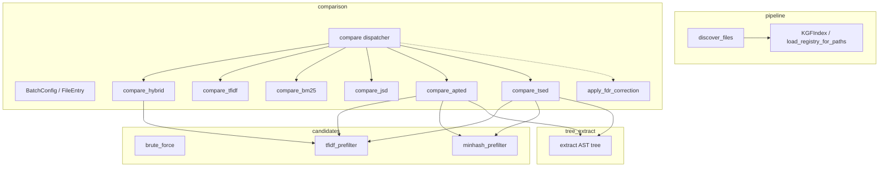

# src/pipeline -- File Discovery & Batch Comparison Engine

The pipeline package provides the two foundational stages shared by every CLI command: **file discovery** (walking directories, applying ignore rules, selecting KGF specs) and **batch comparison** (computing pairwise similarity between files using multiple strategies).

File discovery collects paths from input directories, respects `.gitignore` / `.indexionignore`, and builds a `KGFIndex` so that only KGF specs relevant to the discovered file extensions are loaded. Batch comparison takes an array of `FileEntry` values and dispatches to one of six strategies (hybrid, tfidf, bm25, jsd, apted, tsed) depending on `BatchConfig`. An optional FDR correction step filters statistically significant matches.

## Architecture

## Key Types

| Type | Location | Description |
|------|----------|-------------|
| `DiscoverOptions` | `discover.mbt` | Configuration for file discovery. Fields: `recursive`, `includes`, `excludes`, `include_hidden`, `kgf_ignore` (pattern/language pairs), `root_dir` |
| `SupportedFile` | `discover.mbt` | A discovered file (`pub(all)`) with `path`, `content`, `language`, and `content_type` metadata |
| `KGFIndex` | `select.mbt` | Index mapping source patterns to KGF file paths for selective loading |
| `FileEntry` | `comparison/types.mbt` | A file with `display_name` and `content` for comparison |
| `SimilarityMatch` | `comparison/types.mbt` | Result of a pairwise comparison with file indices and score |
| `BatchConfig` | `comparison/types.mbt` | Configuration for comparison strategy and threshold |
| `BatchResult` | `comparison/types.mbt` | Collection of similarity matches from a batch comparison run |

## Public API

### File Discovery (`pipeline/`)

| Function | Description |
|----------|-------------|
| `discover_files(paths, options)` | Collect all file paths from given input paths, applying filters |
| `DiscoverOptions::default()` | Create default discover options |
| `DiscoverOptions::new(root_dir~, ...)` | Create discover options with named parameters |
| `root_dir_from_paths(paths)` | Derive root_dir from a list of target paths (SoT) |
| `load_supported_file_info(file_paths, registry)` | Load `SupportedFile` metadata from an explicit path list (archive-aware) |
| `collect_supported_file_info(paths, options, registry)` | Discover files and load supported file info in one call |
| `build_filter_from_root(root_dir)` | Build a `FilterConfig` from `.gitignore` / `.indexionignore` at root |
| `should_skip_dir(entry)` | Check if a directory should be skipped (hidden, build artifacts) |
| `trim_trailing_slash(path)` | Remove trailing `/` from a path |
| `extract_basename(path)` | Extract file basename from path |
| `extract_extension(path)` | Extract file extension (with dot) from path |
| `matches_pattern(text, pattern)` | Shared glob pattern matching |

### KGF Selection (`pipeline/`)

| Function | Description |
|----------|-------------|
| `build_kgf_index(specs_dir)` | Build KGF index by reading only headers from all KGF files |
| `build_path_signals(file_paths)` | Build matching signals (extensions, basenames) from file paths |
| `load_registry_from_index(index, signals)` | Load registry from index, only parsing matching KGF files |
| `load_registry_for_paths(specs_dir, file_paths)` | Convenience: build index + signals + load registry in one call |
| `collect_supported_files(paths, registry)` | Collect files supported by the loaded registry |
| `spec_matches_signals(spec, signals)` | Check if a spec matches the discovered signals |

### Batch Comparison (`comparison/`)

| Function | Description |
|----------|-------------|
| `compare(files, config)` | Strategy dispatcher -- delegates to hybrid/tfidf/bm25/jsd/apted/tsed |
| `compare_hybrid(files, threshold)` | Dynamic hybrid: BM25 pre-filter then APTED for candidates |
| `compare_tfidf(files, threshold)` | TF-IDF vocabulary similarity |
| `compare_bm25(files, threshold)` | BM25 similarity with document length normalization and term frequency saturation |
| `compare_jsd(files, threshold)` | Jensen-Shannon Divergence between token probability distributions |
| `compare_with_prefilter(files, threshold, score_fn)` | Pre-filter (brute-force / TF-IDF / MinHash+LSH by size) with custom scoring function |
| `compare_apted(files, threshold)` | APTED tree-edit-distance structural similarity |
| `compare_tsed(files, threshold)` | Token sequence edit distance similarity |
| `filter_cross_directory(matches)` | Filter matches to only cross-directory pairs |

### Candidates (`comparison/candidates/`)

| Function | Description |
|----------|-------------|
| `brute_force(n)` | Generate all pairs for n items |
| `tfidf_prefilter(files, registry, prefilter_threshold)` | TF-IDF inverted-index pre-filter to reduce candidate pairs |
| `minhash_prefilter(files, registry, prefilter_threshold)` | MinHash+LSH pre-filter for near-linear candidate generation on large sets |
| `normalize_pairs(raw)` | Normalize pair indices (smaller first) |
| `pair_key(i, j)` | Generate a string key for a pair |

### Tree Extract (`comparison/tree_extract/`)

| Function | Description |
|----------|-------------|
| `extract(display_name, content, registry)` | Convert source file content into APTED trees (one per function) |

### FDR Correction (`comparison/fdr.mbt`)

| Function | Description |
|----------|-------------|
| `apply_fdr_correction(matches, alpha, total_pairs, threshold?)` | Benjamini-Hochberg FDR correction on raw similarity matches |
| `BatchResult::apply_fdr(alpha, threshold?)` | Apply FDR correction to a `BatchResult`, returning filtered result |

## Dependencies

| Package | Alias | Purpose |
|---------|-------|---------|
| `src/filter` | `@filter` | File filtering configuration |
| `src/config` | `@config` | Path utilities, project root detection |
| `src/vcs/git` | `@vcs_git` | Git-aware file operations |
| `src/glob` | `@glob` | Glob pattern matching |
| `src/kgf/parser` | `@kgf_parser` | KGF spec file parsing |
| `src/kgf/registry` | `@registry` | KGF registry for language detection |
| `src/kgf/types` | `@kgf_types` | KGF type definitions |
| `src/text/tfidf` | `@tfidf` | TF-IDF / BM25 / JSD computation (comparison) |
| `src/text/minhash` | `@minhash` | MinHash+LSH candidate generation (candidates) |
| `src/kgf/features` | `@kgf_features` | Public declaration extraction (comparison) |
| `src/similarity/apted` | `@apted` | APTED tree edit distance (comparison) |
| `moonbitlang/core/math` | `@math` | Exponential function for FDR p-value computation |

> Source: `src/pipeline/`
