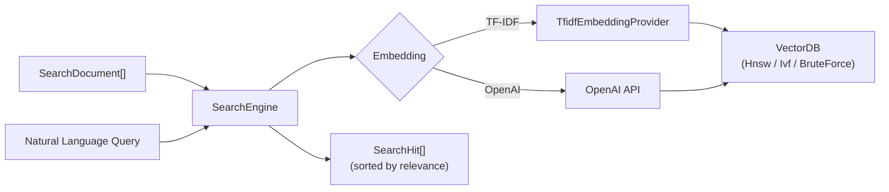

# Semantic Search (src/search)

The search module provides a domain-agnostic semantic search engine backed by vcdb (vector database). It supports multiple embedding strategies (TF-IDF and OpenAI) and is used by the `search` CLI command, wiki search, and the `serve` REST API.

## Architecture

## Key Types

### SearchDocument

A domain-agnostic corpus entry. Any consumer (code search, wiki search, digest) creates `SearchDocument` instances from their own data:

| Field | Type | Description |
|-------|------|-------------|
| `id` | `String` | Unique identifier (e.g., `"file:line"`) |
| `text` | `String` | Content to embed |
| `title` | `String` | Display name (function name, section heading) |
| `source` | `String` | Source file path |
| `line` | `Int` | Line number (0 for document-level) |
| `kind` | `String` | Entry type (`"fn"`, `"section"`, `"page"`) |
| `attrs` | `Map[String, String]` | Custom attributes for filtering (`node_type`, `language`, `module`, etc.) |

### SearchHit

A search result with a relevance score (0.0--1.0).

### SearchEngine

The sole owner of a vcdb instance. Manages document storage, embedding, and querying.

## Key Functions

| Function | Description |
|----------|-------------|
| `SearchEngine::create()` | Creates a new vcdb-backed engine (SoT for vcdb construction) |
| `SearchEngine::build()` | Convenience: builds engine from documents with specified embedding |
| `SearchEngine::search()` | Natural language search (OpenAI if configured, TF-IDF fallback) |
| `SearchEngine::search_vector()` | Raw vector search with optional attribute filter |
| `SearchEngine::add()` | Adds document with pre-computed vector |
| `SearchEngine::serialize()` / `from_bytes()` | Persistence |
| `inline_search()` | One-shot lightweight search without persistent index |

## Embedding Strategies

### TF-IDF (default)

Builds vocabulary in-memory, computes TF-IDF vectors, measures cosine similarity. Fast and requires no external API. Dimension: 256 by default.

### OpenAI

Sends text to the OpenAI embeddings API in batches of 100. More accurate for natural language queries. Dimension: 1536 by default.

## Inline Search

`inline_search()` provides a fast one-shot search that builds and discards a TF-IDF index in-memory. Used by `grep --semantic=similar:QUERY` for ad-hoc similarity queries without a persistent index.

## Integration

- **CLI:** `indexion search "query" src/` uses `SearchEngine` to search code and docs.
- **serve:** The `/api/wiki/search` and `/api/digest/query` endpoints use the search engine.
- **MCP:** Tools registered in the MCP server can query via `SearchEngine`.

> Source: `src/search/types.mbt`, `src/search/engine.mbt`, `src/search/inline.mbt`
