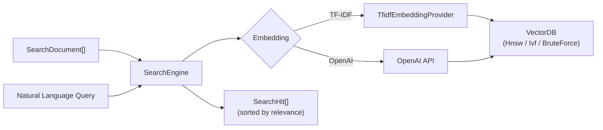

# Semantic Search (src/search)

The search module provides a domain-agnostic semantic search engine backed by vcdb (vector database). It supports multiple embedding strategies (TF-IDF and OpenAI) and is used by the `search` CLI command, wiki search, and the `serve` REST API.

## Architecture

## Key Types

### SearchDocument

A domain-agnostic corpus entry. Any consumer (code search, wiki search, digest) creates `SearchDocument` instances from their own data:

| Field | Type | Description |
|-------|------|-------------|
| `id` | `String` | Unique identifier (e.g., `"file:line"`) |
| `text` | `String` | Content to embed |
| `title` | `String` | Display name (function name, section heading) |
| `source` | `String` | Source file path |
| `line` | `Int` | Line number (0 for document-level) |
| `kind` | `String` | Entry type (`"fn"`, `"section"`, `"page"`) |
| `attrs` | `Map[String, String]` | Custom attributes for filtering (`node_type`, `language`, `module`, etc.) |

### SearchHit

A search result with a relevance score (0.0--1.0).

### SearchEngine

The sole owner of a vcdb instance. Manages document storage, embedding, and querying.

## Public API

### SearchEngine Core

| Function | Description |
|----------|-------------|
| `SearchEngine::create(dim?, strategy?)` | Create a new vcdb-backed engine with optional dimension and strategy |
| `SearchEngine::from_bytes(data)` | Deserialize engine from bytes |
| `SearchEngine::with_tfidf(provider)` | Attach a TF-IDF vocabulary for serialization by consumers |
| `SearchEngine::tfidf_provider()` | Return the attached TF-IDF vocabulary, if any |
| `SearchEngine::with_id_map(id_map)` | Set the vector ID to document ID mapping for a loaded engine |
| `SearchEngine::with_documents(documents)` | Set the documents map for a loaded engine |
| `SearchEngine::with_openai(config)` | Attach OpenAI embedding API config |
| `SearchEngine::add(doc, vector, vid)` | Add a document with a pre-computed vector |
| `SearchEngine::add_raw(vid, vector, attrs)` | Add a vector with raw vcdb attrs (digest, wiki callers manage attrs) |
| `SearchEngine::remove(vid)` | Remove a vector by vcdb vector ID |
| `SearchEngine::size()` | Get the vcdb database size |
| `SearchEngine::dim()` | Get the vcdb embedding dimension |
| `SearchEngine::serialize()` | Serialize the vcdb database to bytes |
| `SearchEngine::search_vector(vector, top_k, filter?)` | Search by raw vector with optional filter expression |
| `SearchEngine::resolve_hits(raw_hits, min_score)` | Resolve raw vcdb hits to SearchHits with score filtering |
| `SearchEngine::build(documents, provider?)` | Async: build engine from documents with specified embedding provider |
| `SearchEngine::search(query, top_k?, min_score?, filter?)` | Async: natural language search (OpenAI if configured, TF-IDF fallback) |

### Embedding Utilities

| Function | Description |
|----------|-------------|
| `embed_texts(provider, texts, tfidf)` | Async: embed a batch of texts using the given provider (TF-IDF or OpenAI) |
| `provider_dim(provider)` | Extract the embedding dimension from a provider enum |
| `empty_attrs()` | Create empty vcdb attrs |

### Convenience

| Function | Description |
|----------|-------------|
| `build_index(documents, provider)` | Async: build a SearchEngine from documents with a provider |
| `search_index(engine, query, provider, top_k, min_score, filter?)` | Async: search a pre-built index with natural language query |
| `inline_search(documents, query, top_k, dim?)` | One-shot lightweight TF-IDF search without persistent index |

## Embedding Strategies

### TF-IDF (default)

Builds vocabulary in-memory, computes TF-IDF vectors, measures cosine similarity. Fast and requires no external API. Dimension: 256 by default.

### OpenAI

Sends text to the OpenAI embeddings API in batches of 100. More accurate for natural language queries. Dimension: 1536 by default.

## Inline Search

`inline_search()` provides a fast one-shot search that builds and discards a TF-IDF index in-memory. Used by `grep --semantic=similar:QUERY` for ad-hoc similarity queries without a persistent index.

## Integration

- **CLI:** `indexion search "query" src/` uses `SearchEngine` to search code and docs.
- **serve:** The `/api/wiki/search` and `/api/digest/query` endpoints use the search engine.
- **MCP:** Tools registered in the MCP server can query via `SearchEngine`.

> Source: `src/search/types.mbt`, `src/search/engine.mbt`, `src/search/inline.mbt`
