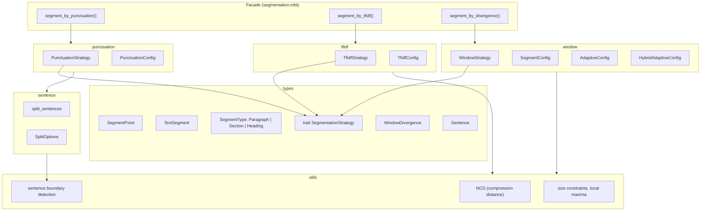

# src/segmentation -- Text Chunk Segmentation

The segmentation package splits text into semantically meaningful chunks for downstream processing (RAG pipelines, embedding, documentation analysis). It provides multiple segmentation strategies that implement a common `SegmentationStrategy` trait, allowing callers to swap strategies without changing their code.

Three primary strategies are available: **punctuation** (split at sentence-ending punctuation), **TF-IDF** (split where vocabulary shifts between sliding windows), and **window** (split at divergence peaks using NCD and/or TF-IDF similarity between adjacent windows). Each strategy supports configuration for target/min/max chunk sizes.

## Architecture

## Key Types

| Type | Subpackage | Description |
|------|------------|-------------|
| `Sentence` | `types` | A sentence with text, start, and end offsets |
| `SegmentPoint` | `types` | A segment boundary with start/end character offsets and segment type |
| `TextSegment` | `types` | A segment with extracted text, offsets, type, and optional heading |
| `SegmentType` | `types` | Enum: `Paragraph`, `Section`, `Heading` |
| `SegmentationStrategy` | `types` | Trait with `name()` and `segment(text)` methods |
| `WindowDivergence` | `types` | Divergence calculation result: values and positions arrays |
| `PunctuationConfig` | `punctuation` | Config: target/min/max chunk sizes |
| `PunctuationStrategy` | `punctuation` | Strategy implementation for punctuation-based segmentation |
| `TfidfConfig` | `tfidf` | Config: target/min/max chunk sizes, TF-IDF threshold, window size |
| `TfidfStrategy` | `tfidf` | Strategy implementation for TF-IDF divergence segmentation |
| `SegmentConfig` | `window` | Config: target/min/max chunk sizes, threshold, window size |
| `AdaptiveConfig` | `window` | Config: percentile-based adaptive thresholding |
| `HybridAdaptiveConfig` | `window` | Config: combined NCD + TF-IDF with configurable weights |
| `WindowStrategy` | `window` | Strategy implementation for window divergence segmentation |
| `SplitOptions` | `sentence` | Options for sentence splitting (quote safety, brackets, max length) |
| `FindBoundariesOptions` | `utils` | Options for sentence boundary detection |
| `QuoteStackEntry` | `utils` | Tracking entry for nested quotes during boundary detection |

## Public API

### Facade (`segmentation.mbt`)

| Function | Description |
|----------|-------------|
| `segment_by_punctuation(text, config)` | Segment text using punctuation strategy |
| `segment_by_tfidf(text, config)` | Segment text using TF-IDF divergence |
| `segment_by_divergence(text, config)` | Segment text using window divergence |
| `to_text_segments(points, text)` | Convert `SegmentPoint` array to `TextSegment` array |
| `new_segment_point(start, end, segment_type)` | Create a new `SegmentPoint` |
| `default_punctuation_config()` | Default punctuation config |
| `default_tfidf_config()` | Default TF-IDF config |
| `default_window_config()` | Default window config |

### Types (`types/types.mbt`)

| Function | Description |
|----------|-------------|
| `extract_substring(text, start, end)` | Extract substring by character offsets |
| `segment_points_to_text_segments(points, text)` | Batch convert segment points to text segments |
| `SegmentPoint::to_text_segment(self, text)` | Convert a single segment point to a text segment |

### Punctuation Segmentation

| Symbol | Description |
|--------|-------------|
| `segment_by_punctuation(text, config)` | Segment text using punctuation strategy |
| `segment(text)` | Segment with default punctuation config |
| `default_target_chunk_size` | Default target chunk size constant (500) |
| `default_min_chunk_size` | Default minimum chunk size constant (100) |
| `default_max_chunk_size` | Default maximum chunk size constant (2000) |

### TF-IDF Segmentation

| Symbol | Description |
|--------|-------------|
| `segment_by_tfidf(text, config)` | Segment text using TF-IDF divergence |
| `segment(text)` | Segment with default TF-IDF config |
| `calculate_window_tfidf_divergence(sentences, window_size)` | Calculate TF-IDF divergence between sentence windows |
| `default_target_chunk_size` | Default target chunk size constant (500) |
| `default_min_chunk_size` | Default minimum chunk size constant (100) |
| `default_max_chunk_size` | Default maximum chunk size constant (2000) |
| `default_tfidf_threshold` | Default TF-IDF threshold constant (0.45) |
| `default_window_size` | Default window size constant (3) |

### Window Segmentation

| Function | Description |
|----------|-------------|
| `segment(text)` | Segment with default window config |
| `segment_by_divergence(text, config)` | Segment using NCD-based window divergence |
| `segment_adaptive(text, config)` | Segment with adaptive thresholding |
| `segment_hybrid_adaptive(text, config)` | Segment with hybrid NCD + TF-IDF |
| `default_config()` | Create default window segment config |
| `default_adaptive_config()` | Create default adaptive config |
| `default_hybrid_adaptive_config()` | Create default hybrid adaptive config |
| `calculate_window_tfidf_divergence(sentences, window_size)` | Calculate TF-IDF divergence between windows |
| `calculate_window_ncd_tfidf_divergence(sentences, window_size, config)` | Calculate hybrid NCD + TF-IDF divergence |
| `min_max_normalize(values)` | Min-max normalize an array of values |
| `find_local_maxima(values, threshold)` | Find local maxima above a threshold |

### Sentence Splitting

| Symbol | Description |
|--------|-------------|
| `split_sentences(text)` | Split text into sentences with default options |
| `split_sentences_with_options(text, options)` | Split with custom options |
| `split_sentences_text(text)` | Split and return text strings only |
| `split_sentences_text_with_options(text, options)` | Split returning text strings with custom options |
| `count_sentences(text)` | Count sentences in text |
| `count_sentences_with_options(text, options)` | Count sentences with custom options |
| `default_quote_safe_max_length` | Default max length for quote-safe splitting (240) |

### Utilities

#### Compression & Normalization (`utils/compression_distance.mbt`)

| Function | Description |
|----------|-------------|
| `compress(text)` | LZ77-based text compression |
| `compressed_size(text)` | Get compressed size of text |
| `ncd(a, b)` | Normalized Compression Distance between two texts |
| `calculate_adjacent_ncd(texts)` | NCD between adjacent text segments |
| `min_max_normalize(values)` | Min-max normalize an array of values to [0, 1] |
| `robust_normalize(values)` | Percentile-based robust normalization (outlier-resistant) |
| `reciprocal_rank_fusion(rankings, k)` | Reciprocal rank fusion of multiple ranking arrays |

#### Sentence Boundary Detection (`utils/sentence_boundary.mbt`)

| Function | Description |
|----------|-------------|
| `find_sentence_boundaries(text, options)` | Find sentence boundary positions with options |
| `find_sentence_boundaries_default(text)` | Find sentence boundary positions with default options |
| `find_next_boundary(text, from_pos, options)` | Find next sentence boundary from a position |
| `find_next_boundary_default(text, from_pos)` | Find next boundary with default options |
| `is_at_boundary(text, pos)` | Check if a position is at a sentence boundary |
| `is_sentence_terminator(c)` | Check if character is a sentence terminator (`.`, `!`, `?`, etc.) |
| `is_trailing_punctuation(c)` | Check if character is trailing punctuation (`"`, `)`, etc.) |
| `is_extended_terminator(c)` | Check if character is an extended terminator (CJK punctuation, etc.) |
| `update_quote_stack(stack, char, pos)` | Update quote tracking stack with a new character |
| `build_quote_stack_until(text, pos)` | Build quote stack from text start up to a position |
| `is_inside_protected_quote(stack, pos, max_len)` | Check if position is inside a protected quote region |

#### Common Segmentation Helpers (`utils/common.mbt`)

| Function | Description |
|----------|-------------|
| `apply_size_constraints(text_len, boundaries, sentences, target, min, max)` | Merge/split segments to respect size constraints |
| `find_local_maxima(values, threshold)` | Find local maxima above a threshold |
| `is_whitespace_only(s)` | Check if a string contains only whitespace |
| `find_nearest_sentence_end(sentences, pos)` | Find the nearest sentence end position |
| `boundaries_to_segment_points(boundaries, text_len)` | Convert boundary positions to segment points |
| `handle_few_sentences(text, sentences, target, min, max)` | Handle segmentation edge case with few sentences |
| `combine_sentences(sentences, from, to)` | Combine consecutive sentences into a single string |
| `get_window_end(sentences, start, window_size)` | Get character end position for a sentence window |

#### Utility Types & Constants (`utils/types.mbt`)

| Symbol | Description |
|--------|-------------|
| `FindBoundariesOptions` | Options for sentence boundary detection |
| `FindBoundariesOptions::new()` | Create default boundary options |
| `FindBoundariesOptions::create(brackets, japanese, max_len)` | Create boundary options with all parameters |
| `QuoteStackEntry` | Tracking entry for nested quotes during boundary detection |
| `QuoteStackEntry::new(open, start)` | Create a new quote stack entry |
| `default_quote_safe_max_length` | Default max length for quote-safe boundary detection (240) |

## Dependencies

| Package | Alias | Purpose |
|---------|-------|---------|
| `segmentation/types` | `@types` | Shared type definitions and trait |
| `segmentation/punctuation` | `@punctuation` | Punctuation strategy |
| `segmentation/tfidf` | `@tfidf` | TF-IDF strategy |
| `segmentation/window` | `@window` | Window divergence strategy |

The subpackages are self-contained with no external dependencies beyond the standard library.

> Source: `src/segmentation/`
