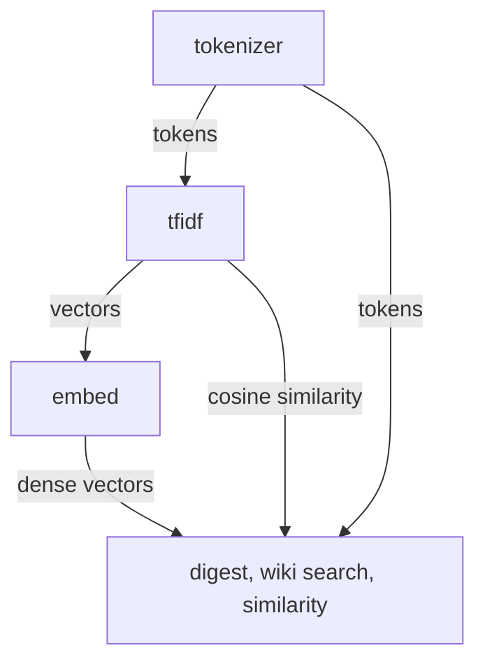

# Text Processing

The `text` package provides text tokenization, TF-IDF vector computation, and TF-IDF-based embedding for use across indexion's similarity analysis, search indexing, and digest pipelines. It is organized into three subpackages that form a layered text processing stack.

## Architecture

## Subpackages

| Subpackage | Purpose |
|-----------|---------|
| `tokenizer` | Text normalization and tokenization for TF-IDF |
| `tfidf` | TF-IDF vector computation, cosine similarity, and batch operations |
| `embed` | TF-IDF embedding provider that converts text to dense fixed-dimension vectors |

## Key Types

| Type | Package | Description |
|------|---------|-------------|
| `TfidfVector` | tfidf | Sparse TF-IDF vector as `Map[String, Double]` with get/set/iter |
| `TfidfBatch` | tfidf | Pre-computed TF-IDF vectors for a document collection with batch similarity queries |
| `BM25Batch` | tfidf | Pre-computed BM25 vectors with term frequency saturation and document length normalization |
| `JSDBatch` | tfidf | Batch Jensen-Shannon Divergence computation for information-theoretic distribution comparison |
| `TfidfBatchBuildStats` | tfidf | Statistics from batch build: document count, total tokens, vocabulary size |
| `TfidfPairSearchStats` | tfidf | Statistics from pair search: posting hits, candidates, evaluations, output pairs |
| `TfidfEmbeddingProvider` | embed | Builds vocabulary from corpus and projects text into fixed-dimension dense vectors |

## Public API

### tokenizer

| Function | Description |
|----------|-------------|
| `tokenize_for_tfidf(text)` | Tokenize text for TF-IDF: normalize, split into words, return token array |
| `normalize_text(text)` | Normalize text: lowercase, strip punctuation |
| `extract_word_tokens(text)` | Extract word-level tokens from text |
| `extract_character_bigrams(text)` | Extract character bigram tokens (e.g., for CJK text) |

### tfidf

#### TfidfVector

| Function | Description |
|----------|-------------|
| `TfidfVector::new()` | Create an empty sparse vector |
| `TfidfVector::from_terms(terms)` | Create from a `Map[String, Double]` |
| `TfidfVector::get(term)` | Get the weight for a term (0.0 if absent) |
| `TfidfVector::set(term, value)` | Set the weight for a term |
| `TfidfVector::length()` | Number of non-zero terms |
| `TfidfVector::is_empty()` | Check if the vector has no terms |
| `TfidfVector::iter()` | Iterate over `(term, weight)` pairs |

#### Core TF-IDF

| Function | Description |
|----------|-------------|
| `build_term_frequency(tokens)` | Count term occurrences in a single document |
| `build_document_frequency(token_arrays)` | Count how many documents contain each term |
| `build_tfidf_vector(tokens, df, doc_count)` | Build a TF-IDF vector for a single document |
| `cosine_similarity(v1, v2)` | Cosine similarity between two TF-IDF vectors |
| `cosine_distance(v1, v2)` | Cosine distance (1 - similarity) |
| `calculate_tfidf_distance_from_tokens(t1, t2)` | End-to-end distance from raw token arrays |
| `calculate_adjacent_tfidf_distance_from_tokenized(docs)` | Distance between consecutive document pairs |
| `TfidfBatch::from_tokens(token_arrays)` | Build batch from pre-tokenized documents |
| `TfidfBatch::length()` | Get the number of documents in the batch |
| `TfidfBatch::build_stats()` | Get aggregate build statistics (doc count, tokens, vocabulary size) |
| `TfidfBatch::similarity(i, j)` | Pairwise similarity between indexed documents |
| `TfidfBatch::all_pairs_above_threshold(threshold)` | Find all document pairs above a similarity threshold |
| `TfidfBatch::all_pairs_above_threshold_with_stats(threshold)` | Same, with performance statistics |
| `sqrt(x)` | Square root utility used in cosine calculations |

#### BM25

| Function | Description |
|----------|-------------|
| `build_bm25_vector(tokens, df, total_docs, avg_doc_length)` | Build a BM25-weighted sparse vector with term frequency saturation and document length normalization |
| `BM25Batch::from_tokens(token_arrays)` | Build BM25 batch from pre-tokenized documents |
| `BM25Batch::length()` | Get the number of documents in the batch |
| `BM25Batch::similarity(i, j)` | Pairwise BM25 cosine similarity between indexed documents |
| `BM25Batch::all_pairs_above_threshold(threshold)` | Find all document pairs above a similarity threshold |

#### Jensen-Shannon Divergence

| Function | Description |
|----------|-------------|
| `jensen_shannon_divergence(tf_a, tf_b)` | Calculate JSD between two term frequency maps, normalized to [0, 1] |
| `jsd_from_tokens(tokens_a, tokens_b)` | Calculate JSD between two token arrays (builds term frequencies internally) |
| `jsd_similarity(tokens_a, tokens_b)` | Convert JSD to similarity score (1 - divergence) |
| `JSDBatch::from_tokens(token_arrays)` | Build JSD batch from pre-tokenized documents |
| `JSDBatch::length()` | Get the number of documents in the batch |
| `JSDBatch::similarity(i, j)` | Pairwise JSD similarity between indexed documents |
| `JSDBatch::all_pairs_above_threshold(threshold)` | Find all document pairs above a similarity threshold |

### embed

| Function | Description |
|----------|-------------|
| `TfidfEmbeddingProvider::new(dim)` | Create provider with target vector dimension |
| `TfidfEmbeddingProvider::build_vocabulary(texts)` | Build vocabulary from corpus, selecting top `dim` terms by document frequency |
| `TfidfEmbeddingProvider::embed(text)` | Generate L2-normalized dense vector for text |
| `TfidfEmbeddingProvider::dim()` | Get embedding dimension |
| `TfidfEmbeddingProvider::has_vocabulary()` | Check if vocabulary has been built |
| `TfidfEmbeddingProvider::to_json_string()` | Serialize vocabulary and IDF to JSON string for persistence |
| `TfidfEmbeddingProvider::load_from_json_string(json_str)` | Restore vocabulary and IDF from JSON string; returns true on success |
| `cosine_similarity_dense(a, b)` | Cosine similarity between two dense vectors |

## Dependencies

| Subpackage | Key Dependencies |
|-----------|-----------------|
| tokenizer | (none) |
| tfidf | `moonbitlang/core/math` |
| embed | `text/tfidf`, `text/tokenizer` |

> Source: `src/text/`
