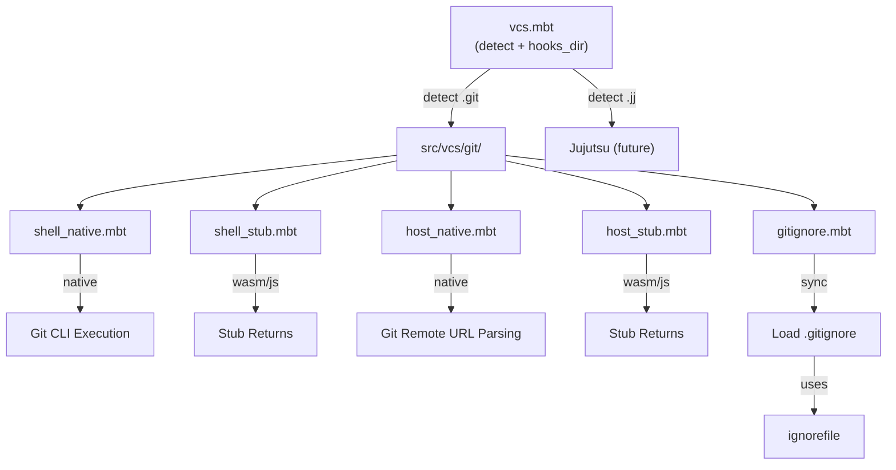

# VCS / Version Control Operations

The `src/vcs/` package tree provides VCS detection and repository interaction. It has two levels:

- **`src/vcs/`** — VCS-agnostic detection and hooks-directory resolution (the SoT for "where are this repo's hooks?")
- **`src/vcs/git/`** — Git-specific operations: querying status, loading `.gitignore`, resolving remote host URLs, checking file modification times

Like the platform package, the git sub-package uses target-conditional compilation with native implementations backed by async process execution and stub fallbacks for non-native targets.

## Architecture

## `src/vcs/` — VCS Abstraction (SoT)

`vcs.mbt` is the Single Source of Truth for VCS detection and hooks-directory resolution. Adding a new VCS (e.g., Mercurial) requires only adding one entry to the `vcs_root_markers` table and one entry to the `vcs_hooks_subdirs` table — no callers change.

### Public API

| Function | Description |
|----------|-------------|
| `detect(start_dir)` | Walk up from `start_dir`; return `(VCS, repo_root)?` for the first recognized VCS marker |
| `hooks_dir(vcs, root)` | Return the hooks directory for the given VCS and root, e.g. `<root>/.git/hooks` for Git |

### `VCS` Enum

| Variant | Marker file | Hooks directory |
|---------|------------|-----------------|
| `Git` | `.git` | `<root>/.git/hooks/` |
| `Jujutsu` | `.jj` | `<root>/.jj/repo/hooks/` |

Detection walks ancestor directories using a lookup table (`vcs_root_markers`), so the order of precedence is deterministic and configurable without touching any caller.

## `src/vcs/git/` — Git Operations

### Public API

| Function | Async | Description |
|----------|-------|-------------|
| `is_repo(dir)` | Yes | Check if a directory is inside a Git repository |
| `repo_root(anchor)` | Yes | Return the repository root containing `anchor` (via `git rev-parse --show-toplevel`) |
| `status_dirty(repo_dir, file)` | Yes | Check if a specific file has uncommitted changes |
| `last_commit_seconds(repo_dir, file)` | Yes | Get Unix timestamp of last commit touching a file |
| `head_commit(root, short?)` | Yes | Return the current HEAD commit hash |
| `head_commit_seconds(root)` | Yes | Return the HEAD commit timestamp in seconds |
| `changed_files(root, base, paths)` | Yes | Return files changed between `base` ref and HEAD |
| `file_mtime_seconds(path)` | Yes | Get file modification time as Unix seconds |
| `query_path(repo_dir, path)` | No | Resolve a path relative to the Git repository root |
| `load_gitignore(dir)` | No | Parse `.gitignore` in the given directory into `IgnorePattern` array |

### Constants

| Constant | Value | Description |
|----------|-------|-------------|
| `GITIGNORE_FILENAME` | `".gitignore"` | Standard gitignore filename |

## Dependencies

| Dependency | Purpose |
|-----------|---------|
| `@config_paths` (`src/config`) | Path utilities (`normalize_path`, `dirname`, `join_path`) |
| `@ignorefile` | Parsing `.gitignore` content |
| `@platform` | Platform detection for path handling |
| `moonbitlang/x/fs` | Sync filesystem checks |
| `moonbitlang/async/fs` | Async file system access |
| `moonbitlang/async/process` | Running `git` CLI commands |

> Source: `src/vcs/`, `src/vcs/git/`
