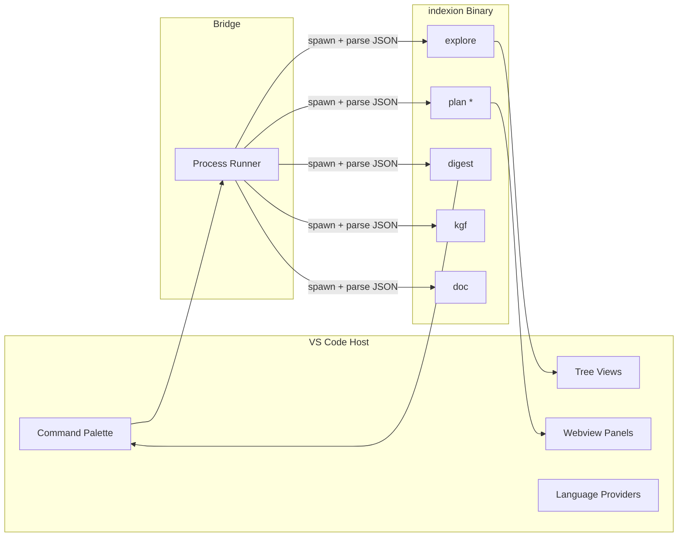

# VS Code Extension

The indexion VS Code extension brings codebase analysis directly into the editor. Rather than switching to a terminal, you can run explore, plan, and digest commands from the command palette and see results in dedicated panels.

## Architecture

The extension does not reimplement any analysis logic. It acts as a thin UI layer that:

1. Collects parameters from the user (via quick picks, input boxes, or settings).
2. Spawns the indexion binary with appropriate flags (typically `--format=json`).
3. Parses the JSON output.
4. Displays results in tree views, webview panels, or notifications.

The bridge layer (`packages/vscode-plugin/src/bridge/`) encapsulates all process spawning. Each command has a dedicated bridge module (`explore.ts`, `plan.ts`, `doc.ts`, `digest.ts`, `kgf.ts`) that constructs the argument array and types the result.

`BridgeConfig` carries three values resolved from VS Code settings: the path to the indexion binary, the workspace directory, and the KGF specs directory.

> Source: `packages/vscode-plugin/src/bridge/types.ts`, `packages/vscode-plugin/src/bridge/process.ts`

## Features

### Explore

`indexion.explore` runs similarity analysis on the current workspace and displays results in the **Explore Results** tree view. Each entry shows a file pair with its similarity score.

### Plan commands

Six plan commands are registered:

| Command ID | Plan subcommand |
|------------|----------------|
| `indexion.planRefactor` | `plan refactor` |
| `indexion.planDocumentation` | `plan documentation` |
| `indexion.planReconcile` | `plan reconcile` |
| `indexion.planSolid` | `plan solid` |
| `indexion.planUnwrap` | `plan unwrap` |
| `indexion.planReadme` | `plan readme` |

Plan results are displayed in a **Plan Results** webview panel that renders the Markdown output with syntax highlighting.

### KGF management

- `indexion.kgfInspect` -- inspect how a file is parsed by its KGF spec
- `indexion.kgfAdd` -- add a new KGF spec to the project
- `indexion.kgfUpdate` -- update existing specs

The **KGF List** tree view shows all specs in the workspace's `kgfs/` directory with their target languages and file extensions.

### Digest query

`indexion.digestQuery` prompts for a purpose string and displays matching functions with scores.

### Doc graph

`indexion.docGraph` generates a dependency graph and displays it.

### Language providers

The extension registers several language intelligence providers:

- **Outline provider** -- document symbols for navigation
- **Semantic tokens** -- syntax highlighting augmented with KGF token data
- **Dependency lens** -- CodeLens annotations showing module dependencies

> Source: `packages/vscode-plugin/src/providers/`

## Settings panel

The `indexion.openSettings` command opens a webview-based settings panel for configuring binary path, specs directory, and default command options. Settings are persisted in VS Code's workspace configuration.

> Source: `packages/vscode-plugin/src/panels/settings/panel.ts`

## Webview communication

Webview panels communicate with the extension host through a typed message bus (`src/webview/shared/message-bus.ts`). Messages are discriminated unions with a `type` field. The `vscode-api.ts` wrapper provides a typed interface to the VS Code webview API.

> Source: `packages/vscode-plugin/src/extension.ts`, `packages/vscode-plugin/src/commands/index.ts`
