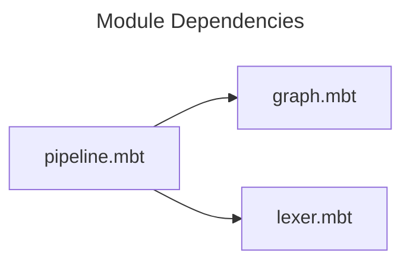
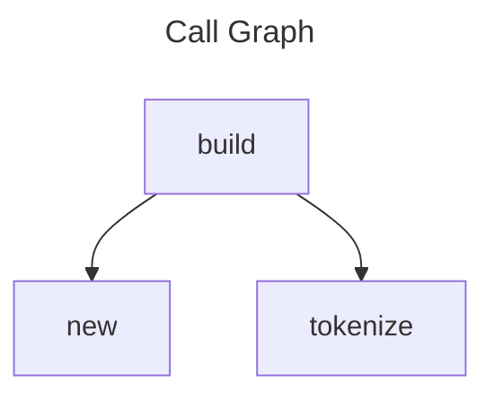

# API Reference

## Structs

### CodeGraph

A directed graph representing code relationships.

**Module:** `core/graph/graph.mbt`

### Lexer

KGF Lexer for tokenizing source code.

**Module:** `kgf/lexer/lexer.mbt`

## Enums

### EdgeKind

Kinds of edges in the code graph.

**References:** 1

**Module:** `core/graph/types.mbt`

## Functions

### new

Creates a new empty CodeGraph.

**Module:** `core/graph/graph.mbt`

### add_edge

Adds an edge between two nodes.

**Module:** `core/graph/graph.mbt`

### tokenize

Tokenizes the input string.

**Module:** `kgf/lexer/lexer.mbt`

### build

Build documentation from configuration.

**Module:** `doc/build/pipeline.mbt`

## Module Dependencies

## Call Graph

## Cross References

| Symbol | Kind | References |
|--------|------|------------|
| `EdgeKind` | Enum | 1 |