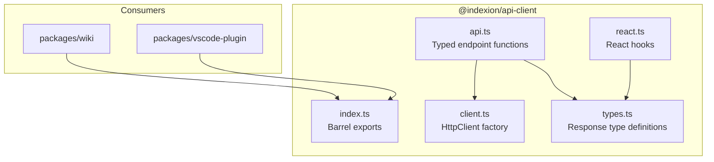

<!-- indexion:sources packages/api-client/ -->
# packages/api-client -- API Client Library

The `@indexion/api-client` package is a shared TypeScript library that provides typed
HTTP client functions for the `indexion serve` REST API. It is the single source of truth
for API response types and endpoint URLs -- both the wiki frontend and the VS Code extension
import from this package, ensuring no consumer constructs endpoint URLs directly.

## Architecture

## Key Components

### `types.ts` -- Response Types

Defines all JSON shapes returned by `indexion serve`:

| Type | Description |
|------|-------------|
| `ApiResponse<T>` | Discriminated union envelope: `{ ok: true, data: T }` or `{ ok: false, error: string }` |
| `CodeGraph` | Modules, symbols, and edges |
| `SymbolNode` | Symbol with name, kind, namespace, module, optional doc |
| `GraphEdge` | Directed edge with kind, from, to |
| `DigestMatch` | Search result with name, file, score, summary |
| `IndexedFunction` | Full function metadata including callers/callees and depth |
| `WikiPage` / `WikiNav` / `WikiNavItem` / `WikiHeading` / `WikiSourceRef` | Wiki page structure |
| `SimilarityPair` / `ExploreResult` | Similarity analysis results |
| `KgfSpecInfo` / `KgfToken` / `KgfEdge` | KGF inspection types |
| `ServerConfig` | Server configuration snapshot |
| `ComparisonStrategy` | `"tfidf" | "ncd" | "hybrid" | "apted" | "tsed"` |
| `DocGraphFormat` | `"mermaid" | "json" | "dot" | "d2" | "text" | "codegraph"` |

### `client.ts` -- HTTP Client

- `createHttpClient(baseUrl)` -- factory that returns an `HttpClient` bound to a base URL (used by VS Code extension with dynamic port)
- `apiGet(path)` / `apiPost(path, body)` -- bare functions using `/api` as the default base (used by the wiki SPA behind a proxy)

All requests return `ApiResponse<T>` and handle `AbortSignal` for cancellation.

### `api.ts` -- Typed Endpoint Functions

Every API endpoint has a typed function that accepts an `HttpClient` and returns `Promise<ApiResponse<T>>`:

| Function | Method | Path | Return Type |
|----------|--------|------|-------------|
| `fetchGraph` | GET | `/graph` | `CodeGraph` |
| `queryDigest` | POST | `/digest/query` | `DigestMatch[]` |
| `fetchDigestIndex` | GET | `/digest/index` | `IndexedFunction[]` |
| `fetchDigestStats` | GET | `/digest/stats` | generic |
| `rebuildDigest` | POST | `/digest/rebuild` | `{ rebuilt, functions }` |
| `fetchWikiNav` | GET | `/wiki/nav` | `WikiNav` |
| `fetchWikiPage` | GET | `/wiki/pages/:id` | `WikiPage` |
| `searchWiki` | POST | `/wiki/search` | `unknown[]` |
| `runExplore` | POST | `/explore` | `ExploreResult` |
| `fetchKgfList` | GET | `/kgf/list` | `KgfSpecInfo[]` |
| `tokenizeFile` | POST | `/kgf/tokens` | `KgfToken[]` |
| `extractEdges` | POST | `/kgf/edges` | `KgfEdge[]` |
| `generateDocGraph` | POST | `/doc/graph` | `string` |
| `runPlan*` (6 variants) | POST | `/plan/*` | `string` |
| `checkHealth` | GET | `/health` | `{ status }` |
| `fetchConfig` | GET | `/config` | `ServerConfig` |

### `react.ts` -- React Hooks

- `useApiCall<T>(call, deps)` -- declarative data fetching hook with `ApiState<T>` (`idle | loading | success | error`). Supports abort on unmount and dependency-based refetch.
- `useApiMutationCall<T>()` -- imperative mutation hook triggered via `mutate()`, with stale-request cancellation.

## Exports

The package provides two entry points:
- `"."` -> `src/index.ts` -- all types, client factory, and API functions
- `"./react"` -> `src/react.ts` -- React hooks (peer dependency on `react >= 18`)

## Dependencies

- **Runtime**: none (uses global `fetch`)
- **Peer**: `react >= 18.0.0` (optional, for `./react` entry point)
- **Dev**: `typescript`, `@types/react`

> Source: `packages/api-client/`
