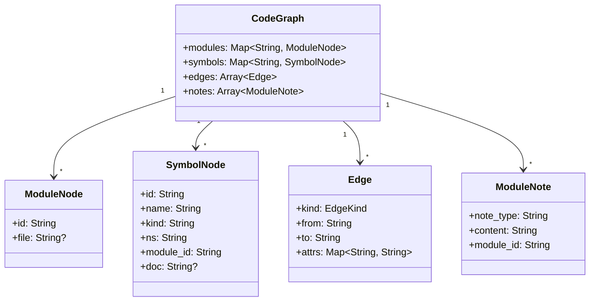
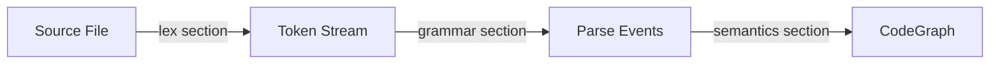

<!-- indexion:sources src/core/graph/types.mbt, src/core/graph/graph.mbt, src/docgen/query/ -->
# CodeGraph

CodeGraph is the central data structure in indexion. It models a codebase as a directed graph of modules, symbols, and typed edges. Every analysis command -- from duplicate detection to documentation generation -- operates on CodeGraph.

## Data model



### ModuleNode

A module represents a source file or package. The `id` is typically the package path (e.g., `moonbitlang/core/json`). The `file` field is an optional filesystem path.

The `file` field serves a critical role: it distinguishes internal code from external dependencies. If a module has a `file`, it is part of the project under analysis. If `file` is `None`, it is an external dependency referenced only through import edges. This convention replaces any need to hard-code organization names or package registries.

### SymbolNode

A symbol is a named entity within a module. The `kind` field captures what the entity is -- "function", "type", "struct", "trait", "variable", and so on. The exact set of kinds depends on the KGF spec for the language being analyzed.

- `id` -- globally unique identifier, typically `module_id::name`
- `name` -- the symbol's local name
- `kind` -- symbol category (language-dependent, comes from KGF)
- `ns` -- namespace or scope within the module
- `module_id` -- which module declares this symbol
- `doc` -- optional documentation comment extracted from source

### Edge types

Edges encode relationships between nodes. Each edge is directed (from -> to) and carries a `kind`:

| EdgeKind | From | To | Meaning |
|----------|------|----|---------|
| `Declares` | Module | Symbol | The module declares this symbol |
| `References` | Symbol | Symbol | One symbol references another |
| `ModuleDependsOn` | Module | Module | Module-level import dependency |
| `Imports` | Symbol | Symbol | Explicit import of a symbol |
| `Calls` | Symbol | Symbol | Function call relationship |
| `Extends` | Symbol | Symbol | Type extension / inheritance |
| `Implements` | Symbol | Symbol | Trait / interface implementation |
| `CircularDependency` | Module | Module | Detected circular dependency |
| `Custom(String)` | Any | Any | Extension point for KGF specs |

Edges can carry additional metadata through the `attrs` map (e.g., line numbers, import aliases).

### ModuleNote

Notes attach free-form information to modules. The most common note type is `module_doc`, which stores the module-level documentation comment. Notes are queried via `get_notes(note_type, module_id)` or the convenience method `get_module_doc(module_id)`.

## How CodeGraph is built

CodeGraph construction is driven entirely by KGF semantic actions. The pipeline looks like this:



1. The **lex** section tokenizes source text into a stream of typed tokens.
2. The **grammar** section matches token patterns and emits parse events.
3. The **semantics** section responds to parse events by calling CodeGraph mutation methods: `get_or_add_module`, `get_or_add_symbol`, `add_edge`, and `add_note`.

Because KGF specs are declarative, adding a new language means writing a new `.kgf` file. The CodeGraph builder itself is language-agnostic.

## Query capabilities

CodeGraph provides a set of query methods for traversing the graph:

### Node access

- `get_module(id)` / `get_symbol(id)` -- look up a single node
- `get_modules()` / `get_symbols()` -- iterate all nodes
- `module_count()` / `symbol_count()` / `edge_count()` -- size metrics

### Edge traversal

- `edges_from(node_id)` -- all outgoing edges from a node
- `edges_to(node_id)` -- all incoming edges to a node
- `get_callees(symbol_id)` -- symbols called by this function
- `get_callers(symbol_id)` -- symbols that call this function

### Notes

- `get_module_doc(module_id)` -- get the module-level doc comment
- `get_notes(note_type, module_id)` -- get all notes of a type for a module
- `get_all_notes()` -- retrieve every note in the graph

### Serialization

CodeGraph supports round-trip JSON serialization via `to_json_string()` and `from_json_string()`. The JSON format follows the KGF convention:

```json
{
  "modules": { "id": { "file": "path/to/file.mbt" } },
  "symbols": { "id": { "name": "foo", "kind": "function", "ns": "pkg", "module": "mod_id" } },
  "edges": [{ "kind": "calls", "from": "a", "to": "b" }]
}
```

This format is used by the `doc graph --format=codegraph` command and the serve API's `/graph` endpoint.

## How downstream commands use CodeGraph

| Consumer | What it reads |
|----------|---------------|
| `explore` / `plan refactor` | File contents (via module file paths) for similarity comparison |
| `plan documentation` | Symbols and their `doc` fields for coverage analysis |
| `plan reconcile` | Modules, symbols, and notes to detect doc/code drift |
| `plan unwrap` | `Calls` edges to find trivial wrapper functions |
| `doc graph` | `ModuleDependsOn` edges for dependency diagrams |
| `doc readme` | Symbols, docs, and module structure for README generation |
| `digest` | Symbols, `Calls` edges, and docs for function indexing |

> **Source:** `src/core/graph/types.mbt`, `src/core/graph/graph.mbt`
