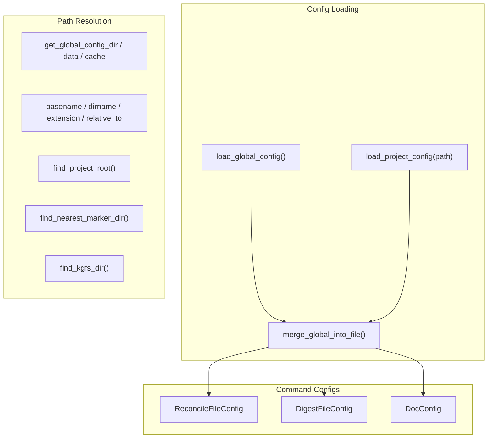

<!-- indexion:sources src/config/ -->
# src/config -- Configuration & Path Management

The config package is the Single Source of Truth for all path resolution, project/global configuration loading, and OS-specific directory detection. It serves as the foundation layer that nearly every other package depends on.

Configuration is layered: global config (OS-standard config dir) can be overridden by project config (`.indexion.toml` or `.indexion.json` in the project root). The package also provides specialized config structs for reconcile, digest, and documentation commands.

## Architecture

## Key Types

| Type | File | Description |
|------|------|-------------|
| `ProjectFileConfig` | `project_config.mbt` | Project-level configuration with `inherit_global` flag and command-specific settings |
| `GlobalConfig` | `global_config.mbt` | Global configuration loaded from OS-standard config directory |
| `EffectiveReconcileConfig` | `project_config.mbt` | Merged reconcile config with provenance tracking |
| `ReconcileFileConfig` | `reconcile_config.mbt` | Reconcile command settings: specs dir, document scopes, thresholds |
| `ReconcileDocumentScope` | `reconcile_config.mbt` | Document scope with paths and spec patterns |
| `DigestFileConfig` | `digest_config.mbt` | Digest command settings: sections, content flags |
| `DocConfig` | `doc_config.mbt` | Documentation command settings: output, packages, root structure |
| `DocOutputConfig` | `doc_config.mbt` | Documentation output settings (directory, format) |
| `DocPackageEntry` | `doc_config.mbt` | Per-package documentation configuration |
| `DocRootConfig` | `doc_config.mbt` | Root documentation sections configuration |

## Public API

### OS Directory Resolution (`app.mbt`)

| Function | Description |
|----------|-------------|
| `get_global_config_dir()` | OS-standard config directory (e.g., `~/Library/Application Support/indexion`) |
| `get_global_data_dir()` | OS-standard data directory |
| `get_global_cache_dir()` | OS-standard cache directory |
| `get_install_dir()` | Binary install directory |
| `get_platform_asset_name()` | Platform-specific release asset name |
| `get_archive_extension()` | Archive extension for the current platform |
| `get_binary_name()` | Binary name for the current platform |

### Path Utilities (`paths.mbt`)

| Function | Description |
|----------|-------------|
| `normalize_path(path)` | Remove trailing slashes |
| `join_path(base, child)` | Join two path segments |
| `dirname(path)` | Get parent directory |
| `basename(path)` | Get file name |
| `extension(path)` | Get file extension |
| `is_absolute_path(path)` | Check if path is absolute |
| `resolve_path(base_dir, path)` | Resolve relative path against a base |
| `relative_to(root, path)` | Compute relative path from root to path |
| `find_last_char(text, target)` | Find last occurrence of a character |
| `substring(s, start, end)` | Extract substring by indices |
| `substring_from(s, start)` | Extract substring from start to end |

### Project Root Detection (`paths.mbt`)

| Function | Description |
|----------|-------------|
| `find_project_root(target_dir, registry)` | Find project root using KGF registry markers |
| `find_nearest_marker_dir(target_dir, markers)` | Find nearest directory containing marker files |
| `ancestors_top_down(target_dir, root)` | List ancestor directories from root down to target |
| `find_indexion_config_path(target_dir)` | Find `.indexion.toml` or `.indexion.json` |
| `find_kgfs_dir(target_dir, registry)` | Find KGF specs directory |
| `get_kgfs_install_dir()` | Get installed KGF specs directory |
| `get_wiki_install_dir()` | Get installed wiki directory |

### Directory Management (`paths.mbt`)

| Function | Description |
|----------|-------------|
| `ensure_parent_dir(path)` | Create parent directories recursively |
| `ensure_dir_recursive(path)` | Create directories recursively |
| `resolve_project_indexion_dir(target_dir)` | Resolve `.indexion/` directory for a project |
| `default_reconcile_index_dir(target_dir)` | Default cache directory for reconcile index |
| `default_tool_dir(target_dir, tool_subdir)` | Default tool-specific directory |

### Config Loading

| Function | Description |
|----------|-------------|
| `load_global_config()` | Load global config from OS config directory |
| `get_global_config_path()` | Get path to global config file |
| `parse_global_toml_config(content)` | Parse TOML content into GlobalConfig |
| `load_project_config(path)` | Load project config from file |
| `parse_project_toml_config(content)` | Parse TOML content into ProjectFileConfig |
| `merge_global_into_file(global, file)` | Merge global config into project config |
| `resolve_effective_reconcile_config(...)` | Resolve effective reconcile config with provenance |
| `load_effective_reconcile_config(...)` | Load and resolve effective reconcile config |
| `load_effective_digest_config(...)` | Load and resolve effective digest config |

### Ignore Patterns (`ignore.mbt`)

| Function | Description |
|----------|-------------|
| `load_indexionignore(dir)` | Load `.indexionignore` patterns from a directory |
| `INDEXIONIGNORE_FILENAME` | Constant: `.indexionignore` |

## Dependencies

| Package | Alias | Purpose |
|---------|-------|---------|
| `moonbitlang/core/json` | `@json` | JSON config file parsing |
| `src/scope` | `@scope` | Scope resolution for config values |
| `src/platform` | `@platform` | OS/arch detection |
| `src/ignorefile` | `@ignorefile` | Ignore file pattern parsing |
| `moonbitlang/x/fs` | `@fs` | Filesystem operations |
| `mizchi/x/sys` | `@sys` | System utilities |
| `trkbt10/osenv/platform` | `@osenv_platform` | OS platform detection |
| `trkbt10/osenv/dirs` | `@osenv_dirs` | OS-standard directory resolution |
| `trkbt10/osenv/path` | `@osenv_path` | OS path operations |

> Source: `src/config/`
