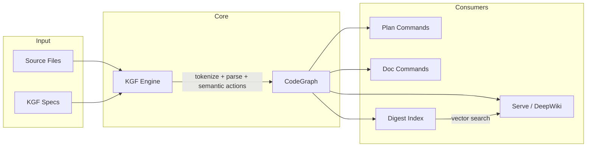
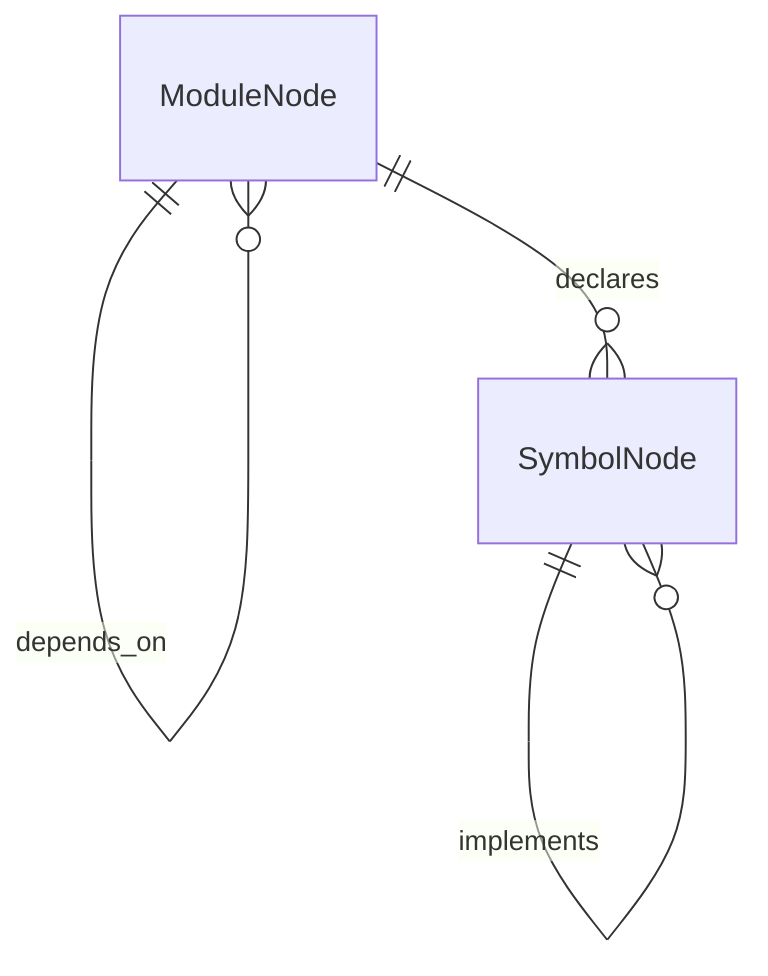
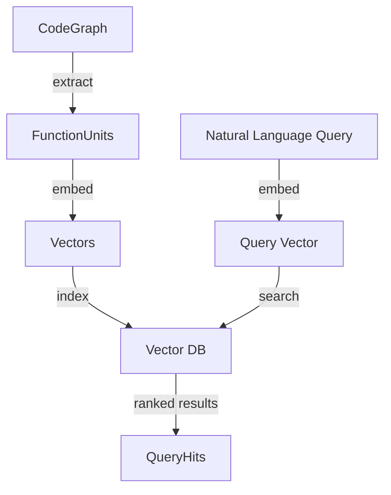

<!-- indexion:sources src/kgf/, src/core/graph/, src/digest/ -->
# Core Concepts

indexion is built around three foundational ideas: **KGF** (language specification), **CodeGraph** (structural representation), and **Digest** (semantic search). Understanding how they connect is essential for using or extending the tool.

## Concept map

## KGF -- Knowledge Graph Framework

KGF is the language specification layer. Instead of writing a separate parser for each programming language, indexion uses declarative `.kgf` spec files that define how to tokenize, parse, and extract semantic information from source code.

A KGF spec has four sections:

| Section | Purpose |
|---------|---------|
| `=== lex` | Token definitions (keywords, operators, patterns) |
| `=== grammar` | Grammar rules for parsing token streams |
| `=== semantics` | Semantic actions that produce CodeGraph nodes and edges |
| `=== resolver` | Module resolution: file extensions, import prefixes, path styles |

The resolver section is particularly important. It declares which file extensions a spec handles (`sources`), how relative imports work (`relative_prefixes`), and how bare/external package imports look (`bare_prefix`). This information replaces what would otherwise be hard-coded language checks.

**Key principle:** When indexion needs to know something language-specific -- whether a declaration is public, how imports work, what file extensions to process -- it consults the KGF spec, never a hard-coded list.

### KGF Registry

At startup, the `@kgf_features.load_registry()` function reads all `.kgf` files from the specs directory and builds a registry. This registry is the single entry point for all language-aware operations. Functions like `extract_pub_declarations`, `build_line_func_map`, and `tokenize_files_with_kgf` all take a registry parameter rather than a language name.

## CodeGraph -- Structural representation

CodeGraph is the unified data model that KGF produces. It represents a codebase as a directed graph with two kinds of nodes and typed edges between them.

**ModuleNode** represents a source file or package. It carries an `id` (typically the package path) and an optional `file` path. The presence or absence of the `file` field is how indexion distinguishes internal packages (your code, with source files) from external dependencies (no source available).

**SymbolNode** represents a named entity: a function, type, struct, variable, or trait. Each symbol has a `kind`, a `namespace`, and belongs to a module.

**Edge** connects two nodes with a typed relationship. Edge kinds include `Declares`, `References`, `Calls`, `Imports`, `Extends`, `Implements`, and `ModuleDependsOn`. Custom edge kinds can be added through the `Custom(String)` variant.

CodeGraph is the shared currency of all downstream commands. The plan commands consume it for similarity analysis, the doc commands consume it for dependency graphs and README generation, and the digest pipeline consumes it for function extraction and indexing.

## Digest -- Purpose-based function index

Digest answers the question: "I know what I want to do, but where is the function that does it?"

Traditional code search works on names and text. Digest works on purpose. It extracts every function from the CodeGraph, generates an embedding vector that captures the function's semantic meaning, and stores those vectors in a local vector database (vcdb). You can then query with natural language like "parse JSON from a file" and get ranked results.

The embedding step supports two providers:

- **TF-IDF (local):** Builds a vocabulary from the codebase and produces 256-dimensional dense vectors. No external API needed.
- **OpenAI (remote):** Uses `text-embedding-3-small` for 1536-dimensional vectors. Higher quality but requires an API key.

Digest uses content hashing for incremental updates. Each function has a `source_hash` (body content) and a `context_hash` (body plus call relationships). When you rebuild the index, only functions whose hashes have changed get re-embedded.

## How they fit together

1. **KGF specs** define how to read source files for a given language.
2. The **KGF engine** tokenizes and parses those files, producing a **CodeGraph**.
3. **Plan commands** (refactor, solid, unwrap, reconcile, documentation) consume the CodeGraph and file contents to detect patterns and generate actionable reports.
4. **Doc commands** (graph, readme) consume the CodeGraph to produce dependency diagrams and documentation.
5. **Digest** consumes the CodeGraph to build a searchable function index.
6. The **serve** command exposes the CodeGraph and Digest index over HTTP, powering the DeepWiki frontend.

This layered architecture means adding support for a new language is a matter of writing a new `.kgf` file. No code changes are needed in the plan, doc, or digest layers.

> **Source:** `src/core/graph/types.mbt`, `src/core/graph/graph.mbt`, `src/kgf/features/`, `src/digest/`, `kgfs/*.kgf`
