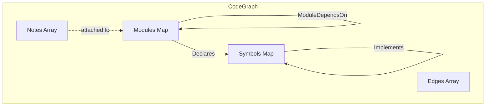

<!-- indexion:sources src/core/ -->
# src/core -- CodeGraph Data Model

The core package defines the central data model for indexion: the **CodeGraph**. A CodeGraph is a directed graph of modules (source files/packages), symbols (functions, types, variables), and edges (relationships like `Declares`, `References`, `Calls`, `Imports`). It also supports notes attached to modules (e.g., module-level documentation).

This data model is the output of KGF semantic evaluation. Every analysis command operates on CodeGraph instances.

## Architecture

## Key Types

| Type | Description |
|------|-------------|
| `CodeGraph` | Main graph structure. Contains maps of modules and symbols, plus arrays of edges and notes |
| `ModuleNode` | A source file or package. Fields: `id` (package path), `file` (optional file path -- absent for external modules) |
| `SymbolNode` | A named entity. Fields: `id`, `name`, `kind` (function/type/variable/struct), `ns` (namespace), `module_id`, `doc` |
| `Edge` | Directed relationship. Fields: `kind` (EdgeKind), `from`, `to`, `attrs` |
| `EdgeKind` | Enum: `Declares`, `References`, `ModuleDependsOn`, `Imports`, `Calls`, `Extends`, `Implements`, `CircularDependency`, `Custom(String)` |
| `ModuleNote` | Note attached to a module. Fields: `note_type` (e.g. "module_doc"), `content`, `module_id` |

## Public API

### Graph Construction

| Function | Description |
|----------|-------------|
| `CodeGraph::new()` | Create an empty CodeGraph |
| `CodeGraph::get_or_add_module(id, file~)` | Get existing module or add new one |
| `CodeGraph::get_or_add_symbol(id, name, kind, ns, module_id)` | Get existing symbol or add new one |
| `CodeGraph::add_edge(kind, from, to)` | Add a directed edge |
| `CodeGraph::add_note(note_type, content, module_id)` | Attach a note to a module |

### Graph Querying

| Function | Description |
|----------|-------------|
| `CodeGraph::get_modules()` | Get all modules as a map |
| `CodeGraph::get_symbols()` | Get all symbols as a map |
| `CodeGraph::get_edges()` | Get all edges |
| `CodeGraph::get_module(id)` | Look up a module by ID |
| `CodeGraph::get_symbol(id)` | Look up a symbol by ID |
| `CodeGraph::module_count()` | Number of modules |
| `CodeGraph::symbol_count()` | Number of symbols |
| `CodeGraph::edge_count()` | Number of edges |
| `CodeGraph::edges_from(node_id)` | Get all edges originating from a node |
| `CodeGraph::edges_to(node_id)` | Get all edges pointing to a node |
| `CodeGraph::get_callees(symbol_id)` | Get symbols called by a symbol |
| `CodeGraph::get_callers(symbol_id)` | Get symbols that call a symbol |
| `CodeGraph::get_notes(note_type, module_id)` | Get notes of a specific type for a module |
| `CodeGraph::get_module_doc(module_id)` | Get module documentation note |
| `CodeGraph::get_all_notes()` | Get all notes |

### Serialization

| Function | Description |
|----------|-------------|
| `CodeGraph::to_json_string()` | Serialize to JSON string (KGF format) |
| `CodeGraph::from_json_string(json_str)` | Parse JSON string to CodeGraph |
| `EdgeKind::to_string()` | Convert EdgeKind to string |
| `EdgeKind::from_string(s)` | Parse string to EdgeKind |

## Dependencies

| Package | Alias | Purpose |
|---------|-------|---------|
| `moonbitlang/core/json` | `@json` | JSON serialization/deserialization |

> Source: `src/core/graph/`
