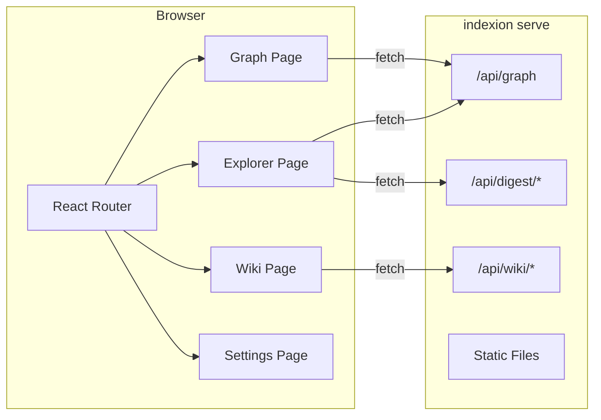

<!-- indexion:sources packages/wiki/ -->
# DeepWiki Frontend

DeepWiki is a web-based code wiki viewer that presents your codebase as an interactive, browsable knowledge base. It connects to the indexion `serve` backend and renders CodeGraph data, digest search results, and wiki pages in a modern web interface.

## Tech stack

| Layer | Technology |
|-------|-----------|
| Framework | React 19 with TypeScript |
| Build tool | Vite |
| Routing | React Router |
| 3D visualization | Three.js (for the graph page) |
| Diagram rendering | Mermaid (for wiki pages) |
| UI components | Custom component library (shadcn/ui style) |
| Styling | Tailwind CSS |

## Architecture



All data fetching goes through a shared `useApi` hook (`src/client/lib/hooks.ts`) that wraps `fetch` with loading/error state management. The API client (`src/client/lib/client.ts`) constructs URLs relative to the server origin.

## Pages

### Explorer

The default landing page (`/`). Displays the codebase as a folder tree built from CodeGraph modules. Each folder expands to show its files and symbols. Selecting a symbol opens a detail panel showing its kind, documentation, callers, and callees.

The tree is built from the `/api/graph` endpoint and enriched with digest index data from `/api/digest/index`.

> Source: `packages/wiki/src/client/pages/explorer/explorer-page.tsx`

### Graph

A 3D force-directed graph visualization of module dependencies. Each node represents a folder (aggregated from modules), sized by file count and symbol count. Edges represent `ModuleDependsOn` relationships.

The scene is built with Three.js and supports hover tooltips showing folder statistics. The graph page is lazy-loaded to avoid pulling Three.js into the initial bundle.

> Source: `packages/wiki/src/client/pages/graph/graph-page.tsx`, `packages/wiki/src/client/pages/graph/graph-scene.ts`

### Wiki

A three-column documentation reader. The left column shows navigation (fetched once from `/api/wiki/nav`), the center column renders wiki page content with Mermaid diagram support, and the right column displays a table of contents extracted from headings.

Wiki pages are Markdown files stored in `.indexion/wiki/` and served by the `indexion serve` command. The content is fetched per route change while the nav stays stable.

> Source: `packages/wiki/src/client/pages/wiki/wiki-page.tsx`, `packages/wiki/src/client/pages/wiki/components/`

### Settings

Configuration page for adjusting frontend display options.

> Source: `packages/wiki/src/client/pages/settings/settings-page.tsx`

## Connecting to the backend

DeepWiki expects the indexion serve backend to be running:

```bash
# Start the server (default port 3741)
indexion serve --static-dir=packages/wiki/dist --cors

# In development, run Vite dev server separately
cd packages/wiki && npm run dev
```

In production, the built frontend assets are served as static files by the indexion HTTP server. In development, Vite's dev server proxies API requests to the indexion backend.

## Component library

DeepWiki uses a set of shared UI components under `src/client/components/ui/`: Button, Badge, Input, Card, Separator, ScrollArea, Collapsible, and Tooltip. The layout shell (`AppLayout`) provides a persistent header with navigation links across all pages.

> Source: `packages/wiki/src/client/router.tsx`, `packages/wiki/src/client/components/`
