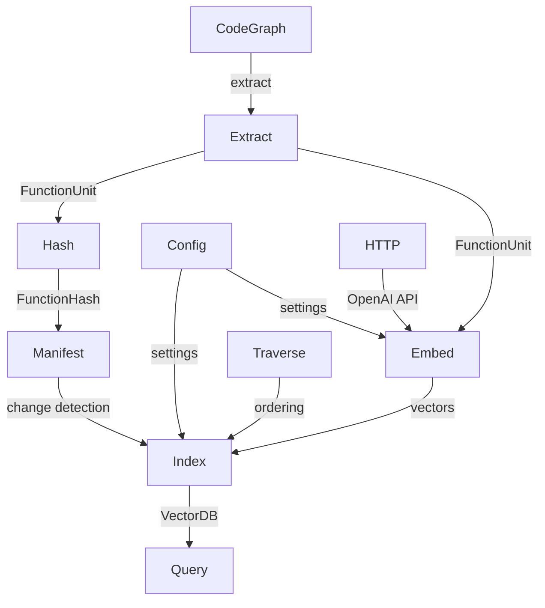

<!-- indexion:sources src/digest/ -->
# Digest Pipeline

The digest pipeline builds a **function-level search index** from a codebase's CodeGraph. It extracts individual functions as `FunctionUnit` records, computes content and context hashes for incremental updates, optionally generates LLM-powered "impressions" (summaries + keywords), embeds function text into vectors (TF-IDF or OpenAI), and stores them in a vcdb vector database for semantic search.

The pipeline is split into focused subpackages that follow a clear data flow: extract functions from the graph, hash them for change detection, embed their text into vectors, persist the manifest, and query the index.

## Architecture

## Subpackages

| Subpackage | Purpose |
|-----------|---------|
| `types` | Core data types: `FunctionUnit`, `FunctionHash`, `Impression`, `QueryHit`, `EmbeddingProvider` trait |
| `config` | `DigestConfig` with embedding provider selection (TF-IDF/OpenAI/Precomputed), LLM config, vcdb strategy |
| `extract` | Extract `FunctionUnit` records from a `CodeGraph`, with filtering by kind and depth |
| `hash` | Content-addressable hashing for function source and context (callers/callees) |
| `embed` | OpenAI embedding and LLM impression generation (async) |
| `http` | HTTP GET/POST helpers for OpenAI API calls |
| `index` | Central `DigestIndex` that ties everything together: build, query, serialize |
| `manifest` | `DigestManifest` for incremental indexing: tracks file/function hashes and vector IDs |
| `query` | High-level query API: search by keywords or purpose |
| `traverse` | Call-graph traversal: bottom-up/top-down ordering with cycle detection |

## Key Types

| Type | Package | Description |
|------|---------|-------------|
| `FunctionUnit` | types | A single function with symbol info, module ID, hashes, callers/callees, optional impression |
| `FunctionHash` | types | Content-addressable hash for function source or context |
| `Impression` | types | LLM-generated summary + keywords for a function |
| `QueryHit` | types | Search result with function, score, and matched keywords |
| `EmbeddingProvider` | types | Trait for embedding text into vectors (`embed`, `dim`, `embed_batch`) |
| `DigestConfig` | config | Full pipeline configuration: embedding source/provider, vcdb strategy, LLM config |
| `EmbeddingSource` | config | What text to embed: `Raw`, `Impression`, or `RawWithContext` |
| `LlmConfig` | config | OpenAI-compatible LLM configuration for impression generation |
| `DigestIndex` | index | The main index: holds manifest, vcdb, TF-IDF provider, and function units |
| `DigestManifest` | manifest | Persistent manifest tracking indexed files, functions, and vector IDs |
| `ExtractConfig` | extract | Extraction settings: include external, min body length, exclude kinds |
| `TraversalResult` | traverse | Ordered function IDs with depth info and detected cycles |

## Public API

### extract

| Function | Description |
|----------|-------------|
| `extract_function_units(graph, config)` | Extract all matching functions from a CodeGraph |
| `extract_leaf_functions(graph, config)` | Extract only leaf functions (no callees) |
| `extract_functions_at_depth(graph, config, depth)` | Extract functions at a specific call depth |
| `get_max_depth(units)` | Get the maximum depth among function units |

### hash

| Function | Description |
|----------|-------------|
| `compute_source_hash(source)` | Hash function body text |
| `compute_context_hash(source_hash, callers, callees)` | Hash function context (callers + callees) |
| `compute_impression_hash(impression)` | Hash an impression for change detection |
| `combine_hashes(hashes)` | Combine multiple hashes into one |

### index

| Function | Description |
|----------|-------------|
| `DigestIndex::new(config)` | Create a new index with given config |
| `DigestIndex::with_config(digest_config)` | Create from a full DigestConfig |
| `DigestIndex::build(graph, extract_config)` | Build index from graph (TF-IDF, synchronous) |
| `DigestIndex::build_native(graph, extract_config, api_key)` | Build with OpenAI embeddings (async, native) |
| `DigestIndex::query(query, top_k)` | Query the index with TF-IDF |
| `DigestIndex::serialize()` | Serialize to (manifest_json, vcdb_bytes) |
| `DigestIndex::from_manifest(manifest, bytes)` | Restore from serialized data |

### embed

| Function | Description |
|----------|-------------|
| `generate_impressions(api_key, units)` | Generate LLM impressions for function units |
| `get_embeddings(config, texts)` | Get OpenAI embeddings for text batch |

### query

| Function | Description |
|----------|-------------|
| `query_by_keywords(index, keywords, options)` | Search by keyword string |
| `query_by_purpose(index, purpose, options)` | Search by natural language purpose description |
| `format_results(hits)` | Format query hits as readable text |

### traverse

| Function | Description |
|----------|-------------|
| `compute_bottom_up_order(graph, ids)` | Compute leaf-first traversal order |
| `compute_top_down_order(graph, ids)` | Compute root-first traversal order |
| `traverse_bottom_up(units, callback)` | Iterate units in bottom-up order |
| `traverse_top_down(units, callback)` | Iterate units in top-down order |

## Dependencies

| Subpackage | Key Dependencies |
|-----------|-----------------|
| types | `@core/graph`, `@json` |
| config | `digest/types`, `digest/extract` |
| extract | `@core/graph`, `digest/types`, `digest/hash` |
| hash | `digest/types`, `@kgf/cas` |
| embed | `digest/http`, `digest/types`, `digest/config` |
| http | `mizchi/x/http` |
| index | `digest/*` (all subpackages), `@text/tfidf`, `@text/tokenizer`, `@text/embed`, `trkbt10/vcdb` |
| manifest | `digest/types`, `@kgf/cas/types`, `@json` |
| query | `digest/index`, `digest/types` |
| traverse | `@core/graph`, `digest/types` |

> Source: `src/digest/`
