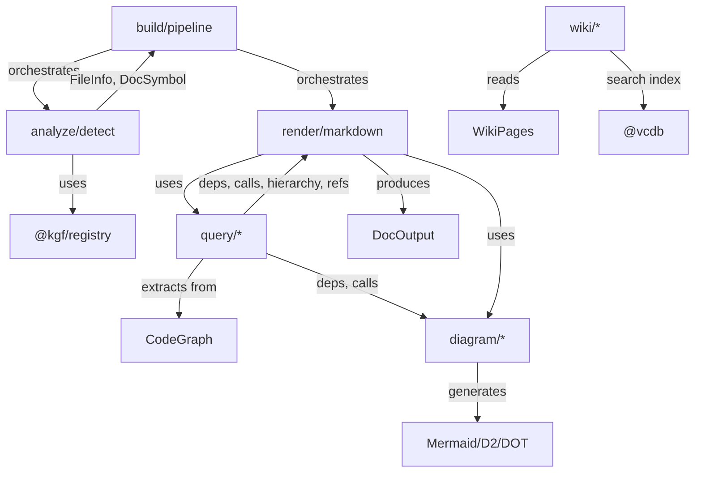

<!-- indexion:sources src/docgen/ -->
# Document Generation

The `docgen` package generates API documentation from source code using KGF-based analysis. It analyzes source files to detect languages and extract symbols, queries the CodeGraph for dependencies/calls/type hierarchies, renders output as Markdown or JSON, and generates dependency diagrams in multiple formats (Mermaid, D2, DOT, text). It also includes a wiki subsystem for reading and searching `.indexion/wiki/` pages.

## Architecture

## Subpackages

| Subpackage | Purpose |
|-----------|---------|
| `types` | Shared data types: `ComponentDoc`, `TokenGroup`, `TokenInfo` |
| `analyze` | Language detection and symbol extraction from source files |
| `query` | Graph queries: declarations, dependencies, call graphs, type hierarchies, references |
| `diagram` | Diagram generation: Mermaid, D2, DOT, text renderers from `GraphJSON` |
| `render` | Markdown/JSON output rendering with configurable sections |
| `build` | Pipeline orchestration: file analysis, graph merging, output generation |
| `wiki` | Wiki page reader, navigation builder, and semantic search index |

## Key Types

| Type | Package | Description |
|------|---------|-------------|
| `DocConfig` | build | Pipeline input: files, KGF specs, render options, root path |
| `DocOutput` | render | Generated output: API reference, diagrams, call graph, hierarchy, cross-refs |
| `RenderOptions` | render | What to include: diagrams, deps, calls, hierarchy, refs, format |
| `OutputFormat` | render | `Markdown` or `Json` |
| `AnalysisResult` | analyze | Collected files, graph, symbols, and module docs |
| `DocSymbol` | analyze | A documented symbol with id, name, kind, doc, parent, file, children |
| `FileInfo` | analyze | Detected file metadata: path, language, extension, spec name |
| `DetectedLang` | analyze | Language enum: TypeScript, JavaScript, Python, MoonBit, Go, Rust, etc. |
| `GraphJSON` | diagram | Portable graph representation with nodes, edges, metadata |
| `GraphNode` / `GraphEdge` | diagram | Node (id, label, kind, file) and edge (from, to, kind) |
| `CallInfo` | query | Caller-callee pair with source file |
| `ModuleDep` | query | Module dependency with optional via and dep_kind |
| `SymbolDecl` | query | Symbol declaration: id, name, kind, module, doc |
| `SymbolRef` | query | Symbol reference: symbol, ref_site, ref_kind |
| `TypeRelation` | query | Parent-child type relationship |
| `CircularDep` | query | Circular dependency between two modules |
| `WikiPage` | wiki | A wiki page with content, sources, headings, children, parent |
| `WikiSearchIndex` | wiki | Vector-backed search index over wiki sections |
| `WikiSearchHit` | wiki | Search result with section and score |

## Public API

### build (pipeline)

| Function | Description |
|----------|-------------|
| `build(config)` | Full pipeline: analyze files, build graph, render output |
| `build_with_graph(config)` | Same as `build` but also returns the CodeGraph |
| `build_markdown(files, specs)` | Quick Markdown generation from files and KGF specs |
| `build_json(files, specs)` | Quick JSON generation |
| `quick_build(files, specs)` | Quick DocOutput with default options |
| `merge_graphs(graphs)` | Merge multiple CodeGraphs into one |

### analyze

| Function | Description |
|----------|-------------|
| `analyze_file(path, content)` | Detect language and extract file metadata |
| `analyze_file_with_registry(registry, path, content)` | Same, using KGF registry for detection |
| `detect_language(path, content)` | Detect programming language from path/content |
| `extract_extension(path)` | Extract file extension |

### query

| Function | Description |
|----------|-------------|
| `extract_module_deps(graph)` | Extract all module dependencies |
| `extract_call_graph(graph)` | Extract all caller-callee relationships |
| `extract_type_hierarchy(graph)` | Extract type inheritance/implementation |
| `extract_circular_deps(graph)` | Detect circular dependencies |
| `extract_declarations(graph)` | Extract all symbol declarations |
| `extract_references(graph)` | Extract all symbol references |
| `get_callers(graph, symbol)` / `get_callees(graph, symbol)` | Get direct callers/callees |
| `get_call_chain(graph, symbol, max_depth?)` | Transitive call chain |
| `get_transitive_deps(graph, module)` | Transitive module dependencies |

### diagram

| Function | Description |
|----------|-------------|
| `generate_dep_diagram(deps, title?)` | Mermaid dependency diagram |
| `generate_dep_diagram_with_circular(deps, circulars, ...)` | With circular dep highlighting |
| `generate_call_diagram(calls, title?, focus?)` | Mermaid call graph diagram |
| `generate_hierarchy_diagram(relations, title?)` | Mermaid type hierarchy |
| `build_graph_from_deps(deps, ...)` | Build portable GraphJSON from deps |
| `render_mermaid(graph)` / `render_d2(graph)` / `render_dot(graph)` / `render_text(graph)` | Multi-format rendering |

### wiki

| Function | Description |
|----------|-------------|
| `load_wiki(wiki_dir)` | Load all wiki pages from a directory |
| `build_search_index(pages, provider)` | Build vector search index over wiki sections |
| `WikiSearchIndex::search(query, top_k?, min_score?)` | Semantic search over wiki |
| `WikiSearchIndex::save(wiki_dir)` | Persist search index to disk |

## Dependencies

| Subpackage | Key Dependencies |
|-----------|-----------------|
| types | (none) |
| analyze | `@config`, `@core/graph`, `@kgf/registry` |
| query | `@core/graph` |
| diagram | `@core/graph`, `docgen/query` |
| render | `@core/graph`, `docgen/query`, `docgen/diagram` |
| build | `@core/graph`, `docgen/analyze`, `docgen/render`, `@kgf/*` |
| wiki | `@fs`, `@config`, `@common`, `@text/embed`, `@digest/config`, `@digest/embed`, `@vcdb` |

> Source: `src/docgen/`
