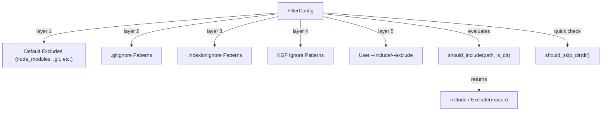

<!-- indexion:sources src/filter/ -->
# File Filtering

The `filter` package determines which files and directories should be included or excluded during file discovery. It implements a multi-layer filtering system that combines built-in default excludes, `.gitignore` patterns, `.indexionignore` patterns, KGF-defined ignores, and user-specified include/exclude globs. The layered approach ensures that gitignore rules are respected while allowing project-specific and per-command overrides.

## Architecture

## Key Types

| Type | Description |
|------|-------------|
| `FilterConfig` | Aggregates all filter layers: default excludes, gitignore patterns, indexionignore patterns, KGF ignore patterns, user includes/excludes, and the `respect_gitignore` flag |
| `FilterResult` | Enum: `Include` or `Exclude(reason)` where reason explains why a file was excluded |

## Public API

| Function | Description |
|----------|-------------|
| `FilterConfig::new()` | Create a config with default excludes only |
| `FilterConfig::with_user_patterns(includes, excludes)` | Create from user-specified include/exclude patterns |
| `FilterConfig::with_includes(includes)` | Add include patterns to existing config |
| `FilterConfig::with_excludes(excludes)` | Add exclude patterns to existing config |
| `FilterConfig::with_gitignore_from_dir(dir, root)` | Load and merge `.gitignore` from a directory |
| `FilterConfig::with_gitignore_patterns(patterns)` | Merge pre-parsed gitignore patterns |
| `FilterConfig::with_indexionignore_from_dir(dir, root)` | Load and merge `.indexionignore` from a directory |
| `FilterConfig::with_indexionignore_patterns(patterns)` | Merge pre-parsed indexionignore patterns |
| `FilterConfig::with_kgf_ignore(patterns, root)` | Add KGF-defined ignore patterns |
| `FilterConfig::should_include(path, is_dir)` | Evaluate all layers and return `Include` or `Exclude(reason)` |
| `FilterConfig::should_skip_dir(dir)` | Quick check: should a directory be skipped entirely during traversal |
| `filter_paths(config, paths, is_dir_fn)` | Filter an array of paths, returning only included ones |
| `pattern_matches(pattern, path, is_dir)` | Check if a single `IgnorePattern` matches a path |
| `default_exclude_patterns()` | Get the built-in default exclude patterns |

## Filter Evaluation Order

1. **User includes**: If include patterns are specified and the path matches none, it is excluded.
2. **Default excludes**: Built-in patterns (e.g., `node_modules`, `.git`, `__pycache__`).
3. **Gitignore**: Patterns from `.gitignore` files (if `respect_gitignore` is true).
4. **Indexionignore**: Patterns from `.indexionignore` files.
5. **KGF ignores**: Language-specific ignore patterns from KGF specs.
6. **User excludes**: Explicit `--exclude` patterns from the command line.
7. **Negation**: Negated patterns (`!pattern`) in any layer can re-include previously excluded files.

## Dependencies

| Dependency | Purpose |
|-----------|---------|
| `@ignorefile` | `IgnorePattern` type and ignore file parsing |
| `@glob` | Glob pattern matching for user include/exclude |
| `@kgf/parser` | Parsing KGF ignore specifications |

> Source: `src/filter/`
