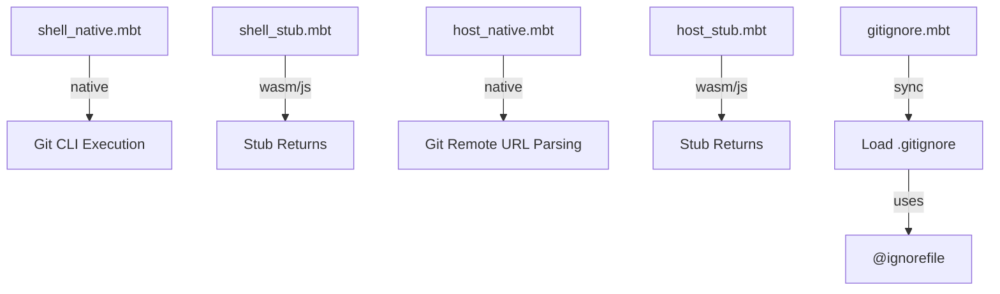

<!-- indexion:sources src/vcs/ -->
# VCS / Git Operations

The `vcs/git` package provides Git repository interaction: querying git status, loading `.gitignore` files, resolving remote host URLs, and checking file modification times. Like the platform package, it uses target-conditional compilation with native implementations backed by async process execution and stub fallbacks for non-native targets.

## Architecture

## Key Types

This package defines no public types. It exposes only functions.

## Public API

| Function | Async | Description |
|----------|-------|-------------|
| `is_repo(dir)` | Yes | Check if a directory is inside a Git repository |
| `status_dirty(repo_dir, file)` | Yes | Check if a specific file has uncommitted changes |
| `last_commit_seconds(repo_dir, file)` | Yes | Get Unix timestamp of last commit touching a file |
| `file_mtime_seconds(path)` | Yes | Get file modification time as Unix seconds |
| `query_path(repo_dir, path)` | No | Resolve a path relative to the Git repository root |
| `load_gitignore(dir)` | No | Parse `.gitignore` in the given directory into `IgnorePattern` array |

## Constants

| Constant | Value | Description |
|----------|-------|-------------|
| `GITIGNORE_FILENAME` | `".gitignore"` | Standard gitignore filename |

## Dependencies

| Dependency | Purpose |
|-----------|---------|
| `@config` | Path utilities (`config_paths`) |
| `@ignorefile` | Parsing `.gitignore` content |
| `@platform` | Platform detection for path handling |
| `moonbitlang/async/fs` | Async file system access |
| `moonbitlang/async/process` | Running `git` CLI commands |

> Source: `src/vcs/git/`
