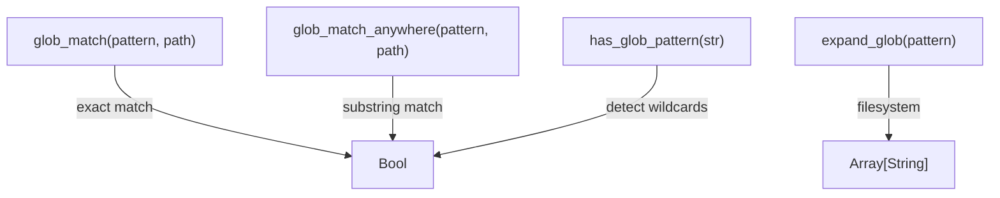

<!-- indexion:sources src/glob/ -->
# Glob Pattern Matching

The `glob` package implements glob pattern matching for file path filtering. It supports standard glob metacharacters (`*`, `?`, `[...]`), the `**` recursive directory wildcard, and filesystem expansion. The package is used throughout indexion by the `scope`, `filter`, and file discovery systems.

## Architecture

The implementation is a single-file pattern matcher (`glob.mbt`) with no subpackages. Pattern matching is purely string-based with no filesystem access required for the core `glob_match` function. The `expand_glob` function additionally interacts with the filesystem to enumerate matching paths.

## Public API

| Function | Description |
|----------|-------------|
| `glob_match(pattern, path)` | Match a glob pattern against a full path. Supports `*` (any segment chars), `?` (single char), `[...]` (character class), and `**` (recursive directory match). Returns `true` if the entire path matches. |
| `glob_match_anywhere(pattern, path)` | Match a pattern against any substring of the path. Useful for unanchored ignore patterns that should match at any directory depth. |
| `has_glob_pattern(str)` | Check whether a string contains glob metacharacters (`*`, `?`, `[`). Useful for distinguishing literal paths from patterns. |
| `expand_glob(pattern)` | Expand a glob pattern against the real filesystem. Returns an array of matching file paths. |

## Dependencies

| Dependency | Purpose |
|-----------|---------|
| `moonbitlang/x/fs` | Filesystem access for `expand_glob` |
| `@kgf/parser` | Reused parsing utilities |

> Source: `src/glob/`
