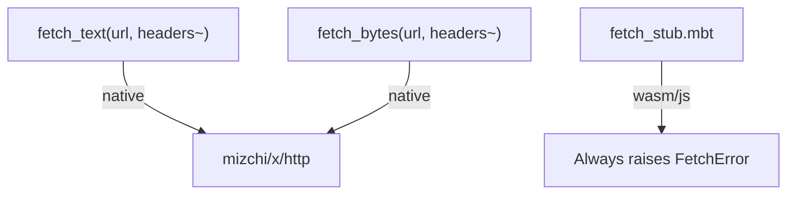

<!-- indexion:sources src/http/ -->
# HTTP Client

The `http` package provides a minimal async HTTP client for fetching remote resources. It wraps the `mizchi/x/http` library with a simpler interface focused on two operations: fetching text and fetching raw bytes. It uses target-conditional compilation with real implementations on native targets and stubs on wasm/js.

## Architecture

## Key Types

| Type | Description |
|------|-------------|
| `FetchError` | Suberror type wrapping an error message string |

## Public API

| Function | Async | Description |
|----------|-------|-------------|
| `fetch_text(url, headers~)` | Yes | Fetch a URL and return the response body as a `String`. Raises `FetchError` on failure. |
| `fetch_bytes(url, headers~)` | Yes | Fetch a URL and return the response body as `Bytes`. Raises `FetchError` on failure. |

Both functions accept a `headers` named parameter of type `Map[String, String]` for setting custom HTTP headers (e.g., authorization tokens, content type).

## Dependencies

| Dependency | Purpose |
|-----------|---------|
| `mizchi/x/http` | Underlying HTTP implementation (native target) |

> Source: `src/http/`
