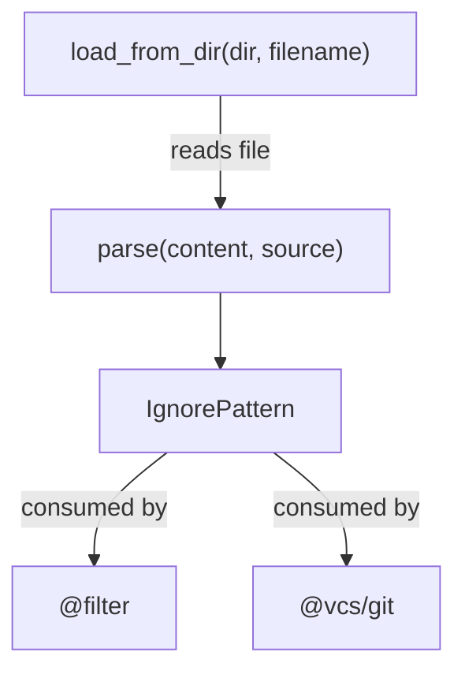

<!-- indexion:sources src/ignorefile/ -->
# Ignorefile Parser

The `ignorefile` package parses `.gitignore`-style ignore files into structured `IgnorePattern` records. It handles gitignore syntax including negation (`!`), directory-only patterns (trailing `/`), anchored patterns (containing `/`), and comments. The parsed patterns are used downstream by the `filter` and `vcs/git` packages to determine which files should be excluded from processing.

## Architecture

The package is intentionally minimal: it handles only parsing. Pattern matching against file paths is the responsibility of the `filter` package.

## Key Types

| Type | Description |
|------|-------------|
| `IgnorePattern` | A parsed ignore rule with fields: `pattern` (the glob), `negated` (starts with `!`), `directory_only` (ends with `/`), `anchored` (contains `/` in body), `source` (origin file path) |

## Public API

| Function | Description |
|----------|-------------|
| `parse(content, source)` | Parse ignore file content into an array of `IgnorePattern`. Each line is trimmed; comments (`#`) and blank lines are skipped. Handles `!` negation prefix, trailing `/` for directory-only, and `/` detection for anchoring. |
| `load_from_dir(dir, filename)` | Read the named file from the given directory and parse it. Returns an empty array if the file does not exist. |
| `IgnorePattern::new(pattern, negated?, directory_only?, anchored?, source?)` | Construct a pattern directly with optional flags. |

## Dependencies

| Dependency | Purpose |
|-----------|---------|
| `moonbitlang/x/fs` | Reading ignore files from disk |
| `@kgf/parser` | Reused parsing utilities |

> Source: `src/ignorefile/`
