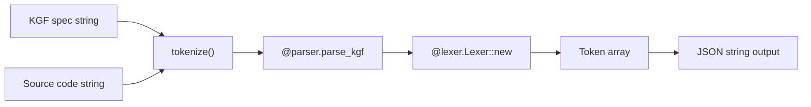

<!-- indexion:sources cmd/kgf-tokenizer/ -->
# cmd/kgf-tokenizer -- Standalone KGF Tokenizer

The `cmd/kgf-tokenizer` package is a standalone KGF tokenizer compiled to JavaScript (ESM).
It exposes a single `tokenize` function that accepts a KGF spec string and source code,
returning tokenized output as a JSON array. This is used by the wiki frontend for
client-side syntax highlighting without requiring a server round-trip.

## Architecture

## Key Components

### `tokenize(spec_text, source) -> String`

The sole public function. It:

1. Parses the KGF spec text via `@parser.parse_kgf(spec_text)` to obtain a `KGFSpec`
2. Creates a `@lexer.Lexer` from the spec's token definitions
3. Tokenizes the source code into a token array
4. Serializes each token as `{"kind": "...", "text": "...", "pos": N}` and returns the full JSON array as a string

Returns `"[]"` if the spec fails to parse.

### Build Configuration

The package targets **JS only** for its main implementation:

- `main.mbt` compiles to the `js` target
- `main_stub.mbt` provides empty stubs for `native`, `wasm`, and `wasm-gc` targets
- Output format is ESM with `tokenize` exported

The built JS module is consumed by the wiki frontend via a Vite alias pointing to the MoonBit JS build output at `_build/js/debug/build/cmd/kgf-tokenizer/kgf-tokenizer.js`.

## Dependencies

| Package | Purpose |
|---------|---------|
| `moonbitlang/core/json` | JSON serialization |
| `trkbt10/indexion/src/kgf/lexer` | KGF lexical analysis |
| `trkbt10/indexion/src/kgf/parser` | KGF spec parsing |
| `trkbt10/indexion/src/kgf/types` | KGF type definitions |

> Source: `cmd/kgf-tokenizer/`
