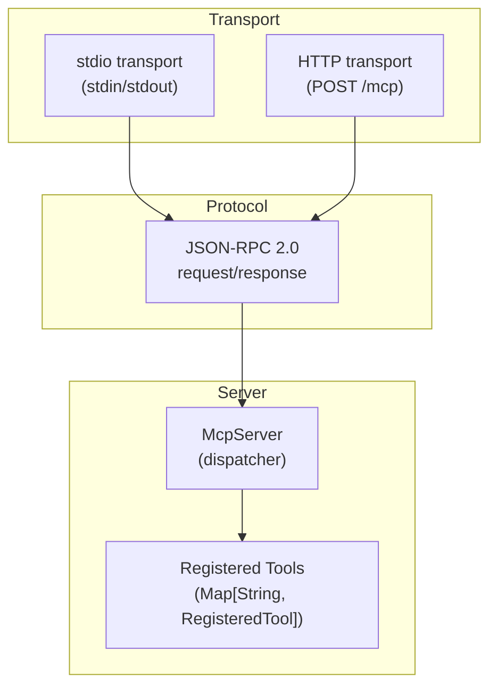

<!-- indexion:sources src/mcp/ -->
# MCP Server (src/mcp)

The MCP (Model Context Protocol) module implements a JSON-RPC 2.0 server that exposes indexion's analysis tools to AI assistants such as Claude Code, Cursor, and other MCP-compatible editors.

## Architecture



## Module Organization

| Package | Responsibility |
|---------|----------------|
| `src/mcp/types` | MCP type definitions (`ToolDefinition`, `InputSchema`, `PropertySchema`, `TextContent`, `ServerInfo`) and JSON serialization |
| `src/mcp/protocol` | JSON-RPC 2.0 message parsing (`JsonRpcRequest`) and response construction |
| `src/mcp/transport` | Transport implementations: `run_stdio()` for stdin/stdout, `run_http()` for HTTP |
| `src/mcp/server` | Central `McpServer` type that registers tools and dispatches requests |

## Key Types

### ToolDefinition

Describes a tool exposed to MCP clients:

- `name` -- tool identifier
- `description` -- human-readable documentation
- `input_schema` -- JSON Schema for the tool's parameters

### McpServer

The central dispatcher. Holds a map of `RegisteredTool` entries and routes incoming JSON-RPC messages to the appropriate handler.

**Protocol flow:**

1. Transport receives a JSON-RPC message (newline-delimited JSON over stdio, or HTTP POST body).
2. `handle_message()` parses and validates the message.
3. Checks initialization state (MCP requires an `initialize` handshake before tool calls).
4. `dispatch()` routes to method-specific handlers: `initialize`, `tools/list`, `tools/call`.
5. Tool handlers are async functions that return `Json`.
6. Response is serialized as JSON-RPC and sent back through the transport.

## Transports

### stdio

Reads newline-delimited JSON from stdin, dispatches to the server, writes responses to stdout. This is the standard MCP transport for editor integrations.

### HTTP

Serves MCP over HTTP with CORS support:

- `POST /mcp` -- MCP request handling (200 for requests, 202 for notifications)
- `GET /health` -- health check endpoint
- `OPTIONS /mcp` -- CORS preflight

## Usage

```bash
# stdio transport (default, for Claude Code / Cursor)
indexion mcp

# HTTP transport
indexion mcp --transport=http --port=3741
```

> Source: `src/mcp/types/types.mbt`, `src/mcp/server/server.mbt`, `src/mcp/transport/`, `src/mcp/protocol/jsonrpc.mbt`
