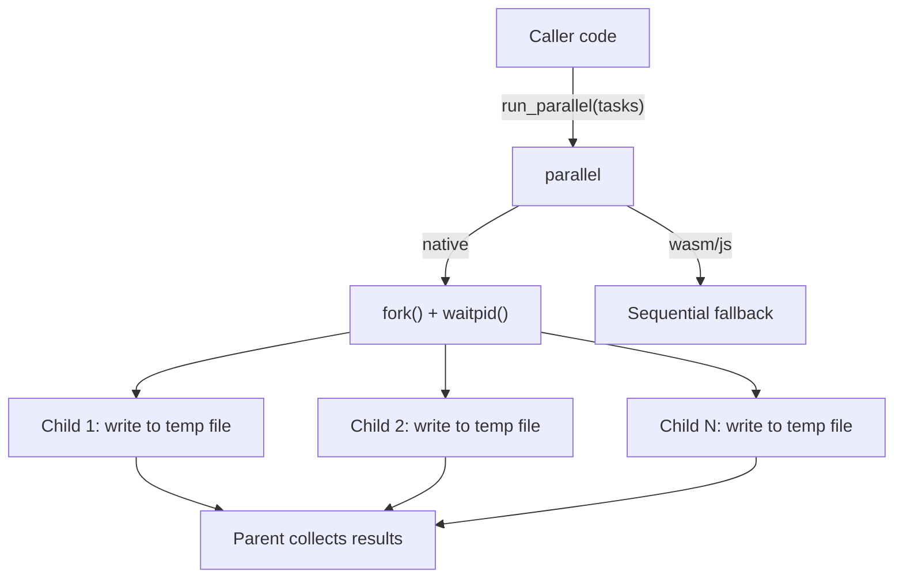

<!-- indexion:sources src/parallel/ -->
# src/parallel -- Fork-Based Process Parallelism

Fork-based process parallelism for native targets. Runs multiple tasks in parallel using `fork()` + temp file IPC. Each task executes in a child process and writes its result to a temporary file. The parent waits for all children and collects results in order.

Falls back to sequential execution on non-native targets (wasm, wasm-gc, js).

## Architecture

## Key Types

This package has no public types. It exposes three functions only.

## Public API

| Function | Description |
|----------|-------------|
| `available()` | Returns `true` if fork-based parallelism is available (native target only) |
| `cpu_count()` | Returns the number of available CPU cores |
| `run_parallel(tasks)` | Run an array of `() -> String` tasks in parallel, returns results in order |

### Platform-Specific Implementation

| File | Target | Behavior |
|------|--------|----------|
| `host_native.mbt` | `native` | Uses C FFI (`parallel_stub.c`) for `fork()`, `waitpid()`, temp file I/O |
| `host_stub.mbt` | `wasm`, `wasm-gc`, `js`, `llvm` | Sequential fallback -- runs tasks one by one |

## Dependencies

| Package | Alias | Purpose |
|---------|-------|---------|
| `moonbitlang/core/encoding/utf8` | `@utf8` | UTF-8 encoding for temp file I/O |
| `moonbitlang/x/fs` | `@fs` | Filesystem operations for temp files |
| `src/config` | `@config` | Cache directory resolution for temp file storage |

> Source: `src/parallel/`
