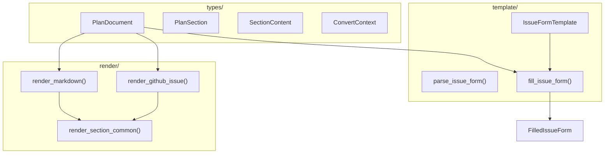

<!-- indexion:sources src/plan/ -->
# src/plan -- Plan IR, Templates & Renderers

The plan package provides a structured intermediate representation (IR) for analysis output, along with renderers that convert the IR into Markdown or GitHub Issue format. It also includes a template system for filling GitHub Issue Form templates with data from Plan IR.

All `plan` CLI commands (refactor, documentation, reconcile, solid, unwrap) produce a `PlanDocument` IR, which is then rendered into the requested output format. This separation ensures that analysis logic never touches formatting directly.

## Architecture

## Key Types

### Plan IR (`types/`)

| Type | Description |
|------|-------------|
| `PlanDocument` | Top-level document with title, description, metadata, and sections |
| `PlanSection` | A section with heading, optional level, and content |
| `SectionContent` | Enum: `Text(String)`, `List(Array[ListItem])`, `Table(TableData)`, `Checklist(Array[ChecklistItem])`, `Code(lang, code)`, `Nested(Array[PlanSection])`, `KeyValue(Array[(String, String)])` |
| `ListItem` | List item with text and optional description |
| `TableData` | Table with headers, rows, and column alignments |
| `TableAlign` | Enum: `Left`, `Center`, `Right` |
| `ChecklistItem` | Checklist item with label, optional priority and description |
| `ConvertContext` | Conversion context with project name for output generation |

### Renderers (`render/`)

| Type | Description |
|------|-------------|
| `RenderStyle` | Configuration struct for rendering: heading prefix, list marker, code fence style |
| `GitHubIssue` | Rendered GitHub Issue with title, body, and labels |

### Templates (`template/`)

| Type | Description |
|------|-------------|
| `IssueFormTemplate` | Parsed GitHub Issue Form template with name, description, labels, and fields |
| `FormField` | Enum: `Markdown`, `Textarea`, `Input`, `Dropdown`, `Checkboxes` |
| `MarkdownField` | Static markdown content field |
| `TextareaField` | Multi-line input with label, description, placeholder, and validation |
| `InputField` | Single-line input with label, description, placeholder, and validation |
| `DropdownField` | Dropdown selector with options and multi-select support |
| `CheckboxesField` | Checkbox group with options |
| `CheckboxOption` | Single checkbox with label and required flag |
| `FilledIssueForm` | Result of filling a template: title and body |

## Public API

### Plan IR Construction

| Function | Description |
|----------|-------------|
| `PlanDocument::new(title)` | Create a new document with title |
| `PlanDocument::add_section(heading, content)` | Add a section |
| `PlanDocument::set_meta(key, value)` | Set metadata key-value pair |
| `PlanDocument::set_description(desc)` | Set document description |
| `PlanDocument::to_json()` | Serialize to JSON |
| `PlanSection::new(heading, level, content)` | Create a section with explicit level |
| `SectionContent::text(s)` | Create text content |
| `SectionContent::list(items)` | Create list content |
| `SectionContent::table(data)` | Create table content |
| `SectionContent::checklist(items)` | Create checklist content |
| `SectionContent::code(lang, code)` | Create code block content |
| `SectionContent::nested(sections)` | Create nested sections content |
| `SectionContent::keyvalue(pairs)` | Create key-value pairs content |
| `ListItem::simple(text)` | Create a simple list item |
| `ListItem::with_desc(text, description)` | Create list item with description |
| `TableData::new(headers)` | Create table with headers |
| `TableData::add_row(row)` | Add a row to the table |
| `ChecklistItem::new(label)` | Create checklist item |
| `ChecklistItem::with_priority(label, priority)` | Create with priority level |
| `ChecklistItem::with_desc(label, priority, desc)` | Create with priority and description |

### Rendering

| Function | Description |
|----------|-------------|
| `render_markdown(doc)` | Render PlanDocument to Markdown string |
| `render_github_issue(doc)` | Render PlanDocument to GitHubIssue (title + body + labels) |
| `GitHubIssue::format()` | Format a GitHubIssue as a complete string |
| `RenderStyle::markdown()` | Create Markdown render style |
| `RenderStyle::github_issue()` | Create GitHub Issue render style |
| `render_section_common(section, style, buf, base_level)` | Render a section with a given style |
| `render_content_common(content, style, buf, level)` | Render content with a given style |

### Template System

| Function | Description |
|----------|-------------|
| `parse_issue_form(content)` | Parse a YAML-like GitHub Issue Form template |
| `load_issue_form(path)` | Load and parse an issue form template from file |
| `fill_issue_form(template, doc)` | Fill a template with PlanDocument data |
| `fill_and_render(template_path, doc)` | Load template, fill, and render in one step |

### Conversion Context

| Function | Description |
|----------|-------------|
| `ConvertContext::new()` | Create empty context |
| `ConvertContext::with_project(name)` | Create context with project name |

## Dependencies

| Package | Alias | Purpose |
|---------|-------|---------|
| `src/plan/types` | `@types` | Plan IR types (used by render and template) |
| `src/plan/render` | `@render` | Renderers (used by template) |
| `src/kgf/parser` | `@parser` | KGF parser (used by render for spec-aware formatting) |
| `src/config` | `@config` | Path resolution (used by template for file loading) |
| `moonbitlang/x/fs` | `@fs` | Filesystem (used by template for loading templates) |

> Source: `src/plan/`
