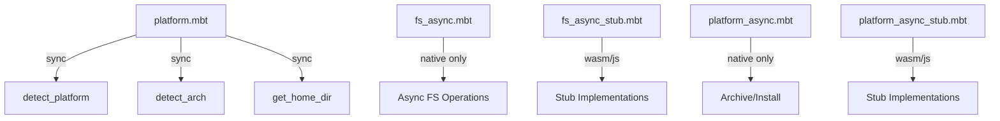

<!-- indexion:sources src/platform/ -->
# Platform Abstraction

The `platform` package provides cross-platform abstractions for OS detection, filesystem operations, and binary installation. It detects the current operating system and CPU architecture at runtime, and exposes async filesystem utilities (temp directories, file copy, archive extraction, executable permissions) that work on native targets with stub fallbacks for wasm/js.

## Architecture

The package uses a **target-conditional compilation** pattern: native-target files (`fs_async.mbt`, `platform_async.mbt`) contain real implementations using `@async_fs` and `@async_process`, while stub files (`fs_async_stub.mbt`, `platform_async_stub.mbt`) provide no-op or error implementations for non-native targets (wasm, wasm-gc, js).

## Key Types

| Type | Description |
|------|-------------|
| `Platform` | Enum: `MacOS`, `Linux`, `Windows`, `Unknown` |
| `Arch` | Enum: `X64`, `Arm64`, `UnknownArch` |

## Public API

| Function | Async | Description |
|----------|-------|-------------|
| `detect_platform()` | No | Detect current OS (`MacOS`/`Linux`/`Windows`/`Unknown`) |
| `detect_arch()` | No | Detect CPU architecture (`X64`/`Arm64`/`UnknownArch`) |
| `get_home_dir()` | No | Get user home directory path (returns `String?`) |
| `create_temp_dir(prefix)` | Yes | Create a temporary directory with given prefix |
| `copy_file(src, dst)` | Yes | Copy a single file |
| `copy_dir_recursive(src, dst)` | Yes | Recursively copy a directory |
| `ensure_dir_async(path)` | Yes | Create directory and parents if needed |
| `path_exists_async(path)` | Yes | Check if a path exists |
| `remove_dir_recursive(path)` | Yes | Recursively remove a directory |
| `write_bytes_async(path, bytes)` | Yes | Write raw bytes to a file |
| `extract_archive(archive, dest)` | Yes | Extract a tar.gz archive to destination |
| `install_binary(src, dest)` | Yes | Copy a binary and make it executable |
| `make_executable(path)` | Yes | Set executable permissions on a file |

## Dependencies

| Dependency | Purpose |
|-----------|---------|
| `moonbitlang/x/fs` | Synchronous filesystem operations |
| `mizchi/x/sys` | System-level utilities |
| `moonbitlang/async/fs` | Async filesystem API (native target) |
| `moonbitlang/async/process` | Async process execution for archive extraction |
| `trkbt10/osenv/platform` | OS platform detection |
| `trkbt10/osenv/dirs` | OS directory resolution |

> Source: `src/platform/`
