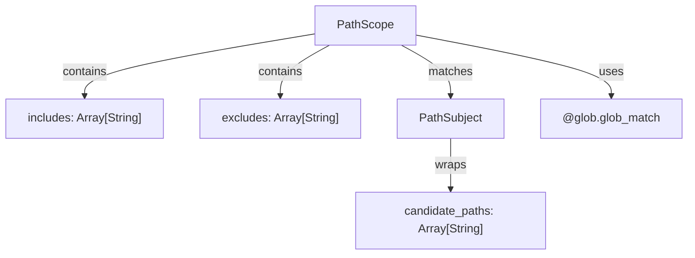

<!-- indexion:sources src/scope/ -->
# Scope Analysis

The `scope` package provides path-based include/exclude filtering used by CLI commands to select which files or modules to operate on. It wraps glob pattern matching with a clean `PathScope` abstraction that supports both include and exclude lists, and a `PathSubject` that allows matching against multiple candidate paths (e.g., a file's absolute path and its relative path).

## Architecture

## Key Types

| Type | Description |
|------|-------------|
| `PathScope` | Include/exclude pattern lists. A path is included if it matches any include pattern (or includes is empty) AND does not match any exclude pattern. |
| `PathSubject` | Wraps one or more candidate path representations for a single file, allowing patterns to match against any of them. |

## Public API

| Function | Description |
|----------|-------------|
| `PathScope::new(includes?, excludes?)` | Create a scope with optional include and exclude glob patterns |
| `PathScope::is_empty()` | Returns true if both include and exclude lists are empty |
| `PathScope::matches(subject)` | Check if a PathSubject passes the scope filter |
| `PathScope::matches_path(path)` | Convenience: check a single path string |
| `PathSubject::new(path, additional_paths?)` | Create a subject from a primary path and optional alternates |
| `path_matches_pattern(path, pattern)` | Low-level: check if a single path matches a single glob pattern |
| `subject_matches_pattern(subject, pattern)` | Low-level: check if any candidate path in a subject matches a pattern |

## Dependencies

| Dependency | Purpose |
|-----------|---------|
| `@glob` | Glob pattern matching via `glob_match` |

> Source: `src/scope/`
