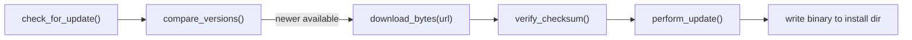

<!-- indexion:sources src/update/ -->
# src/update -- Self-Update Mechanism

The update package implements indexion's self-update capability. It checks for new versions on GitHub Releases, downloads platform-specific binaries, verifies SHA-256 checksums, and replaces the running binary in-place.

The update flow is fully async: version check and binary download use the `@http` package. Checksum verification uses `@crypto` (SHA-256). Platform detection and install directory resolution delegate to `@config` and `@platform`.

## Architecture

## Key Types

| Type | Description |
|------|-------------|
| `UpdateCheckResult` | Result of a version check. Contains latest version string and whether an update is available |
| `UpdateError` | Suberror type with variants: `PlatformNotSupported`, `NetworkError(String)`, `ChecksumMismatch`, `InstallError(String)` |
| `Semver` | Parsed semver components (major, minor, patch) |

## Public API

### Version Management

| Function | Description |
|----------|-------------|
| `current_version` | String constant with the current indexion version |
| `compare_versions(a, b)` | Compare two semver strings: positive if a > b, negative if a < b, 0 if equal |
| `parse_semver(s)` | Parse a version string like "0.1.0" or "v0.1.0" into `Semver` |
| `extract_tag_name(json)` | Extract `tag_name` from GitHub API JSON response |

### Update Check (async)

| Function | Description |
|----------|-------------|
| `check_latest_version()` | Fetch the latest version from GitHub Releases API |
| `check_for_update()` | Check if a newer version is available, returns `UpdateCheckResult` |

### Download & Verify (async)

| Function | Description |
|----------|-------------|
| `get_platform_asset()` | Get the platform-specific asset filename |
| `build_download_url(version, asset)` | Build the download URL for a release asset |
| `build_checksum_url(version, asset)` | Build the checksum URL for a release asset |
| `download_bytes(url)` | Download binary content from a URL |
| `download_text(url)` | Download text content from a URL |
| `verify_checksum(data, expected_hash)` | Verify SHA-256 checksum of downloaded data |
| `extract_hash_from_checksum(line)` | Extract hash from a checksum file line |

### Apply

| Function | Description |
|----------|-------------|
| `get_install_dir()` | Get the install directory, delegating to `@config` |
| `perform_update(version)` | Download, verify, and install a specific version |

## Dependencies

| Package | Alias | Purpose |
|---------|-------|---------|
| `src/config` | `@config` | Install directory, platform asset name |
| `src/platform` | `@platform` | Platform detection (OS, arch) |
| `src/kgf/manage` | `@kgf_manage` | KGF spec management during updates |
| `src/http` | `@http` | HTTP client for GitHub API and downloads |
| `moonbitlang/core/json` | `@json` | JSON parsing for GitHub API responses |
| `moonbitlang/x/crypto` | `@crypto` | SHA-256 checksum verification |

> Source: `src/update/`
