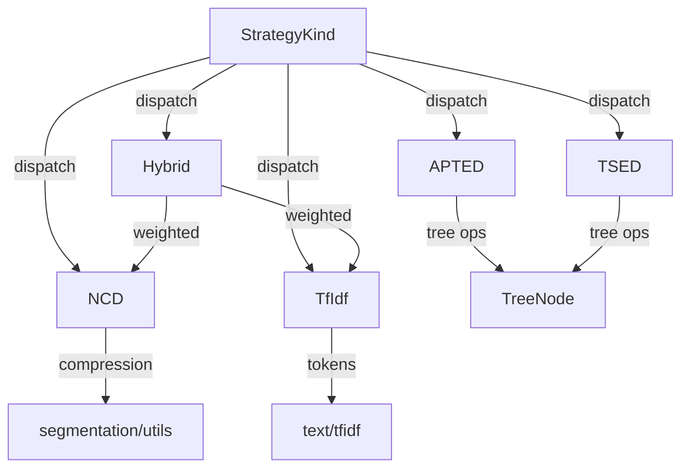

<!-- indexion:sources src/similarity/ -->
# Similarity Algorithms

The `similarity` package provides a unified interface for computing text and tree similarity using multiple algorithms. It supports **NCD** (Normalized Compression Distance), **TF-IDF** cosine similarity, **APTED** (All-Path Tree Edit Distance), **TSED** (Tree Sequence Edit Distance), and **Hybrid** (weighted combination of NCD + TF-IDF). All strategies implement a common `SimilarityStrategy` trait and are dispatched through the `StrategyKind` enum.

## Architecture

## Subpackages

| Subpackage | Purpose |
|-----------|---------|
| `types` | Core trait `SimilarityStrategy`, `SimilarityResult`, `HybridConfig` |
| `apted` | Tree edit distance algorithms (APTED and TSED) with PEG tree adapters |
| `ncd` | Normalized Compression Distance for text similarity |
| `tfidf_strategy` | TF-IDF cosine similarity strategy with batch support |
| `hybrid` | Weighted combination of NCD and TF-IDF |

## Key Types

| Type | Package | Description |
|------|---------|-------------|
| `SimilarityStrategy` | types | Trait: `name()`, `distance()`, `similarity()` |
| `SimilarityResult` | types | Holds both `distance` (0=identical) and `similarity` (1=identical) |
| `HybridConfig` | types | NCD/TF-IDF weight configuration for hybrid strategy |
| `StrategyKind` | root | Enum dispatching to concrete strategies |
| `TreeNode` | apted | Recursive tree structure with label and children |
| `CostConfig` | apted | Insert/delete/rename costs for tree edit distance |
| `TSEDConfig` | apted | TSED-specific configuration (cost config + label finalization) |
| `IndexedTree` | apted | Pre-indexed tree for efficient edit distance computation |
| `NodeInfo` | apted | Node metadata: ID, parent, leftmost leaf, subtree size |
| `TfidfStrategy` | tfidf_strategy | TF-IDF similarity strategy implementing `SimilarityStrategy` |
| `TfidfBatch` | tfidf_strategy | Batch TF-IDF computation with `all_pairs_above_threshold` |
| `NCDStrategy` | ncd | NCD similarity strategy implementing `SimilarityStrategy` |
| `HybridStrategy` | hybrid | Hybrid similarity strategy implementing `SimilarityStrategy` |

## Public API

### Root package

| Function | Description |
|----------|-------------|
| `StrategyKind::parse(name)` | Parse strategy name ("ncd", "tfidf", "apted", "tsed", "hybrid") |
| `StrategyKind::parse_with_weights(name, w1, w2)` | Parse with custom hybrid weights |
| `StrategyKind::calculate(text1, text2)` | Calculate similarity between two texts |
| `StrategyKind::text_similarity(text1, text2)` | Text-based similarity (NCD, TF-IDF, Hybrid) |
| `StrategyKind::tree_similarity(tree1, tree2)` | Tree-based similarity (APTED, TSED) |
| `available_strategies()` | List all strategy names |
| `text_strategies()` / `tree_strategies()` | List text-only or tree-only strategies |
| `parse_bracket_tree(str)` | Parse bracket notation into TreeNode |

### apted

| Function | Description |
|----------|-------------|
| `compute_tree_edit_distance(t1, t2, cost)` | Raw tree edit distance |
| `normalized_tree_edit_distance(t1, t2, cost)` | Normalized to [0,1] range |
| `tree_similarity(t1, t2, cost)` | 1 - normalized distance |
| `calculate_tsed(t1, t2, config)` | TSED similarity score |
| `peg_node_to_tree_node(node)` | Convert PEG parse tree to TreeNode |
| `peg_similarity(n1, n2, cost)` | APTED similarity on PEG nodes |
| `peg_tsed_similarity(n1, n2, config)` | TSED similarity on PEG nodes |
| `should_compare_trees(t1, t2, threshold)` | Heuristic check before expensive comparison |

### tfidf_strategy

| Function | Description |
|----------|-------------|
| `TfidfBatch::from_tokens(token_arrays)` | Build batch from pre-tokenized documents |
| `TfidfBatch::all_pairs_above_threshold(threshold)` | Find all pairs above similarity threshold |
| `TfidfBatch::similarity(i, j)` | Pairwise similarity between documents |

### ncd / hybrid

| Function | Description |
|----------|-------------|
| `calculate_adjacent_ncd(texts)` | NCD between consecutive text pairs |
| `calculate_adjacent_hybrid(texts, config)` | Hybrid similarity between consecutive pairs |

## Dependencies

| Subpackage | Key Dependencies |
|-----------|-----------------|
| types | (none) |
| apted | `@kgf/peg` |
| ncd | `@segmentation/utils`, `similarity/types` |
| tfidf_strategy | `@text/tfidf`, `similarity/types` |
| hybrid | `@segmentation/utils`, `similarity/types` |
| root | All subpackages |

> Source: `src/similarity/`
