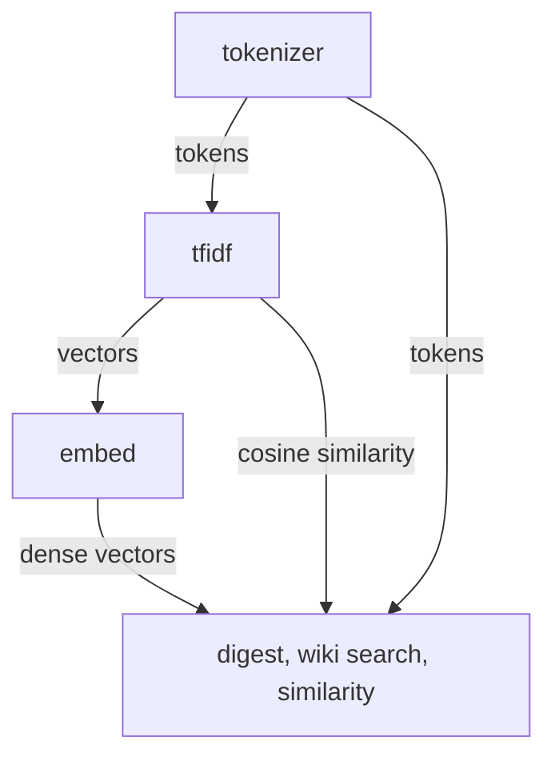

<!-- indexion:sources src/text/ -->
# Text Processing

The `text` package provides text tokenization, TF-IDF vector computation, and TF-IDF-based embedding for use across indexion's similarity analysis, search indexing, and digest pipelines. It is organized into three subpackages that form a layered text processing stack.

## Architecture

## Subpackages

| Subpackage | Purpose |
|-----------|---------|
| `tokenizer` | Text normalization and tokenization for TF-IDF |
| `tfidf` | TF-IDF vector computation, cosine similarity, and batch operations |
| `embed` | TF-IDF embedding provider that converts text to dense fixed-dimension vectors |

## Key Types

| Type | Package | Description |
|------|---------|-------------|
| `TfidfVector` | tfidf | Sparse TF-IDF vector as `Map[String, Double]` with get/set/iter |
| `TfidfBatch` | tfidf | Pre-computed TF-IDF vectors for a document collection with batch similarity queries |
| `TfidfBatchBuildStats` | tfidf | Statistics from batch build: document count, total tokens, vocabulary size |
| `TfidfPairSearchStats` | tfidf | Statistics from pair search: posting hits, candidates, evaluations, output pairs |
| `TfidfEmbeddingProvider` | embed | Builds vocabulary from corpus and projects text into fixed-dimension dense vectors |

## Public API

### tokenizer

| Function | Description |
|----------|-------------|
| `tokenize_for_tfidf(text)` | Tokenize text for TF-IDF: normalize, split into words, return token array |
| `normalize_text(text)` | Normalize text: lowercase, strip punctuation |
| `extract_word_tokens(text)` | Extract word-level tokens from text |
| `extract_character_bigrams(text)` | Extract character bigram tokens (e.g., for CJK text) |

### tfidf

| Function | Description |
|----------|-------------|
| `build_term_frequency(tokens)` | Count term occurrences in a single document |
| `build_document_frequency(token_arrays)` | Count how many documents contain each term |
| `build_tfidf_vector(tokens, df, doc_count)` | Build a TF-IDF vector for a single document |
| `cosine_similarity(v1, v2)` | Cosine similarity between two TF-IDF vectors |
| `cosine_distance(v1, v2)` | Cosine distance (1 - similarity) |
| `calculate_tfidf_distance_from_tokens(t1, t2)` | End-to-end distance from raw token arrays |
| `calculate_adjacent_tfidf_distance_from_tokenized(docs)` | Distance between consecutive document pairs |
| `TfidfBatch::from_tokens(token_arrays)` | Build batch from pre-tokenized documents |
| `TfidfBatch::similarity(i, j)` | Pairwise similarity between indexed documents |
| `TfidfBatch::all_pairs_above_threshold(threshold)` | Find all document pairs above a similarity threshold |
| `TfidfBatch::all_pairs_above_threshold_with_stats(threshold)` | Same, with performance statistics |
| `sqrt(x)` | Square root utility used in cosine calculations |

### embed

| Function | Description |
|----------|-------------|
| `TfidfEmbeddingProvider::new(dim)` | Create provider with target vector dimension |
| `TfidfEmbeddingProvider::build_vocabulary(texts)` | Build vocabulary from corpus, selecting top `dim` terms by document frequency |
| `TfidfEmbeddingProvider::embed(text)` | Generate L2-normalized dense vector for text |
| `TfidfEmbeddingProvider::dim()` | Get embedding dimension |
| `cosine_similarity_dense(a, b)` | Cosine similarity between two dense vectors |

## Dependencies

| Subpackage | Key Dependencies |
|-----------|-----------------|
| tokenizer | (none) |
| tfidf | `moonbitlang/core/math` |
| embed | `text/tfidf`, `text/tokenizer` |

> Source: `src/text/`
