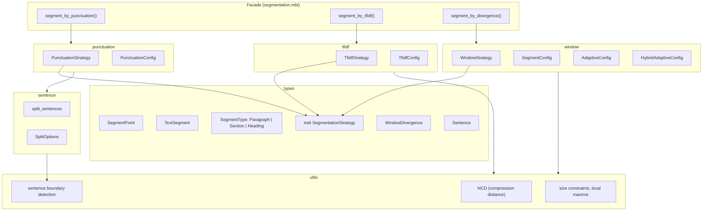

<!-- indexion:sources src/segmentation/ -->
# src/segmentation -- Text Chunk Segmentation

The segmentation package splits text into semantically meaningful chunks for downstream processing (RAG pipelines, embedding, documentation analysis). It provides multiple segmentation strategies that implement a common `SegmentationStrategy` trait, allowing callers to swap strategies without changing their code.

Three primary strategies are available: **punctuation** (split at sentence-ending punctuation), **TF-IDF** (split where vocabulary shifts between sliding windows), and **window** (split at divergence peaks using NCD and/or TF-IDF similarity between adjacent windows). Each strategy supports configuration for target/min/max chunk sizes.

## Architecture

## Key Types

| Type | Subpackage | Description |
|------|------------|-------------|
| `SegmentPoint` | `types` | A segment boundary with start/end character offsets and segment type |
| `TextSegment` | `types` | A segment with extracted text, offsets, type, and optional heading |
| `SegmentType` | `types` | Enum: `Paragraph`, `Section`, `Heading` |
| `SegmentationStrategy` | `types` | Trait with `name()` and `segment(text)` methods |
| `Sentence` | `types` | A sentence with text, start, and end offsets |
| `WindowDivergence` | `types` | Divergence calculation result: values and positions arrays |
| `PunctuationConfig` | `punctuation` | Config: target/min/max chunk sizes |
| `PunctuationStrategy` | `punctuation` | Strategy implementation for punctuation-based segmentation |
| `TfidfConfig` | `tfidf` | Config: target/min/max chunk sizes, TF-IDF threshold, window size |
| `TfidfStrategy` | `tfidf` | Strategy implementation for TF-IDF divergence segmentation |
| `SegmentConfig` | `window` | Config: target/min/max chunk sizes, threshold, window size |
| `AdaptiveConfig` | `window` | Config: percentile-based adaptive thresholding |
| `HybridAdaptiveConfig` | `window` | Config: combined NCD + TF-IDF with configurable weights |
| `WindowStrategy` | `window` | Strategy implementation for window divergence segmentation |
| `SplitOptions` | `sentence` | Options for sentence splitting (quote safety, brackets, max length) |
| `FindBoundariesOptions` | `utils` | Options for sentence boundary detection |
| `QuoteStackEntry` | `utils` | Tracking entry for nested quotes during boundary detection |

## Public API

### Facade (`segmentation.mbt`)

| Function | Description |
|----------|-------------|
| `segment_by_punctuation(text, config)` | Segment text using punctuation strategy |
| `segment_by_tfidf(text, config)` | Segment text using TF-IDF divergence |
| `segment_by_divergence(text, config)` | Segment text using window divergence |
| `to_text_segments(points, text)` | Convert `SegmentPoint` array to `TextSegment` array |
| `new_segment_point(start, end, segment_type)` | Create a new `SegmentPoint` |
| `default_punctuation_config()` | Default punctuation config |
| `default_tfidf_config()` | Default TF-IDF config |
| `default_window_config()` | Default window config |

### Window Segmentation

| Function | Description |
|----------|-------------|
| `segment(text)` | Segment with default window config |
| `segment_by_divergence(text, config)` | Segment using NCD-based window divergence |
| `segment_adaptive(text, config)` | Segment with adaptive thresholding |
| `segment_hybrid_adaptive(text, config)` | Segment with hybrid NCD + TF-IDF |
| `calculate_window_tfidf_divergence(sentences, window_size)` | Calculate TF-IDF divergence between windows |
| `calculate_window_ncd_tfidf_divergence(sentences, window_size, config)` | Calculate hybrid NCD + TF-IDF divergence |

### Sentence Splitting

| Function | Description |
|----------|-------------|
| `split_sentences(text)` | Split text into sentences with default options |
| `split_sentences_with_options(text, options)` | Split with custom options |
| `split_sentences_text(text)` | Split and return text strings only |
| `count_sentences(text)` | Count sentences in text |

### Utilities

| Function | Description |
|----------|-------------|
| `compress(text)` | LZ77-based text compression |
| `compressed_size(text)` | Get compressed size of text |
| `ncd(a, b)` | Normalized Compression Distance between two texts |
| `calculate_adjacent_ncd(texts)` | NCD between adjacent text segments |
| `min_max_normalize(values)` | Min-max normalize an array of values |
| `find_sentence_boundaries(text, options)` | Find sentence boundary positions |
| `find_local_maxima(values, threshold)` | Find local maxima above a threshold |
| `apply_size_constraints(points, sentences, min, max)` | Merge/split segments to respect size constraints |

## Dependencies

| Package | Alias | Purpose |
|---------|-------|---------|
| `segmentation/types` | `@types` | Shared type definitions and trait |
| `segmentation/punctuation` | `@punctuation` | Punctuation strategy |
| `segmentation/tfidf` | `@tfidf` | TF-IDF strategy |
| `segmentation/window` | `@window` | Window divergence strategy |

The subpackages are self-contained with no external dependencies beyond the standard library.

> Source: `src/segmentation/`
