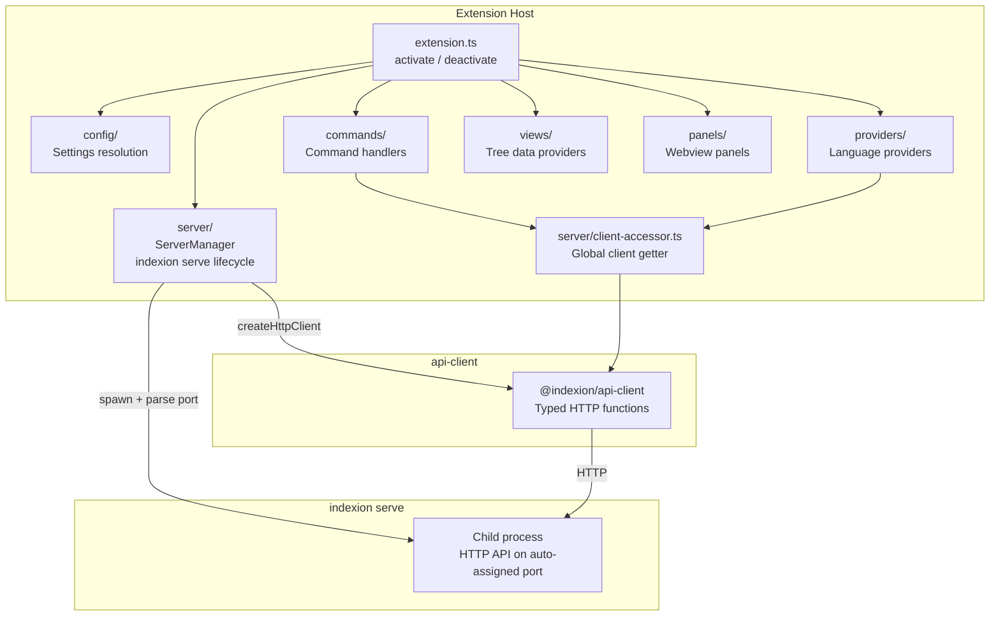

<!-- indexion:sources packages/vscode-plugin/ -->
# packages/vscode-plugin -- VS Code Extension

The `@indexion/vscode-plugin` package is a VS Code extension that integrates indexion's
code analysis features directly into the editor. It spawns an `indexion serve` child process,
communicates with it via the `@indexion/api-client` HTTP client, and exposes commands,
tree views, language providers, and webview panels to the user.

## Architecture

## Key Components

### Extension Lifecycle (`extension.ts`)

On activation:
1. Reads VS Code settings via `resolveConfig()`
2. Creates a `ServerManager` that spawns `indexion serve --cors --port=0` as a child process
3. Parses the server's stdout for `Serving on http://...` to discover the auto-assigned port
4. Creates an `HttpClient` bound to the discovered port
5. Registers commands, language providers, tree views, and panel commands

On deactivation: kills the `indexion serve` process.

### Server Manager (`server/server.ts`)

Manages the `indexion serve` child process lifecycle:
- Resolves the binary path: prefers `indexion.binaryPath` setting, then checks `which indexion`, then falls back to `moon run cmd/indexion --target native --`
- Spawns with `--cors` and `--port=0` (OS assigns a free port)
- Exposes `start()`, `stop()`, `getClient()`, `isReady()`, and `onReady` event

### Commands (`commands/`)

12 commands registered via a `COMMAND_MAP` array:

| Command ID | Handler | Description |
|------------|---------|-------------|
| `indexion.explore` | `executeExplore` | Run similarity analysis on workspace |
| `indexion.planRefactor` | `executePlanRefactor` | Generate refactoring plan |
| `indexion.planDocumentation` | `executePlanDocumentation` | Documentation coverage analysis |
| `indexion.planReconcile` | `executePlanReconcile` | Implementation/docs drift detection |
| `indexion.planSolid` | `executePlanSolid` | Common code extraction plan |
| `indexion.planUnwrap` | `executePlanUnwrap` | Unnecessary wrapper detection |
| `indexion.planReadme` | `executePlanReadme` | README generation plan |
| `indexion.docGraph` | `executeDocGraph` | Generate dependency graph |
| `indexion.kgfInspect` | `executeKgfInspect` | Inspect file with KGF |
| `indexion.kgfAdd` | `executeKgfAdd` | Add KGF spec |
| `indexion.kgfUpdate` | `executeKgfUpdate` | Update KGF specs |
| `indexion.digestQuery` | `executeDigestQuery` | Search functions by purpose |

Plan commands share common logic via `commands/plan-common.ts`.

### Language Providers (`providers/`)

Three providers registered for all file types:

| Provider | Type | Description |
|----------|------|-------------|
| `createOutlineProvider` | `DocumentSymbolProvider` | Document outline (symbol tree) |
| `createSemanticTokensProvider` | `DocumentSemanticTokensProvider` | Semantic token coloring |
| `createDependencyLensProvider` | `CodeLensProvider` | Inline dependency information |

### Tree Views (`views/`)

| View ID | Provider | Description |
|---------|----------|-------------|
| `indexion.kgfList` | `KgfListProvider` | Lists available KGF specs in the sidebar |
| `indexion.exploreResults` | `ExploreResultsProvider` | Displays explore similarity results |

### Panels (`panels/`)

| Panel | Description |
|-------|-------------|
| `plan-results` | Displays plan command output (refactor, docs, etc.) |
| `settings` | Extension settings editor webview |

### Configuration (`config/index.ts`)

Reads from VS Code's `contributes.configuration`:
- `indexion.binaryPath` -- path to indexion binary (auto-detect if empty)
- `indexion.specsDir` -- KGF specs directory (default: `kgfs`)
- `indexion.defaultThreshold` -- similarity threshold (default: 0.7)
- `indexion.defaultStrategy` -- comparison strategy (default: `tfidf`)

Runtime configuration (workspace dir, index dir, etc.) comes from `GET /api/config` on the running server.

## Dependencies

### Runtime

| Package | Purpose |
|---------|---------|
| `@indexion/api-client` | Typed HTTP client for indexion serve API (workspace dependency) |
| `react` / `react-dom` | Webview panel rendering |

### Dev

| Package | Purpose |
|---------|---------|
| `@types/vscode` | VS Code API types |
| `vite` | Build tooling (separate configs for extension and webview) |
| `vitest` + `@testing-library/react` | Testing |
| `typescript` | Type checking |
| `ajv` | JSON schema validation |

### Build

Three Vite configurations:
- `vite.extension.config.ts` -- builds the Node.js extension entry point
- `vite.webview.config.ts` -- builds React webview bundles
- `build` script chains both: `build:extension && build:webview`

Packaged with `vsce package --no-dependencies`.

> Source: `packages/vscode-plugin/`
